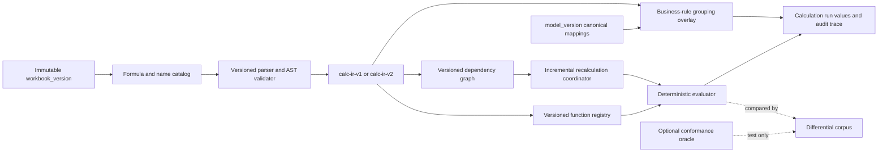
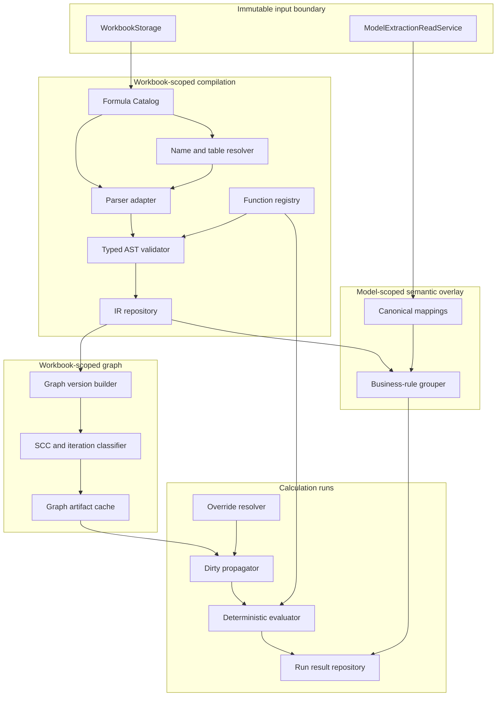
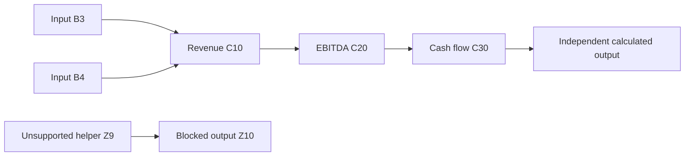
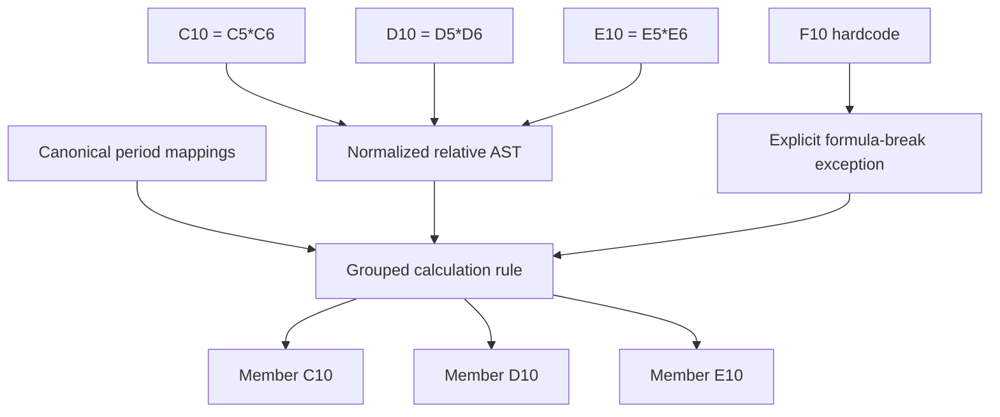
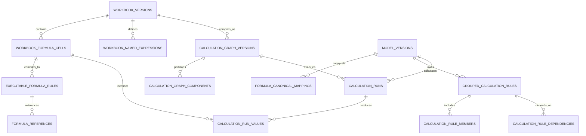
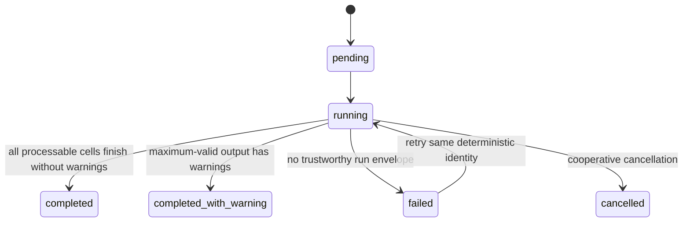
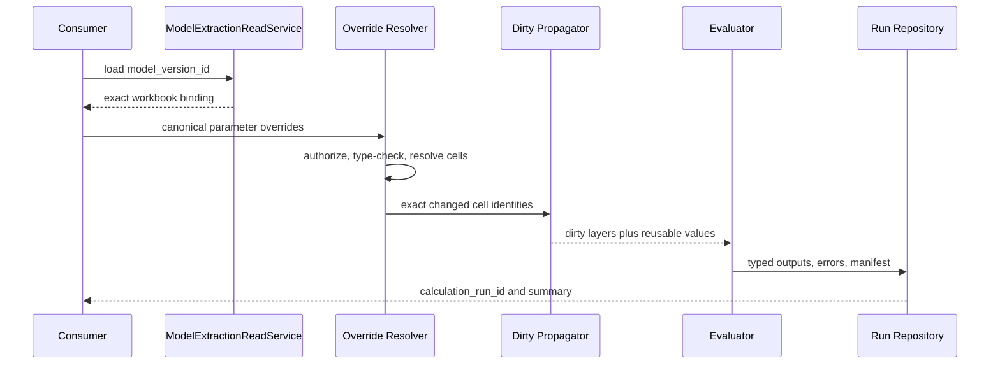

# Internal Excel Calculation Engine Target Design

**Date:** 2026-07-15
**Status:** Approved target architecture; implementation not started
**Phase:** 2 — Internal Excel Calculation Engine Target State
**Branch:** `design/calculation-rule-extraction`
**Base commit:** `158bf40c460053cdc4d98d208625a50873dee580`
**Phase 1 contract:** [2026-07-15-simple-executable-calculation-rule-extraction-design.md](2026-07-15-simple-executable-calculation-rule-extraction-design.md)

## 1. Executive Summary

**Recommended.** Evolve the Phase 1 compiler-and-executor into an InvestIQ-owned, versioned Excel calculation platform. Preserve workbook cell identity as execution truth, keep canonical Model Extraction identities as a model-scoped semantic overlay, and extend the typed intermediate representation, function registry, dependency graph, and calculation-run contracts additively.

The target engine is not a clone of the Excel application. It is an auditable server-side calculation engine for the subset of Excel semantics used by InvestIQ financial models. Compatibility is explicit and testable:

- **required semantics** must match the named Excel behavior before a feature is declared supported;
- **progressive semantics** enter the engine only through versioned capability increments; and
- **permanently unsupported features** are detected, preserved as evidence, and never executed.

The authoritative execution path remains custom and typed. A mature third-party formula engine may be used as a non-authoritative differential-test oracle after license and security approval, but no external library owns InvestIQ persistence contracts or silently determines business results.



## 2. Scope

### 2.1 In scope

**Proposed.** The target architecture covers:

- additive evolution from every Phase 1 persisted contract;
- a stable parser boundary for supported Excel formula syntax;
- versioned typed IR with backward-compatible readers;
- named expressions and table-structured reference resolution;
- a versioned, metadata-driven function registry;
- broader logical, aggregation, lookup, date, financial, math, statistics, and text functions;
- explicit Excel blank, error, coercion, precision, date-system, and lazy-evaluation semantics;
- graph versioning, strongly connected components, and policy-gated iterative calculation;
- incremental dirty propagation and reusable immutable graph artifacts;
- deterministic parallel execution of independent graph components;
- business-rule grouping across repeated period formulas without losing cell-level evidence;
- override-to-recalculation consumer contracts;
- auditable calculation runs and per-cell results;
- maximum-valid output for independent supported subgraphs;
- SQLite development/test compatibility and PostgreSQL production compatibility; and
- conformance, regression, differential, performance, and security testing.

### 2.2 Explicit non-goals

The target does not attempt to reproduce:

- Excel's desktop user interface;
- formatting, charts, shapes, comments, or print layout;
- external workbook fetching or network link resolution;
- VBA, macros, COM add-ins, XLL add-ins, Office Scripts, or arbitrary UDFs;
- Power Query, data connections, pivots, or refresh orchestration;
- Excel's solver, goal seek, scenario manager, or optimization UI;
- opaque binary calculation-chain reuse as authority;
- formulas that can invoke operating-system, network, or dynamic code; or
- bit-for-bit agreement where Microsoft does not publish a stable semantic contract.

### 2.3 Special deferred subsystem

Excel What-If Analysis Data Tables are not ordinary cell formulas. The target retains them as a **future special-engine capability**, not as a permanent exclusion and not as an implicit feature of the core evaluator. A workbook containing a Data Table is classified explicitly; the core engine never pretends that the table was recalculated.

## 3. Current Repository Capabilities

### 3.1 Observed persistence and reload boundary

The current repository already provides the immutable input and canonical read boundary that this target requires:

- `WorkbookStorage` saves workbook bytes by `workbook_version_id` and verifies size and SHA-256 when loading.
- `ModelExtractionReadService.load_model_version` binds a materialized `model_version_id` to its exact workbook version.
- canonical parameters, financial series, and source-cell identities are read without falling back to `extraction_snapshot_json`.
- `resolve_entity_by_source_cell` returns one canonical entity, no entity, or an explicit ambiguity failure.

These are upstream contracts, not engine internals. The engine consumes them without reopening the legacy snapshot path.

### 3.2 Observed experimental formula evidence

The workbook-agent experiment already demonstrates useful evidence collection:

- formula and cached-value workbooks are loaded separately;
- formulas on hidden sheets are visible;
- cached missing, error, and external values are not coerced to zero;
- internal and external references can be distinguished; and
- formulas can be translated to compare cross-period patterns.

It is not an execution engine. Its regex reference parser removes anchor information, omits range dependency edges, and provides no typed AST, function semantics, topological execution, cycle policy, or incremental graph.

### 3.3 Observed calculation library boundary

`libs/calc_engine` contains bespoke finance functions such as IRR, NPV, and DSCR. These functions are useful future registry implementations, but the library is not an Excel formula parser or workbook calculation engine. Its existing public behavior should remain independently testable while adapters provide Excel-compatible argument and error semantics.

### 3.4 Formula-corpus implication

A read-only corpus audit found 352 formula cells in the repository financial workbook, including 119 `IF`, 60 `ABS`, 41 `SUM`, and one `COUNTIF`. Repository fixtures exercise hidden sheets, external references, mixed anchors, multilingual sheets, and named-range injection. This validates the Phase 1 baseline and motivates progressive function-family expansion rather than an unrestricted parser.

## 4. Design Principles

1. **Workbook cells are execution truth.** An unmapped helper cell still participates in parsing, graphing, and evaluation.
2. **Canonical identities are business lineage.** Mapping enriches a cell but does not redefine formula syntax.
3. **Immutable inputs produce immutable artifacts.** Workbook-scoped catalog, IR, and graph versions are content-addressable and reusable.
4. **No raw string execution.** All calculation passes through validated typed IR and registered functions.
5. **Compatibility is named and versioned.** A run records parser, IR, registry, semantics, and graph versions.
6. **Unknown is not zero.** Blank, missing cache, unsupported syntax, typed error, and unavailable external data are distinct.
7. **Maximum-valid output is explicit.** Independent supported components execute even when other components are blocked.
8. **Cell evidence is never discarded.** Grouped rules supplement, but never replace, formula-cell records.
9. **Backward compatibility is additive.** Phase 1 identifiers, statuses, and `calc-ir-v1` remain readable.
10. **Resource use is bounded.** Range size, AST depth, graph size, run time, and trace volume are budgeted.
11. **Observability excludes sensitive payloads.** Metrics identify versions and counts, not raw formulas or values by default.
12. **Human policy is visible.** Iteration, volatility, licensing, tolerance, and retention are approval-controlled.

## 5. Architecture Approaches Considered

### 5.1 Approach A — InvestIQ-owned typed engine

Build and own the parser adapter, IR, function registry, dependency graph, evaluator, and persistence contracts.

**Advantages**

- strongest auditability and stable contracts;
- exact control over supported semantics and errors;
- Python-native integration with current services and SQLAlchemy;
- no runtime copyleft or service-boundary ambiguity; and
- cell- and canonical-identity lineage can be first-class.

**Costs**

- significant conformance burden;
- long-tail Excel semantics require sustained maintenance; and
- performance and coverage grow incrementally.

### 5.2 Approach B — Embed a third-party formula engine

Adopt `formulas`, `xlcalculator`, `Pycel`, HyperFormula, or another engine as the authoritative runtime.

**Advantages**

- faster initial function breadth;
- existing parser/evaluator test corpora; and
- potential performance benefits.

**Costs**

- license, language/runtime, and release-risk differences;
- library-specific ASTs leak into persistence;
- observed projects document semantic gaps, beta status, or lazy-evaluation limitations; and
- canonical lineage and maximum-valid behavior still require InvestIQ orchestration.

### 5.3 Approach C — Translate formulas to a general programming runtime

Translate Excel expressions to Python, JavaScript, SQL, or another executable language.

**Advantages**

- reuses language operators and runtime optimizers.

**Costs**

- unsafe unless a second restrictive compiler is built;
- host-language coercion, error, date, and rounding behavior differs from Excel;
- generated code complicates audit evidence; and
- injection risk expands sharply.

### 5.4 Approach D — Owned contracts with optional oracle integration

Use Approach A as the authoritative engine. Isolate optional third-party parsers/evaluators behind test-only adapters that produce no production persistence and cannot approve results.

**Advantages**

- stable InvestIQ contracts and security boundary;
- independent differential evidence;
- libraries can be replaced without migrations; and
- target coverage can expand without a one-way dependency decision.

**Costs**

- maintains both conformance adapters and the owned engine; and
- differential mismatches require classification, not automatic acceptance.

### 5.5 Decision

**Approved direction: Approach D.** The production engine is InvestIQ-owned typed IR plus safe evaluation. A third-party engine is optional and non-authoritative. Enabling any oracle requires separate license/security approval and pinned-version reproducibility.

Candidate assessment at design time:

| Candidate | Maintenance/runtime/license | Coverage and workbook dependencies | AST, determinism, and security | Persistence / black-box risk | Target role |
|---|---|---|---|---|---|
| `formulas` | Python; 1.3.4 released in 2026; EUPL 1.1+ | broad documented Excel functions; compiles workbooks/formulas to dispatch graphs | exposes AST/compile APIs; its independent coercion and dependency behavior must be differentially tested; no production workbook transfer | foreign AST must not be persisted; moderate semantic black-box risk | Optional offline oracle after legal/security approval |
| `xlcalculator` | Python; 0.5.0 released in 2023; MIT project with documented parser/tokenizer provenance | useful parser/evaluator corpus; project documents incomplete function/semantic areas and lazy-evaluation work | inspectable Python model but determinism depends on selected functions; sandbox assumptions cannot replace InvestIQ validation | foreign model is not Phase 1 IR; high replacement risk if made authoritative | Optional test corpus/oracle |
| Pycel | Python; 1.0b30 released in 2021; GPLv3; beta | spreadsheet-to-graph evaluation with incomplete Excel breadth | exposes a calculation graph; beta semantics and copyleft boundary require isolation | incompatible as persisted/runtime authority without separate legal architecture | Research only unless separately approved |
| HyperFormula | TypeScript; 3.3.0 released in 2026; GPLv3 or commercial | documents 400+ functions and dependency-graph recalculation | active engine with explicit graph behavior, but cross-runtime service and deterministic profile need validation | foreign JS model and license boundary create the highest integration/persistence cost | Independent service/oracle only after commercial decision |

This assessment inspects maintenance, coverage, licensing, Python/runtime compatibility, dependency handling, AST visibility, determinism, security, persistence fit, and black-box risk. None of the candidates can bypass the InvestIQ parser-neutral IR or acceptance corpus. Current source links are collected in Section 25.3.

The target does not select or install a third-party dependency.

## 6. Target Architecture



### 6.1 Compilation boundary

Compilation is deterministic for this key:

```text
(workbook_version_id, parser_version, ir_version, semantics_profile, registry_version)
```

The compiler inventories formulas and names, classifies unsupported constructs, resolves workbook-internal identities, produces typed IR, and emits reference facts. It never reads model overrides or canonical values.

### 6.2 Graph boundary

The graph builder consumes validated workbook-scoped IR and reference facts. It produces a versioned immutable graph containing formula dependencies, value-input dependencies, SCCs, topological layers, volatile flags, and blocked boundaries.

### 6.3 Model semantic boundary

Canonical mappings and business-rule groups are model-version-scoped. The same workbook bytes can support multiple model versions with different semantic mappings without recompiling syntax.

### 6.4 Run boundary

A calculation run selects one graph version, one registry version, one semantics profile, one model version, and zero or more typed overrides. It persists resolved inputs, statuses, errors, outputs, and an audit manifest. It does not mutate workbook, formula, mapping, or graph rows.

## 7. Component Responsibilities

| Component | Responsibility | Must not do |
|---|---|---|
| Workbook loader | Load SHA-verified bytes for one workbook version | Read arbitrary filesystem paths |
| Formula catalog | Inventory formulas, caches, tables, names, dates, hidden state | Evaluate expressions |
| Parser adapter | Convert accepted syntax to parser-neutral nodes | Execute or persist library-specific objects |
| Name/table resolver | Resolve scoped names and structured references | Fetch external workbooks |
| AST validator | Enforce node types, arity, budgets, and registry availability | Coerce unsupported syntax into a value |
| Function registry | Define versioned signatures, coercion, volatility, laziness | Dynamically import code from workbooks |
| Graph builder | Emit dependencies, SCCs, layers, and blocked components | Apply model business mappings |
| Evaluator | Evaluate typed nodes under a named semantics profile | Execute raw strings or host `eval` |
| Incremental coordinator | Resolve overrides, dirty nodes, reusable values, execution layers | Change immutable graph artifacts |
| Canonical mapper | Bind cell identities to canonical entities | Make mapping mandatory for helpers |
| Rule grouper | Detect repeated business calculations with evidence | Replace member formula records |
| Run repository | Persist idempotent runs and values | Store unbounded traces |
| Oracle adapter | Produce test-only comparison results | Write production calculation results |

## 8. Data Ownership and Identity

### 8.1 Workbook-scoped artifacts

Owned by `workbook_version_id`:

- raw formula cell records;
- cached-value telemetry;
- sheet, table, name, and date-system metadata;
- parsed IR;
- resolved workbook-internal references;
- compilation status and errors;
- graph versions and components; and
- content fingerprints.

### 8.2 Model-scoped artifacts

Owned by `model_version_id`:

- canonical cell mappings;
- business-rule groups and membership;
- grouping evidence and exceptions;
- parameter override validation; and
- semantic coverage metrics.

### 8.3 Run-scoped artifacts

Owned by `calculation_run_id`:

- engine/version manifest;
- resolved typed overrides;
- dirty-set and reuse metrics;
- result values and typed errors;
- cached-value comparisons;
- warning and failure evidence; and
- timestamps and actor/request correlation.

### 8.4 Stable identities

All deterministic artifacts use UUIDv5 over normalized identity tuples. Required identity inputs remain stable:

```text
formula_cell_id = UUIDv5(workbook_version_id, "formula-cell|sheet-position|exact-sheet-name|uppercase-A1")
executable_formula_rule_id = UUIDv5(formula_cell_id, ir_version, compiler_version, semantics_profile, formula_sha256)
formula_reference_id = UUIDv5(formula_cell_id, executable_formula_rule_id, reference_ordinal, source_span, reference_kind, normalized_target)
formula_canonical_mapping_id = UUIDv5(calculation_rule_extraction_id, formula_cell_id, optional_reference_id, mapping_role, canonical_target)
graph_version_id = UUIDv5(workbook_version_id, compiler_manifest_hash)
grouped_rule_id = UUIDv5(model_version_id, grouping_profile, group_fingerprint)
calculation_run_id = UUIDv5(model_version_id, graph_version_id, registry_version, normalized_override_hash, run_policy_hash)
```

The first four rules are the exact Phase 1 identities: sheet names are not case-normalized or fuzzy-matched, and formula reference identity retains source span and kind. Changing compiler semantics creates a new versioned artifact; it never rewrites the meaning of an existing identifier.

## 9. Formula and Reference Model

### 9.1 Formula records remain cell-granular

One workbook formula cell remains one raw record throughout the target state. A record includes exact formula text, normalized syntax fingerprint, cell type, cached-value telemetry, sheet visibility, array/spill metadata, and compilation classification.

### 9.2 Reference classes

The resolver classifies every reference as one of:

- internal scalar cell;
- internal finite range;
- workbook-scoped defined name;
- sheet-scoped defined name;
- table structured reference;
- implicit-intersection reference;
- spill/array reference;
- external workbook reference;
- dynamic reference; or
- invalid/unresolved reference.

Only a class supported by the selected IR/registry version produces executable edges.

### 9.3 Anchors and copy semantics

Relative, absolute, and mixed row/column anchors are preserved as syntax evidence. Resolved execution targets are exact workbook-cell identities. Grouping uses anchor-aware relative offsets; execution does not repeatedly translate formula text.

### 9.4 Named expressions

Defined names are resolved by Excel scope precedence: sheet scope before workbook scope where applicable. Names may refer to constants, cells, ranges, or formulas. Hidden names are not inherently unsafe; external, dynamic, macro, and unsupported definitions remain explicit evidence.

### 9.5 Structured references

Table references resolve against immutable table metadata and the formula cell's row context. The IR records both the structured source expression and resolved target set. Resizing a table requires a new workbook version and therefore a new compiled artifact.

### 9.6 External and dynamic references

External workbooks, `INDIRECT`, `OFFSET`, and other dynamic address construction do not create guessed edges. Each is classified and blocks only the affected downstream component under strict recalculation.

## 10. Versioned Intermediate Representation

### 10.1 Compatibility rule

`calc-ir-v1` is permanent readable input. `calc-ir-v2` is additive: all v1 node names, field meanings, literal encodings, error codes, and reference identities remain valid. No migration rewrites v1 JSON in place.

Every IR envelope contains:

```json
{
  "expression_id": "uuid",
  "formula_cell_id": "uuid",
  "ir_version": "calc-ir-v2",
  "compiler_version": "formula-compiler-v2",
  "semantics_profile": "excel-compatible-v2",
  "formula_sha256": "hex64",
  "normalized_signature": "...",
  "root": {},
  "required_registry_version": "calc-functions-v2",
  "capabilities": ["named-reference", "structured-reference"],
  "limits": {"node_count": 42, "max_depth": 7}
}
```

The Phase 1 envelope field names retain their meanings. `required_registry_version`, `capabilities`, and `limits` are additive v2 fields; readers choose the schema through `ir_version`, not a replacement `schema` field.

### 10.2 Preserved v1 node kinds

The target reader continues to accept:

- `literal`;
- `error_value`;
- `cell_reference`;
- `range_reference`;
- `unary_operation`;
- `binary_operation`;
- `comparison`; and
- `function_call`.

### 10.3 Additive v2 node kinds

| Node | Purpose | Key typed fields |
|---|---|---|
| `blank` | explicit empty-cell semantic | `origin` |
| `named_range_reference` | resolved workbook/sheet defined name | `scope`, `name`, `target_kind`, `target_ids` |
| `structured_reference` | resolved table expression | `table_id`, `selector`, `target_ids` |
| `logical_operation` | explicit lazy/eager logical form | `operator`, `operands`, `evaluation_mode` |
| `conditional` | generalized lazy branches | `condition`, `when_true`, `when_false` |
| `array_value` | typed rectangular value | `rows`, `columns`, `values` |
| `implicit_intersection` | scalar selection from range/array | `operand`, `context_cell` |
| `spill_reference` | dependency on a dynamic array anchor | `anchor_cell_id`, `spill_policy` |
| `date_serial` | epoch-tagged Excel serial | `serial`, `date_system`, `has_time` |

The IR never embeds canonical entity IDs. Canonical mappings remain a separate model-scoped overlay.

### 10.4 Function calls

A function call identifies a registry symbol and expected semantic major version:

```json
{
  "node_type": "function_call",
  "function_name": "SUMIFS",
  "source_span": {"start": 1, "end": 27},
  "registry_symbol": "aggregation.sumifs@2",
  "arguments": [],
  "evaluation_mode": "eager",
  "source_name": "SUMIFS"
}
```

Aliases normalize only after parsing; exact source spelling remains in the formula record.

### 10.5 AST safety

The validator rejects unknown fields, unknown node kinds, excessive depth, excessive node count, oversized literals, non-finite range expansion, registry arity mismatches, recursive names beyond policy, and any node capable of host-language execution.

## 11. Function Registry and Capability Roadmap

This is a capability roadmap, not an implementation plan. A function family becomes supported only when its syntax, coercion, error, blank, range, array, and volatility behavior passes conformance gates.

### 11.1 Registry metadata

Each function definition declares:

- stable symbol and semantic version;
- accepted arity and argument kinds;
- scalar/range/array handling;
- coercion rules by argument position;
- blank and error propagation;
- eager or lazy argument evaluation;
- volatile, semi-volatile, or deterministic classification;
- thread-safety and cacheability;
- resource cost model; and
- conformance-suite version.

### 11.2 Progressive function families

| Capability increment | Function families | Representative functions | Gate emphasis |
|---|---|---|---|
| Phase 1 baseline | arithmetic, comparisons, simple aggregation, branch, rounding | `SUM`, `AVERAGE`, `MIN`, `MAX`, `ABS`, `ROUND`, `IF` | exact v1 contract |
| Logical and errors | Boolean logic and explicit error control | `IFS`, `AND`, `OR`, `NOT`, `IFERROR`, `IFNA`, `IS*` | laziness and typed errors |
| Aggregation and conditional aggregation | counts and criteria-based aggregation | `COUNT`, `COUNTA`, `SUMIF`, `SUMIFS`, `COUNTIF`, `COUNTIFS`, `AVERAGEIF`, `AVERAGEIFS` | criteria grammar and aligned ranges |
| Lookup and reference | deterministic lookup | `INDEX`, `MATCH`, `XMATCH`, `XLOOKUP`, `VLOOKUP`, `HLOOKUP`, `CHOOSE` | approximate-match and error semantics |
| Date and time | serial-date and working-day calculation | `DATE`, `YEAR`, `MONTH`, `DAY`, `EDATE`, `EOMONTH`, `DAYS`, `YEARFRAC`, `NETWORKDAYS`, `WORKDAY` | 1900/1904 systems, leap-year quirk, calendars |
| Financial | project-finance and valuation | `NPV`, `XNPV`, `IRR`, `XIRR`, `PV`, `FV`, `PMT`, `IPMT`, `PPMT`, `RATE`, `NPER` | convergence and numeric tolerance |
| Math and statistics | broader scalar/range math | `ROUNDUP`, `ROUNDDOWN`, `ABS`, `EXP`, `LN`, `LOG`, `SQRT`, `POWER`, `MEDIAN`, `STDEV.*`, `VAR.*` | coercion and precision |
| Text | deterministic text manipulation | `CONCAT`, `LEFT`, `RIGHT`, `MID`, `LEN`, `VALUE`, `TEXT` | locale and formatting limits |
| Arrays | explicit array and spill semantics | selected dynamic-array functions | shape, spill conflicts, resource budgets |

### 11.3 Volatile and dynamic functions

- `NOW`, `TODAY`, and random functions require an injected calculation context so reruns are reproducible.
- `INDIRECT` and `OFFSET` remain unsupported until a safe dynamic-reference graph design exists.
- functions that inspect workbook metadata or environment require explicit, deterministic inputs.
- web, cube, RTD, and external-data functions remain permanently unsupported.

### 11.4 Excel error values

The registry works with typed errors, including `#DIV/0!`, `#VALUE!`, `#REF!`, `#NAME?`, `#NUM!`, `#N/A`, `#NULL!`, `#SPILL!`, and an InvestIQ `unsupported` classification outside the Excel value domain. Excel errors can be caught only by functions whose registered semantics permit it.

## 12. Compatibility Semantics

### 12.1 Required semantics

These behaviors are part of the authoritative contract:

| Area | Required behavior |
|---|---|
| Operator precedence | reference operations, negation, percent, exponentiation, multiply/divide, add/subtract, concatenation, comparisons |
| Branching | unselected `IF`/conditional branches are not evaluated |
| Errors | typed propagation and function-specific interception |
| Blanks | distinguish empty cell, empty string, zero, false, and missing/unavailable |
| Numbers | IEEE-754 binary64 operation with explicit Excel-compatible function semantics |
| Rounding | function-specific behavior, not host-language `round` by accident |
| Dates | workbook 1900/1904 system carried with serial values; 1900 compatibility quirk explicit |
| Text comparison | named case/collation rules independent of database collation |
| Ranges | rectangular shape, row-major ordering, and function-specific blank/error behavior |
| References | exact sheet/cell/table/name resolution within immutable workbook metadata |
| Iteration | disabled unless graph/run policy explicitly enables a qualified SCC |
| Volatility | injected deterministic context and recorded seed/time |

### 12.2 Progressive semantics

The following are introduced only by versioned capability increments:

- defined names and name formulas;
- table structured references;
- criteria mini-languages;
- lookup approximate matching;
- financial convergence algorithms;
- dynamic arrays and spill behavior;
- implicit intersection;
- selected volatile functions; and
- iterative calculation for qualified SCCs.

### 12.3 Permanently unsupported semantics

The following never enter the trusted evaluator:

- VBA, macros, Office Scripts, XLL/COM add-ins, and arbitrary UDFs;
- external workbook fetching;
- network, filesystem, shell, process, or dynamic-code execution;
- Power Query and connection refresh;
- cube, RTD, and web-service functions;
- formula injection into another runtime; and
- encrypted or corrupted workbook content that cannot be safely inventoried.

### 12.4 Semantic classification matrix

| Semantic area | Classification | Target contract |
|---|---|---|
| Blank versus zero | Required | distinct typed values; function-specific coercion only |
| Empty string versus blank | Required | distinct values in references, comparisons, and results |
| Text-to-number coercion | Required per enabled function/operator | profile-defined, locale-invariant baseline; no host coercion |
| Boolean coercion | Required per enabled function/operator | explicit positional rules; validation never equates Boolean and number |
| Date serial values | Required | epoch-tagged serials with explicit date/time shape |
| 1900/1904 date systems | Required | workbook metadata selects system; 1900 compatibility quirk tested |
| Percentage representation | Required | postfix `%` evaluates to the underlying decimal; formatting is not a value |
| Excel errors | Required | typed propagation and registered interception |
| Comparison semantics | Required | named number/text/Boolean/blank/error behavior |
| Operator precedence | Required | Microsoft-documented precedence under the semantics profile |
| Range behavior | Required for supported functions | shape and ordering retained; argument-position rules registered |
| Absolute/mixed references | Required | exact target plus row/column anchor evidence |
| Named-range scope | Progressively supported | sheet/workbook precedence and immutable resolution evidence |
| Hidden/helper sheets | Required | visibility does not gate inventory, graphing, or execution |
| Implicit intersection | Progressively supported | explicit v2 node; never applied as an invisible repair |
| Volatile functions | Progressively supported | injected time/seed and non-reuse policy |
| Deterministic versus volatile evaluation | Required | registry classification and run manifest control reuse |
| Workbook calculation settings | Required as evidence | full-calc/iteration settings affect freshness and policy validation, not blind trust |
| Cached values | Required as comparison evidence | never used as a boundary input for strict recalculation |
| Formula locale issues | Progressively supported | invariant OOXML syntax first; locale conversion is a separate capability |
| Decimal/floating-point precision | Required | binary64 baseline plus function-specific algorithms and tolerances |
| Dynamic address construction | Explicitly unsupported until separately designed | no guessed dependencies for `INDIRECT`/`OFFSET` |
| External data/code semantics | Permanently unsupported | no retrieval, refresh, macro, add-in, or arbitrary code path |

### 12.5 Maximum-valid rule

An unsupported or failed node blocks strict recalculation of its dependents, but not independent graph components. A workbook run can therefore complete with warnings while clearly distinguishing calculated, reused, blocked, unsupported, error, and unavailable cells.

## 13. Dependency Graph and Recalculation

### 13.1 Graph model

The graph is a versioned directed multigraph:

```text
precedent cell or name -> dependent formula cell
```

Edges retain source AST path, reference kind, range membership, and conditionality. Compact range indexes may replace fully expanded edges when expansion exceeds a configured threshold, but logical dependencies remain exact.



### 13.2 Graph versions

A graph version records:

- compiler manifest hash;
- IR and registry compatibility requirements;
- node and edge counts;
- SCC membership;
- topological layer assignments;
- range-index format;
- volatile nodes;
- unsupported boundaries; and
- content fingerprint.

Graphs are immutable. A new workbook or compiler semantic version produces a new graph version.

### 13.3 Strongly connected components

Tarjan or an equivalent deterministic algorithm identifies SCCs. Each SCC is classified as:

- acyclic singleton;
- self-reference;
- multi-cell cycle;
- eligible iterative component; or
- blocked unsupported component.

### 13.4 Iterative calculation

Iteration is off by default. A qualified component can run only when a recorded policy supplies maximum iterations, absolute/relative convergence tolerance, calculation order, and non-convergence behavior. The run stores iteration count and convergence evidence. Excel's workbook iteration settings may be evidence, but human policy controls server execution.

### 13.5 Dirty propagation

For overrides, the coordinator:

1. resolves canonical or workbook-cell override identities;
2. validates typed values and authorization;
3. maps overrides to exact graph nodes;
4. computes the transitive dependent set through graph indexes;
5. expands the set for volatile or iterative components as policy requires;
6. reuses values only when the prior run manifest is compatible; and
7. evaluates dirty topological layers.

This ordered description defines behavior, not an implementation task plan.

### 13.6 Deterministic parallelism

Independent SCC-condensed graph components and nodes within a topological layer may run concurrently if every invoked registry function is deterministic and thread-safe. Result persistence order is canonicalized by cell identity so concurrency does not change run fingerprints.

### 13.7 Cache rules

Reusable result caches are keyed by graph version, registry version, semantics profile, calculation context, and normalized upstream input fingerprint. Workbook cached values are never execution cache entries; they remain comparison evidence only.

## 14. Business-Rule Grouping

### 14.1 Purpose

Financial models often copy a calculation across periods. The target can present one business rule such as “Revenue equals volume multiplied by price” while preserving every formula cell and period-specific dependency.

### 14.2 Grouping inputs

Grouping uses:

- anchor-aware normalized AST shape;
- relative dependency offsets;
- function and operator sequence;
- sheet and period continuity;
- canonical series/parameter mappings;
- date/period metadata; and
- formula-break and hardcode evidence;
- row-versus-column source orientation;
- scenario context as metadata only;
- historical/forecast boundary classification; and
- period offsets from the normalized output cell.

### 14.3 Group fingerprint

The fingerprint excludes the member's absolute period coordinate but includes normalized AST, relative reference pattern, semantics version, and canonical roles when available. It is model-scoped because canonical interpretation can differ across model versions.

### 14.4 Membership rules

- A group contains ordered member formula cells.
- Every member retains exact source formula, IR, and execution result.
- Gaps, hardcodes, and divergent formulas create explicit exceptions.
- A grouping confidence score never upgrades execution support.
- Ambiguous canonical mappings prevent semantic grouping but do not prevent cell execution.
- User-approved group annotations create a new grouping revision; they do not mutate prior evidence.



### 14.5 Grouped output contract

A grouped rule exposes stable identity, label/description, member cells, canonical inputs/outputs, normalized expression, period coverage, exceptions, confidence, approval status, and source engine versions. It is a semantic projection; the evaluator still calculates cell-level IR.

## 15. Persistence Evolution

### 15.1 Phase 1 tables remain authoritative

The six Phase 1 tables remain readable and are not repurposed:

1. `calculation_rule_extractions`
2. `workbook_formula_cells`
3. `executable_formula_rules`
4. `formula_references`
5. `formula_canonical_mappings`
6. `formula_execution_results`

Phase 2 adds tables only where the state cannot be reliably derived from those rows.

### 15.2 Target additive tables

| Table | Scope | Why it cannot remain derived only |
|---|---|---|
| `workbook_named_expressions` | workbook version | scoped definitions and resolution evidence are durable compilation inputs |
| `calculation_graph_versions` | workbook version | graph compiler manifest, fingerprint, and reusable topology need immutable identity |
| `calculation_graph_components` | graph version | SCC/iteration/blocked classification supports bounded recalculation |
| `grouped_calculation_rules` | model version | business meaning, confidence, approval, and revision are model-specific |
| `calculation_rule_members` | grouped rule | ordered membership, periods, and formula-break exceptions are auditable |
| `calculation_rule_dependencies` | grouped rule | business-facing dependency projection differs from raw cell edges |
| `calculation_runs` | model version + graph | engine manifest, override fingerprint, actor, and run policy define reproducibility |
| `calculation_run_values` | calculation run | typed per-cell results, reuse flags, errors, and comparison evidence are run-specific |

### 15.3 Logical ER model



### 15.4 JSON boundaries

IR, error detail, registry manifest, and bounded trace fragments may use JSON columns with explicit schemas and size limits. Query-critical identities, statuses, version keys, timestamps, counts, and foreign keys remain relational columns. JSON never becomes a fallback canonical snapshot.

### 15.5 Database compatibility

- SQLAlchemy types and constraints must compile on SQLite and PostgreSQL.
- PostgreSQL may add performance indexes, but behavior cannot depend on a PostgreSQL-only JSON operator.
- migrations are forward-only, with explicit downgrade or documented irreversibility;
- uniqueness constraints enforce deterministic identities and retry safety; and
- large result retention is policy-controlled rather than silently truncated.

## 16. Calculation Run, Status, and Error Model

### 16.1 Run statuses

Stable Phase 1 statuses remain valid:

- `completed`;
- `completed_with_warning`; and
- `failed`.

Target processing state may additionally use `pending`, `running`, and `cancelled` while a run is not terminal. Consumers must treat unknown future statuses as non-success.

### 16.2 Cell result statuses

The target preserves the exact Phase 1 cell statuses:

- `executed`;
- `not_executable`;
- `blocked_by_dependency`;
- `cycle`; and
- `execution_error`.

Target versions may add these values without changing the Phase 1 meanings:

- `reused`;
- `cached_comparison_only`;
- `iteration_converged`;
- `iteration_not_converged`;
- `unavailable`.

Support and dependency reason codes remain separate fields. For example, a cell remains `not_executable` with `FormulaSupportStatus=unsupported`; target readers do not rename that Phase 1 status.



### 16.3 Error envelope

```json
{
  "code": "CALCULATION_DEPENDENCY_BLOCKED",
  "category": "dependency",
  "message": "A required precedent is unsupported",
  "cell_id": "...",
  "source_cell_id": "...",
  "ast_path": "/arguments/1",
  "excel_error": null,
  "retryable": false,
  "details": {"blocked_by": ["..."]}
}
```

Messages are safe for internal consumers; raw formulas, values, credentials, and workbook bytes are excluded from default errors and logs.

### 16.4 Comparison outcomes

Cached-value comparison preserves the exact Phase 1 values `matched`, `mismatched`, `not_comparable`, `no_cached_value`, and `execution_error`. Freshness remains `missing`, `unknown`, or `recalculation_required`; the engine never labels an imported workbook cache as proven fresh. More specific reason codes may be additive fields, not replacement status values.

## 17. Consumer and Internal Service Contracts

### 17.1 Compilation contract

```python
compile_workbook(
    workbook_version_id,
    parser_version,
    ir_version,
    semantics_profile,
    registry_version,
) -> CompilationResult
```

The result identifies immutable extraction, IR, and graph artifacts plus support metrics. Equivalent requests return the existing deterministic artifact.

### 17.2 Calculation contract

```python
calculate_model(
    model_version_id,
    graph_version_id,
    overrides,
    run_policy,
    idempotency_key=None,
) -> CalculationRunResult
```

Overrides accept either an authorized canonical parameter identity or an explicit workbook-cell identity. Values are typed; formula text cannot be supplied as an override.

### 17.3 Override-to-recalculation flow



### 17.4 Read contracts

Consumers can retrieve:

- compilation support summary;
- graph/version metadata;
- formula-cell rule detail;
- grouped business-rule detail;
- calculation-run summary;
- paginated run values;
- canonical output projections; and
- bounded audit evidence.

No consumer contract returns a legacy extraction snapshot as a substitute for canonical rows.

### 17.5 Compatibility negotiation

Requests can specify a required capability set. If the selected compiler/registry cannot supply it, the service fails with explicit capability evidence rather than silently switching engine versions.

## 18. Idempotency, Retry, and Concurrency

### 18.1 Compilation idempotency

The compiler key and UUIDv5 identities make retries convergent. A database uniqueness conflict causes a reload of the winning artifact after transaction rollback; partial artifacts are never exposed as complete.

### 18.2 Run idempotency

Equivalent model, graph, registry, semantics, override, calculation-context, and run-policy inputs produce the same deterministic run identity unless the caller explicitly requests a new audit attempt. Client idempotency keys are unique within actor and model scope.

### 18.3 Concurrency control

- compilation uses a short artifact-claim transaction and computes outside long-held locks where safe;
- competing writers resolve through unique constraints;
- immutable completed artifacts require no update locks;
- run cancellation is cooperative and produces a terminal audit row; and
- result batches commit atomically with terminal status or remain non-terminal and invisible to success reads.

### 18.4 Retry classification

Database serialization, transient storage, and worker interruption errors may be retried. Parse errors, unsupported syntax, graph cycles under strict policy, invalid overrides, and deterministic calculation errors are not made retryable by repetition.

## 19. Security and Resource Controls

### 19.1 Execution prohibitions

The engine must never call Python `eval`/`exec`, JavaScript evaluation, shell processes, dynamic imports from workbook content, SQL constructed from formulas, filesystem paths from formulas, network endpoints from formulas, or arbitrary user functions.

### 19.2 Input controls

- workbook bytes are SHA-verified and size-limited;
- ZIP entry counts, compression ratios, XML sizes, sheets, cells, formulas, names, and tables are budgeted;
- external links are inventoried without retrieval;
- encrypted or malformed content fails closed;
- parser depth, token count, literal length, range area, graph edges, and name recursion are bounded; and
- typed overrides are authorized against model access and allowed parameter identities.

### 19.3 Runtime controls

- wall-clock, CPU, memory, node-evaluation, iteration, and trace limits are explicit;
- cancellation checks occur between bounded work units;
- per-function cost metadata prevents pathological calls;
- caches are tenant- and version-scoped; and
- independent components stop safely on budget exhaustion.

### 19.4 Data protection

Formula text and calculated values are potentially confidential. Logs and metrics use identifiers, hashes, counts, statuses, and latency. Detailed traces require privileged access and policy-defined retention. No third-party oracle receives production workbooks without separate authorization.

## 20. Validation and Testing Strategy

### 20.1 Test layers

1. parser/token/precedence unit tests;
2. IR schema and backward-reader tests;
3. reference, name, table, and anchor-resolution tests;
4. per-function semantic conformance tests;
5. graph/SCC/topological/dirty-propagation tests;
6. evaluator coercion, error, blank, date, and numeric tests;
7. grouping and formula-break tests;
8. persistence/idempotency/concurrency tests;
9. SQLite and PostgreSQL migration tests;
10. repository workbook and fixture acceptance tests;
11. security/resource/adversarial tests;
12. deterministic parallelism tests; and
13. performance and memory benchmarks.

### 20.2 Golden workbook corpus

Golden workbooks store formulas plus caches produced by a controlled Excel recalculation step. Each fixture records Excel version, platform, calculation settings, date system, locale assumptions, and cache provenance. Imported cache is comparison evidence, not an execution input.

### 20.3 Differential testing

Where approved, the same bounded synthetic workbook is evaluated by Excel-produced caches, the InvestIQ engine, and an optional third-party oracle. Mismatches are classified by function, coercion, precision, date, lookup, array, or unsupported boundary. An oracle mismatch never automatically changes production semantics.

### 20.4 Metamorphic testing

Properties include:

- equivalent anchor translations preserve expected relative behavior;
- independent sheet renaming changes identities but not values;
- non-dirty components are reused exactly;
- serial and deterministic-parallel runs produce identical fingerprints;
- grouping never changes cell-level results;
- a blocked component cannot contaminate an independent component; and
- v1 artifacts read identically after v2 support is introduced.

### 20.5 Acceptance metrics

Metrics are reported by workbook, function family, and graph component:

- formula inventory coverage;
- syntax parse rate;
- executable rule rate;
- graph edge resolution rate;
- canonical mapping coverage;
- calculated/reused/blocked/error counts;
- cache comparison match rate with tolerance profile;
- dirty-set reduction ratio;
- grouping coverage and exception rate;
- cold/warm run latency; and
- peak memory and budget failures.

No aggregate percentage hides unsupported high-value outputs; critical canonical outputs are reported individually.

## 21. Migration and Backward Compatibility

### 21.1 Stable Phase 1 contracts

The exact shared contract names are `FormulaCellId`, `FormulaReferenceId`, `CalculationRuleExtractionId`, `CalculationExpression`, `CalculationExpressionVersion`, `ExecutionStatus`, `ExecutionResult`, `FormulaParseStatus`, `FormulaSupportStatus`, `WorkbookCellRef`, and `CanonicalEntityRef`. Their frozen and extensible fields are defined in the companion Phase 1 design, Section 20.2, and incorporated here by reference.

The following are frozen across the transition:

- workbook cell identity as execution truth;
- optional model-scoped canonical mappings;
- six Phase 1 table meanings;
- UUIDv5 identity inputs for Phase 1 artifacts;
- `calc-ir-v1` envelope and nodes;
- `completed`, `completed_with_warning`, and `failed` terminal meanings;
- cell-level evidence and maximum-valid output;
- typed error and cached-comparison concepts;
- no legacy snapshot fallback; and
- no raw formula string execution.

### 21.2 Additive reader behavior

- v2 services read both v1 and v2 IR.
- v1 artifacts are never auto-recompiled in place.
- a new compilation capability creates a new extraction/graph version.
- unknown node or status values fail explicitly for old consumers.
- old run results remain readable with their recorded engine manifest.
- grouped rules are optional projections; absence does not alter cell results.

### 21.3 Migration sequencing constraints

Schema migration, artifact backfill, dual-version reads, and consumer opt-in must be independently reversible at the service boundary. This target design intentionally does not prescribe implementation tasks or delivery dates.

### 21.4 Compatibility matrix

| Producer | Consumer | Required behavior |
|---|---|---|
| `calc-ir-v1` | target engine | execute with v1 semantics profile and registry |
| `calc-ir-v2` using only v1 nodes | target engine | execute under recorded v2 profile; do not pretend it is v1 |
| `calc-ir-v2` | Phase 1 reader | reject as unsupported version, never partially parse |
| Phase 1 run | target read service | return preserved statuses and evidence |
| grouped target rule | cell-result consumer | optional; cell results remain canonical execution evidence |

## 22. Observability and Operations

### 22.1 Structured metrics

Required dimensions are tenant-safe version identifiers, engine versions, support classification, function family, graph size bucket, run status, and latency bucket. Metrics exclude formula text, cell values, workbook names, and canonical labels.

### 22.2 Traces

Compilation traces cover load, inventory, parse, validate, resolve, graph, and persist stages. Calculation traces cover override resolution, dirty propagation, layer evaluation, comparison, and persistence. Cell-level spans are sampled or aggregated to avoid unbounded cardinality.

### 22.3 Audit manifest

Every terminal run records:

- workbook and model versions;
- graph, parser, IR, registry, and semantics versions;
- override and policy fingerprints;
- deterministic time/random context where relevant;
- counts by status and support classification;
- resource usage and termination reason; and
- actor/request correlation.

### 22.4 Operational recovery

Incomplete compilation/run rows are distinguishable from terminal artifacts. Recovery can retry a deterministic key, cancel abandoned work, or rebuild a new version. It never edits completed immutable results.

## 23. Deferred Capabilities and Permanent Boundaries

### 23.1 Deferred, with explicit future design required

- What-If Analysis Data Tables through a special input-substitution engine;
- dynamic arrays and spill conflicts;
- safe subsets of `INDIRECT`/`OFFSET` if exact dependencies can be bounded;
- iterative calculation for approved workbook classes;
- selected locale-sensitive text/number formats;
- selected volatile functions with injected contexts;
- wider function families; and
- high-volume distributed evaluation.

### 23.2 Permanently outside the trusted engine

- external workbook retrieval;
- VBA, macros, Office Scripts, add-ins, and arbitrary UDFs;
- network and data-connection refresh;
- Power Query execution;
- operating-system or dynamic-code access;
- uncontrolled third-party production processing; and
- any unsupported feature silently replaced by cached values.

## 24. Risks and Required Human Approvals

| Risk | Architectural control | Human approval |
|---|---|---|
| Semantic drift from Excel | versioned profiles, golden workbooks, per-function conformance | approve compatibility thresholds |
| Third-party license contamination | test-only adapter, no persisted foreign AST | legal/security approve each oracle |
| Numeric differences affect decisions | named algorithms, tolerance profiles, critical-output reporting | model-risk owner approves tolerances |
| Iterative models do not converge | off by default, SCC qualification, bounded iteration | product/model-risk approve policy |
| Volatile functions make runs irreproducible | injected time/seed and manifest | product approves supported volatile set |
| Formula/value confidentiality | privileged traces, bounded retention, no production oracle transfer | security/data owner approves retention/access |
| Graph/range explosion | compact indexes and strict budgets | operations approves resource budgets |
| Incorrect business grouping | evidence, confidence, exceptions, approval revisions | business owner approves group semantics |
| What-If Data Tables misrepresented | explicit unsupported/special classification | architecture approves separate subsystem design |
| Function breadth becomes open-ended | capability registry and acceptance gates | product prioritizes supported families |

### 24.1 Decisions already approved

- InvestIQ-owned typed IR and safe evaluator are authoritative.
- Phase 2 is additive to the approved Phase 1 contract.
- workbook cells remain execution truth; canonical mapping remains optional lineage.
- third-party libraries, if any, are non-authoritative test oracles.
- business-rule grouping preserves member formula evidence.
- unsupported dependencies block strict downstream recalculation but not independent components.
- What-If Data Tables require a separate future engine design.

### 24.2 Approvals required before implementation completion

1. License/security approval for any selected differential-test oracle.
2. Model-risk approval for numeric tolerances and financial convergence algorithms.
3. Product/model-risk approval for iterative-calculation eligibility and defaults.
4. Product approval for volatile functions and injected time/random behavior.
5. Security/data-owner approval for formula, value, trace, and golden-workbook retention.
6. Operations approval for workbook, graph, range, runtime, and trace budgets.
7. Business-owner approval for grouped-rule labels, confidence, and manual revision workflow.
8. Architecture approval for a future What-If Data Table subsystem.

No implementation plan is included in this design task.

## 25. Implementation Readiness and Evidence Appendix

### 25.1 Readiness checklist

- [x] Phase 1 contracts identified and frozen.
- [x] custom, embedded, translated, and hybrid approaches compared.
- [x] authoritative custom-plus-oracle architecture selected.
- [x] workbook/model/run ownership boundaries defined.
- [x] v1-to-v2 IR evolution rules defined.
- [x] function registry metadata and capability families defined.
- [x] required/progressive/permanently unsupported semantics classified.
- [x] graph versioning, SCC, incremental, reuse, and parallelism defined.
- [x] business-rule grouping identity and evidence defined.
- [x] override-to-recalculation contract defined.
- [x] additive persistence evolution defined.
- [x] status/error/idempotency/concurrency contracts defined.
- [x] security/resource/test/observability boundaries defined.
- [x] human approvals enumerated.
- [ ] Human owners approve policies listed in Section 24.2.

### 25.2 Repository evidence

| Conclusion | Classification | Evidence |
|---|---|---|
| Immutable workbook bytes can be loaded and verified | Observed in code/tests | `apps/api/app/workbook_storage.py:DatabaseWorkbookStorage.load`; `tests/test_model_extraction_reload.py:test_reload_workbook_after_new_session_returns_verified_bytes` |
| Model versions have an explicit workbook binding | Observed in code/tests | `apps/api/app/model_extraction_read_service.py:ModelExtractionReadService.load_model_version`; `tests/test_model_extraction_reload.py:test_model_workbook_mismatch_is_explicit` |
| Canonical source-cell resolution can be absent or ambiguous | Observed in code/tests | `apps/api/app/model_extraction_read_service.py:ModelExtractionReadService.resolve_entity_by_source_cell`; `tests/test_model_extraction_reload.py:test_unmapped_source_cell_returns_none` |
| Canonical reads reject snapshot fallback | Observed in tests | `tests/test_model_extraction_reload.py:test_missing_canonical_row_never_falls_back_to_snapshot` |
| Formula/cache evidence and hidden cells are already inspectable | Observed in code/tests | `experiments/workbook_agent_poc/workbook_tools.py:WorkbookToolset`; `experiments/workbook_agent_poc/tests/test_tools_ext.py` |
| Existing dependency parsing is not execution-grade | Observed in code | `experiments/workbook_agent_poc/dependency.py:parse_formula_refs`; `experiments/workbook_agent_poc/dependency.py:build_dependency_graph` |
| Existing formula translation supports pattern evidence only | Observed in code/tests | `experiments/workbook_agent_poc/time_series.py:FinancialSeriesMaterializer._formula_pattern`; `experiments/workbook_agent_poc/tests/test_financial_series.py` |
| Canonical series values retain source formula/cache telemetry | Observed in code/tests | `apps/api/app/model_extraction_models.py:FinancialSeriesValue`; `tests/test_model_extraction_reload.py:test_series_values_are_ordered_by_series_and_period_index` |
| Existing finance functions are not a workbook engine | Observed in code/tests | `libs/calc_engine/irr.py`; `libs/calc_engine/npv.py`; `tests/test_calc_engine.py` |
| SQLite/PostgreSQL migration verification exists | Observed in code/tests | `apps/api/alembic/versions/20260715_0002_model_extraction_persistence.py`; `tests/test_model_extraction_persistence_schema.py` |
| Versioned typed IR and graph are required | Inferred | Combined repository evidence above |
| Grouped business rules must be an additive model overlay | Proposed | Sections 8, 14, and 15 |
| Optional libraries must remain non-authoritative | Proposed | Sections 5 and 20 |

### 25.3 External semantic and library references

- Microsoft documents Excel operators and precedence: <https://support.microsoft.com/en-us/excel/calculation-operators-and-precedence-in-excel>.
- openpyxl documents that it does not calculate formulas and that `data_only=True` reads stored values: <https://openpyxl.readthedocs.io/en/3.1.2/simple_formulae.html> and <https://openpyxl.readthedocs.io/en/3.1.2/api/openpyxl.reader.excel.html>.
- openpyxl documents formula tokenization/translation utilities and their limited scope: <https://openpyxl.readthedocs.io/en/latest/formula.html>.
- `formulas` describes AST compilation/execution and its EUPL license: <https://pypi.org/project/formulas/> and <https://github.com/vinci1it2000/formulas>.
- `xlcalculator` describes its parser/evaluator, license, and known limitations: <https://pypi.org/project/xlcalculator/> and <https://github.com/bradbase/xlcalculator>.
- Pycel describes spreadsheet-to-graph compilation and GPLv3 licensing: <https://pypi.org/project/pycel/> and <https://github.com/dgorissen/pycel>.
- HyperFormula describes its TypeScript engine, function breadth, and GPLv3/commercial licensing: <https://github.com/handsontable/hyperformula>.
