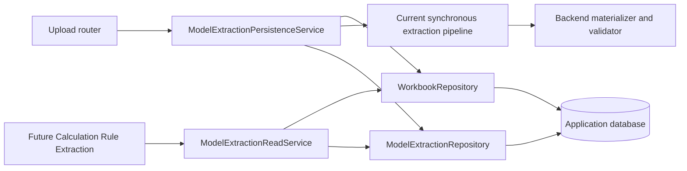
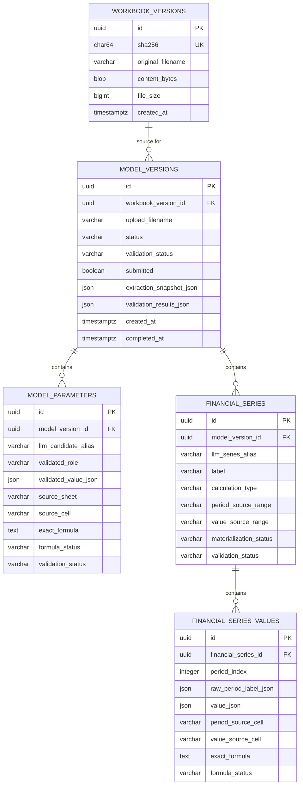
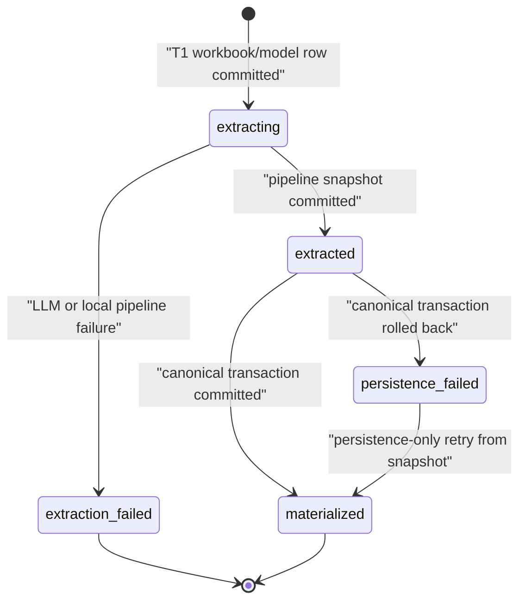
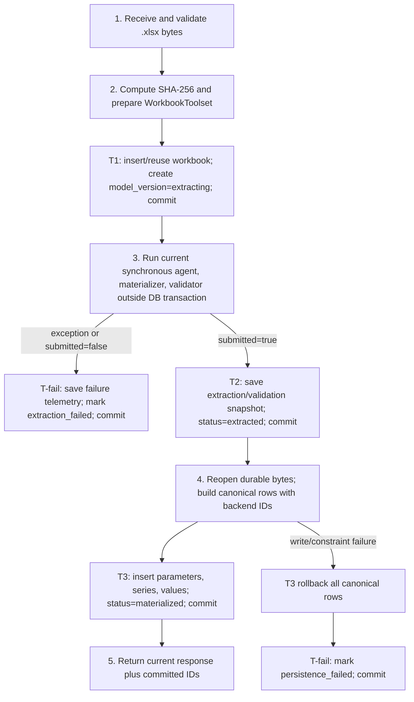

# Model Extraction Persistence Design

**Date:** 2026-07-15

**Status:** Proposed for review; no persistence implementation exists yet

**Branch:** `design/model-extraction-persistence`
**Base commit:** `1f59fa88e64502f56a919c5ab06959f57be80a92`

## 1. Executive Summary

**Proposed.** Persist each accepted `.xlsx` as one immutable, content-addressed `workbook_versions` row whose bytes are stored in the existing application database. Reuse that workbook row when SHA-256 matches, but create a new `model_versions` row for every Model Extraction execution. Persist canonical parameters, canonical financial series, and aligned series values in relational tables with backend-generated IDs and indexed workbook provenance. Keep a JSON extraction snapshot and validation evidence on the model version only as an audit/retry artifact; it is not the canonical query model.

This is the minimum architecture that satisfies the future upstream contract:

```json
{
  "model_version_id": "...",
  "workbook_version_id": "..."
}
```

A future backend task can use those IDs to reload the exact workbook bytes, canonical parameters, canonical series, every aligned value point, and exact source/formula metadata after the request and process have ended. V1 remains synchronous. It adds no queue, calculation-rule table, formula inventory, dependency table, calculation engine, vectorization, or frontend behavior.

The recommended persistence model has five tables:

1. `workbook_versions`
2. `model_versions`
3. `model_parameters`
4. `financial_series`
5. `financial_series_values`

The first item stores the immutable source artifact; the remaining four store one extraction execution and its canonical result. `model_versions` deliberately combines “extraction run” and “model version” for V1: one run produces at most one immutable canonical version. A separate `extraction_runs` entity is deferred until the product needs multiple attempts under one logical model version.

**Observed in code.** The current route is synchronous, has no database dependency, reads the full upload into memory, delegates to the workbook-validation adapter, and returns its response directly. The adapter writes a request-scoped temporary workbook, constructs `WorkbookToolset`, runs extraction, materializes financial series, validates the result, and returns JSON. The temporary directory is then removed.

Evidence:
- `apps/api/app/routers/models.py:upload_model`
- `apps/api/app/workbook_validation.py:run_workbook_validation`
- `tests/test_experimental_workbook_upload.py:test_experimental_route_has_no_database_or_auth_dependency`
- `tests/test_workbook_validation.py:test_temporary_workbook_is_removed_after_success_and_failure`

## 2. Scope

### In scope

**Proposed.** This design covers only:

- immutable uploaded workbook persistence and integrity checking;
- content-addressed workbook identity and filename metadata;
- one backend-owned Model Extraction/model version identity per execution;
- canonical assumption, parameter, selector, and formula-derived parameter persistence;
- canonical financial-series and aligned point persistence;
- period-cell and value-cell provenance;
- exact formula, formula-status, number-format, and data-type persistence where the current toolset exposes them;
- extraction, materialization, and validation lifecycle state;
- synchronous transaction and write orchestration;
- reload/query interfaces for later backend consumers;
- idempotent workbook ingest and persistence retry behavior;
- migration sequencing and SQLite/PostgreSQL compatibility;
- implementation tests.

### Out of scope

**Proposed.** The following are explicitly excluded:

- Calculation Rule Extraction implementation;
- formula inventory, formula dependency, grouped-rule, or AST tables;
- formula execution, Calculation Engine, scenarios, sensitivities, and Monte Carlo;
- async queues, background jobs, or distributed transactions;
- dead `apps/orchestrator` or `apps/agents` code;
- frontend changes;
- legacy analytics repair or migration into the new canonical model;
- vectorization, embeddings, and document chunking;
- unrelated refactoring;
- any code, migration, or API change in this design task.

## 3. Current-State Findings

### 3.1 Current request flow

```mermaid
flowchart LR
    A["POST /api/v1/models/upload"] --> B["Read UploadFile bytes"]
    B --> C["TemporaryDirectory / uploaded.xlsx"]
    C --> D["WorkbookToolset loads value and formula workbooks"]
    D --> E["run_loop and coverage gate"]
    E --> F["final_extraction submission"]
    F --> G["materialize_financial_series mutates final_extraction"]
    G --> H["validate_extraction"]
    H --> I["Synchronous WorkbookValidationResponse JSON"]
    I --> J["TemporaryDirectory removed"]
```



**Observed in code.** `upload_model` accepts `.xlsx` only, rejects empty input, does not inject a SQLAlchemy session or authenticated user, and maps workbook/Azure/validation exceptions to sanitized HTTP errors. It calls `run_workbook_validation(file_bytes, filename)` and returns the resulting dict.

Evidence:
- `apps/api/app/routers/models.py:upload_model`
- `tests/test_experimental_workbook_upload.py:test_unsupported_formats_return_structured_415_without_running_agent`
- `tests/test_experimental_workbook_upload.py:test_empty_xlsx_returns_structured_400_without_running_agent`
- `tests/test_experimental_workbook_upload.py:test_adapter_errors_map_to_sanitized_http_errors`

**Observed in code.** `run_workbook_validation` writes `uploaded.xlsx` beneath `tempfile.TemporaryDirectory`, constructs `WorkbookToolset` from that path, runs `run_loop`, calls `materialize_financial_series`, then calls `validate_extraction`. The response includes driver metadata, submitted/stop state, coverage, mutated `final_extraction`, validation and time-series summaries, detailed validation results, warnings, errors, and trace data. It performs no persistence.

Evidence:
- `apps/api/app/workbook_validation.py:run_workbook_validation`
- `apps/api/app/workbook_validation.py:_driver_meta`
- `apps/api/app/workbook_validation.py:_validation_summary`
- `apps/api/app/workbook_validation.py:_validation_warnings`

**Observed in tests.** Success and invalid-workbook paths both remove the request-scoped temporary directory. The endpoint contract test currently requires the exact response field set and proves that the route has neither `get_db` nor `get_current_user` as a dependency.

Evidence:
- `tests/test_workbook_validation.py:test_temporary_workbook_is_removed_after_success_and_failure`
- `tests/test_experimental_workbook_upload.py:test_success_returns_complete_raw_validation_contract`
- `tests/test_experimental_workbook_upload.py:test_experimental_route_has_no_database_or_auth_dependency`

### 3.2 Workbook identity and source facts

**Observed in code.** `WorkbookToolset` reads the source bytes, loads the workbook twice (`data_only=True` and `data_only=False`), and computes SHA-256 into `workbook_version`. Every cell fact includes sheet, normalized A1 cell, source reference, raw/cached value, exact formula, formula status, external/error flags, openpyxl data type, number format, and parse warnings. Missing or unreliable formula caches remain `None`; they are not coerced to zero.

Evidence:
- `experiments/workbook_agent_poc/workbook_tools.py:WorkbookToolset.__init__`
- `experiments/workbook_agent_poc/workbook_tools.py:WorkbookToolset.workbook_version`
- `experiments/workbook_agent_poc/workbook_tools.py:WorkbookToolset._cell_fact`
- `experiments/workbook_agent_poc/tests/test_validator.py:test_honest_null_for_uncached_formula_not_zero`
- `experiments/workbook_agent_poc/tests/test_validator.py:test_external_ref_value_fabrication_rejected`

**Inferred.** The existing SHA-256 has the correct semantics for content identity, but it is only an in-memory hex string. No database model stores it, and the current response does not expose it as a stable backend ID.

Evidence:
- `experiments/workbook_agent_poc/workbook_tools.py:WorkbookToolset.__init__`
- `apps/api/app/schemas.py:WorkbookValidationResponse`
- `apps/api/app/models.py:FinancialModel`

### 3.3 Extraction contract and candidate authority

**Observed in code.** The LLM submission schema contains `metadata`, `all_assumption_candidates`, `parameter_candidates`, `derived_value_candidates`, `output_candidates`, `financial_series_candidates`, `financial_series`, `scenario_structures`, `sensitivity_structures`, `unclassified_inputs`, and `review_candidates`. Candidate IDs and series IDs are supplied by the LLM. Candidate source references require sheet and cell. The schema requires only `all_assumption_candidates` and `output_candidates` at the top level.

Evidence:
- `experiments/workbook_agent_poc/extraction_contract.py:SUBMIT_RESULT_SCHEMA`
- `experiments/workbook_agent_poc/extraction_contract.py:_CANDIDATE`
- `experiments/workbook_agent_poc/extraction_contract.py:_FINANCIAL_SERIES`

**Observed in code.** `validate_extraction` deterministically validates candidates from assumption, parameter, derived, output, financial-series-candidate, unclassified, and review buckets. It does not validate the `metadata` bucket. Validation re-reads the cited workbook cell, compares submitted and actual values, reconciles submitted and backend-classified roles, and emits source, role, overall status, validated value, formula status, number format, data type, confidence, warnings, and review flags.

Evidence:
- `experiments/workbook_agent_poc/validator.py:validate_extraction`
- `experiments/workbook_agent_poc/validator.py:validate_candidate`
- `experiments/workbook_agent_poc/roles.py:structural_classification`
- `experiments/workbook_agent_poc/roles.py:reconcile`

**Observed in tests.** The validator rejects fabricated values, reclassifies a correct value submitted with an incompatible role, preserves honest nulls for unavailable formula caches, and rejects missing/bad source references.

Evidence:
- `experiments/workbook_agent_poc/tests/test_validator.py:test_fabricated_value_rejected`
- `experiments/workbook_agent_poc/tests/test_validator.py:test_correct_cell_wrong_role_reclassified`
- `experiments/workbook_agent_poc/tests/test_validator.py:test_missing_source_rejected`
- `experiments/workbook_agent_poc/tests/test_validator.py:test_bad_sheet_reference_rejected`

### 3.4 Backend-owned financial-series materialization

**Observed in code.** The LLM supplies compact series descriptors and complete period/value ranges. `FinancialSeriesMaterializer` is the source of truth for orientation, aligned period points, aligned value points, exact value-cell formulas, formula/cache status, number formats, data types, calculation type, warnings, materialization status, and validation status. `materialize_financial_series` replaces `final_extraction["financial_series"]` with canonical backend materialization while preserving submitted descriptors separately.

Evidence:
- `experiments/workbook_agent_poc/time_series.py:FinancialSeriesMaterializer.materialize`
- `experiments/workbook_agent_poc/time_series.py:FinancialSeriesMaterializer.materialize_collection`
- `experiments/workbook_agent_poc/time_series.py:materialize_financial_series`
- `experiments/workbook_agent_poc/extraction_contract.py:SYSTEM_PROMPT`

**Observed in tests.** Tests prove complete horizontal and vertical source order, backend-owned values instead of LLM arrays, period normalization, exact source cells, formula telemetry, duplicate handling, structured failures, and exclusion of scenario/sensitivity structures from time-series materialization.

Evidence:
- `experiments/workbook_agent_poc/tests/test_financial_series.py:test_descriptor_only_materializes_complete_horizontal_series`
- `experiments/workbook_agent_poc/tests/test_financial_series.py:test_vertical_series_materializes_in_source_order`
- `experiments/workbook_agent_poc/tests/test_financial_series.py:test_legacy_arrays_are_ignored_as_source_of_truth`
- `experiments/workbook_agent_poc/tests/test_financial_series.py:test_formula_series_remains_financial_and_uses_backend_telemetry`
- `experiments/workbook_agent_poc/tests/test_financial_series.py:test_scenario_and_sensitivity_structures_are_never_materialized`

### 3.5 Current database, sessions, serialization, and migrations

**Observed in code.** Local development defaults to SQLite at `./investiq.db`; setting `USE_SQLITE=false` selects the configured PostgreSQL URL. `SessionLocal` uses `autocommit=False` and `autoflush=False`. `get_db` opens and closes a session but does not commit or roll back automatically; routers own explicit commits.

Evidence:
- `apps/api/app/database.py:DATABASE_URL`
- `apps/api/app/database.py:SessionLocal`
- `apps/api/app/database.py:get_db`
- `apps/api/app/routers/models.py:_legacy_upload_model_for_rollback`

**Observed in code.** Existing ORM IDs are application-generated UUID strings. ORM models use generic SQLAlchemy `JSON` and `DateTime`; the raw PostgreSQL schema uses native UUID, JSONB, and TIMESTAMPTZ. This is an existing dialect/schema-definition mismatch that the new schema should not copy accidentally.

Evidence:
- `apps/api/app/models.py:generate_uuid`
- `apps/api/app/models.py:FinancialModel`
- `apps/api/app/models.py:ModelAssumption`
- `db/schema_v1.sql:CREATE TABLE financial_models`
- `db/schema_v1.sql:CREATE TABLE model_assumptions`

**Observed in code.** FastAPI startup calls `Base.metadata.create_all`. Separately, Docker Compose mounts two raw SQL init scripts into a new PostgreSQL data directory. No Alembic configuration, migration environment, or migration dependency is present. `create_all` creates missing tables but cannot safely version or alter an existing production schema.

Evidence:
- `apps/api/app/main.py:lifespan`
- `docker-compose.yml:services.postgres.volumes`
- `db/schema_v1.sql`
- `db/schema_v2_vector.sql`
- `apps/api/requirements.txt`

**Observed in tests.** The current extraction/upload tests do not create a database, assert SQL constraints, or verify persistence/reload behavior. The current route test explicitly asserts the absence of a database dependency.

Evidence:
- `tests/test_experimental_workbook_upload.py:test_experimental_route_has_no_database_or_auth_dependency`
- `tests/test_workbook_validation.py:test_adapter_runs_real_tools_gate_and_validator`
- `tests/test_workbook_validation.py:test_financial_model_data_completes_geometric_coverage_without_rejection`

**Observed in code.** API serialization currently converts UUID and datetime values through a custom JSON response, while Pydantic response schemas coerce UUID-like values to strings.

Evidence:
- `apps/api/app/main.py:UUIDEncoder`
- `apps/api/app/main.py:UUIDJSONResponse`
- `apps/api/app/schemas.py:StrFromUUID`

### 3.6 Existing file and object storage

**Observed in code.** The unregistered legacy upload implementation writes files beneath `UPLOAD_DIR`, stores that path in `financial_models.file_path`, and writes parsed output to `financial_models.parsed_json`. Docker Compose mounts `UPLOAD_DIR=/app/uploads` to a named volume. The active experimental route bypasses this path entirely.

Evidence:
- `apps/api/app/routers/models.py:_legacy_upload_model_for_rollback`
- `apps/api/app/models.py:FinancialModel`
- `docker-compose.yml:services.api.environment`
- `docker-compose.yml:services.api.volumes`

**Observed in code.** Azure deployment scripts provision a Blob Storage account and `models` container, but the API image has no Azure Blob SDK dependency, the API application has no Blob client, and Container App environment variables do not inject storage credentials or a storage endpoint. The production Container App sets `/app/uploads` without mounting durable storage.

Evidence:
- `infra/deploy.sh:Azure Blob Storage (M10)`
- `infra/deploy.sh:Deploying Backend API Container App`
- `infra/deploy.ps1:Azure Blob Storage (M10)`
- `infra/deploy.ps1:Deploying Backend API`
- `apps/api/requirements.txt`

**Inferred.** The local Docker upload volume is durable for that Compose installation, but `/app/uploads` is not a reliable production persistence contract for a scalable Container App with multiple replicas. Blob infrastructure exists nominally, but application integration does not.

Evidence:
- `docker-compose.yml:services.api.volumes`
- `infra/deploy.sh:Deploying Backend API Container App`

## 4. Design Principles

1. **Proposed — immutable source.** A workbook version is identified by bytes, not filename, request, user, or LLM output.
2. **Proposed — backend authority.** Workbook facts, deterministic materialization, and deterministic validation outrank LLM-submitted values and roles.
3. **Proposed — relational canonical model.** Data that must be joined, indexed, reloaded, or referenced by later rules is relational. JSON is reserved for immutable source snapshots, telemetry, warnings, and heterogeneous scalar values.
4. **Proposed — stable backend IDs.** LLM IDs are aliases only. Backend IDs never depend on LLM naming.
5. **Proposed — no long database transaction around the LLM.** The model call runs between short transactions.
6. **Proposed — failure evidence without false readiness.** A failed execution remains auditable but cannot be loaded as a materialized canonical model.
7. **Proposed — retry without duplicate canonical rows.** Workbook ingest is content-idempotent; persistence retry is model-version-idempotent; a new extraction is a new model version.
8. **Proposed — synchronous compatibility.** The current request still completes synchronously and returns the current response plus committed IDs.
9. **Proposed — cross-dialect types.** SQLite development and PostgreSQL production share the same ORM semantics and constraints where both dialects support them.
10. **Proposed — YAGNI.** No formula-rule, dependency, AST, engine, async, vector, frontend, or legacy-analytics design enters this foundation.

## 5. Considered Approaches

| Approach | Complexity | Correctness and auditability | Retryability | Queryability / LLM coupling | Calculation Rule Extraction suitability | Migration cost | Decision |
|---|---:|---|---|---|---|---:|---|
| 1. Persist `final_extraction` JSON only | Low | Preserves a response-shaped snapshot but not an independently enforceable canonical model; source workbook is still lost unless separately added | Can replay JSON, but cannot revalidate against exact bytes | Poor relational lookup; tightly coupled to the evolving LLM/API schema | Insufficient: cannot reopen exact workbook and cell/formula lookup is JSON traversal | Low initially, high when normalized later | Reject |
| 2. Persist canonical relational entities but not workbook bytes | Medium | Canonical rows are queryable, but provenance cannot be independently re-read after request cleanup | Canonical insert retry is possible, extraction or validation replay is not trustworthy without source bytes | Good canonical queryability and lower LLM coupling | Insufficient: future extraction cannot reopen the exact workbook by ID | Medium plus later storage migration | Reject |
| 3. Persist immutable workbook plus canonical relational entities and a noncanonical audit snapshot | Medium | Exact source, deterministic canonical rows, and validation evidence survive restart | Workbook dedupe and same-model persistence retry are deterministic; no LLM rerun is needed after snapshot commit | Strong relational queries; JSON snapshot is explicitly noncanonical | Meets the required two-ID upstream contract | Medium once | Recommend |

**Proposed.** Approach 3 is the only approach that meets durability, auditability, reloadability, and future upstream requirements without designing any future calculation-rule schema. The additional complexity over Approach 2 is one immutable byte column and a small workbook repository; it eliminates a much larger later migration and prevents source/canonical drift.

## 6. Recommended Architecture

### 6.1 Logical components



**Proposed.** The router remains an HTTP adapter. A new backend service owns lifecycle and transaction orchestration. Repositories own database mapping, not extraction decisions. The current workbook-agent, materializer, and validator remain the domain producers. A read service exposes typed reload methods and enforces “materialized only” readiness.

### 6.2 Entity relationship diagram



### 6.3 Why no `extraction_runs` table in V1

**Proposed.** One `model_versions` row represents exactly one Model Extraction execution and at most one canonical result. A new extraction retry creates a new model version. A persistence-only retry reuses the same model version and its saved extraction snapshot. This preserves attempt history without a second identity layer. Add a separate run table only if a later requirement needs multiple extraction attempts to compete for or replace one logical model version.

### 6.4 Relationship to legacy `financial_models`

**Observed in code.** Legacy `FinancialModel` owns a file path, response-shaped `parsed_json`, health score, investment relationship, assumptions, scenarios, and document chunks. The active experimental extraction route does not create or use it.

Evidence:
- `apps/api/app/models.py:FinancialModel`
- `apps/api/app/models.py:ModelAssumption`
- `apps/api/app/routers/models.py:_legacy_upload_model_for_rollback`
- `tests/test_experimental_workbook_upload.py:test_experimental_route_has_no_database_or_auth_dependency`

**Proposed.** Do not reuse, extend, or foreign-key `financial_models` in V1. The ownership and lifecycle are disjoint, and reusing it would couple the new canonical model to `parsed_json`, investment creation, vectorization, and legacy file paths. If product ownership later needs a logical link, add an optional mapping after both sides have an explicit contract; do not make that mapping part of this foundation.

## 7. Component Boundaries

| Component | Owns | Does not own |
|---|---|---|
| Upload router | format/empty checks, HTTP errors, response schema | transactions, ID generation, canonical mapping |
| `ModelExtractionPersistenceService` | lifecycle, short transaction boundaries, pipeline invocation, snapshot commit, canonical write orchestration | workbook parsing rules, SQL query details |
| `WorkbookRepository` | insert-or-reuse by SHA-256, byte reload, integrity verification | extraction/model status |
| Current workbook-agent | exploration and LLM submission | canonical IDs, database state |
| Current backend materializer | canonical period/value axes and formula telemetry | storage and transactions |
| Current backend validator | source/role/value validation outcomes | storage and API serialization |
| `ModelExtractionRepository` | model version, parameters, series, values, idempotent writes | LLM invocation and workbook interpretation policy |
| `ModelExtractionReadService` | ready-state enforcement and typed reload/query contract | Calculation Rule Extraction logic |

**Proposed.** Repository methods receive a caller-owned SQLAlchemy session. The service opens/commits/rolls back transaction units. Repository methods use `flush` when IDs or constraints must be observed but never call `commit`. This is stricter than current route-level commit conventions and is required to make the canonical write atomic.

## 8. Data Ownership and Sources of Truth

| Artifact / field | Source of truth | Persistence rule |
|---|---|---|
| Workbook bytes, SHA-256, file size | Workbook ingest/backend | Immutable `workbook_versions` |
| First-seen original filename | User upload metadata | Immutable metadata on workbook version |
| Filename for a particular execution | User upload metadata | `model_versions.upload_filename` |
| LLM candidate/series ID | LLM | Alias only; never PK/FK |
| Candidate label, category, canonical name, unit, scenario, period, reasoning, confidence | LLM unless independently available | Store as attributed submission metadata, never silently upgrade to backend fact |
| Raw and exact cached cell value | Workbook via `WorkbookToolset` | Backend fact; persist on canonical entity/value |
| Exact formula, formula status, number format, data type | Workbook via `WorkbookToolset` | Backend fact; persist relationally where available |
| Validated role/value/status/confidence | Deterministic validator | Canonical parameter authority |
| Series periods, values, source cells, orientation, calculation type, formula pattern | Deterministic materializer | Canonical series/value authority |
| Coverage and driver metadata | Runtime/driver | Model-version JSON telemetry |
| Validation summary/results | Deterministic validator/materializer | Filtered model-version audit JSON plus relational status on canonical rows; omit `dependency_evidence` from the durable projection |
| `metadata` candidates | LLM; currently not deterministically validated | Snapshot only in V1 |
| Validated output candidates that remain output-family | LLM plus validator | Snapshot/validation evidence only in V1; not canonical parameters |
| Scenario/sensitivity structures | LLM | Snapshot only; explicitly not materialized as series |
| Future formula inventory/dependencies/rules | Future Calculation Rule Extraction | Not present in this schema |

### 8.1 Canonical parameter eligibility

**Proposed.** Build a candidate pool from `all_assumption_candidates`, `parameter_candidates`, `derived_value_candidates`, `output_candidates`, `unclassified_inputs`, and `review_candidates`, matched to deterministic validation results. Persist one canonical `model_parameters` row only when:

1. the source reference resolves to a real workbook cell;
2. source validation is not `rejected`;
3. the backend `validated_role` family is assumption, derived, or selector;
4. canonicalization finds no unresolved conflict for the same source cell.

This makes `parameter_candidates` and `all_assumption_candidates` inputs to canonicalization rather than authoritative database categories. It also permits a misbucketed candidate to become canonical only when backend validation reclassifies it into an eligible family. A candidate validated as output or metadata remains in the extraction/validation snapshots and is not a parameter. Formula-derived values with unavailable caches remain canonical with `validated_value_json = null`, exact formula, and formula status.

**Observed in code.** Role families distinguish assumption, output, derived, metadata, selector, series, and external roles. Formula cells can be reclassified away from assumptions, and unavailable formula values remain null.

Evidence:
- `experiments/workbook_agent_poc/roles.py:family`
- `experiments/workbook_agent_poc/roles.py:reconcile`
- `experiments/workbook_agent_poc/validator.py:validate_candidate`

### 8.2 Duplicate candidate resolution

**Proposed.** Normalize source sheet names exactly as workbook titles and cells as uppercase A1 addresses. Group eligible candidates by `(model_version_id, source_sheet, source_cell)`. Prefer a non-rejected deterministic result; then prefer a more specific input bucket over the umbrella bucket. If two surviving candidates disagree on backend-validated role or validated value, fail canonical persistence with `CANONICAL_SOURCE_CONFLICT` rather than guessing. Preserve the selected LLM ID as `llm_candidate_alias`; every original submission remains in `extraction_snapshot_json`.

## 9. Persistence Data Model

### 9.1 Actual V1 tables

**Proposed.** V1 creates only the five tables shown in the ERD. It does not create a generic artifact table, polymorphic provenance table, extraction-attempt table, model parent table, output table, metadata table, formula table, dependency table, or audit-event table.

### 9.2 Backend-generated ID strategy

**Proposed.** Generate IDs in the backend before insert:

- `workbook_versions.id`: UUIDv4 when a SHA-256 is first seen; reused thereafter.
- `model_versions.id`: UUIDv4 for each extraction execution.
- `model_parameters.id`: UUIDv5 under the model-version namespace from `parameter|source_sheet|source_cell`.
- `financial_series.id`: UUIDv5 under the model-version namespace from normalized period/value ranges plus scenario/entity/unit/currency context.
- `financial_series_values.id`: UUIDv5 under the financial-series namespace from `period_index`.

The child UUIDv5 policy makes persistence-only retries generate the same IDs without trusting LLM IDs. UUIDv4 model IDs keep distinct extraction executions distinct even for identical workbook bytes.

### 9.3 Canonical JSON boundaries

**Proposed.** JSON is permitted for:

- the immutable extraction snapshot used for audit and persistence retry;
- driver, coverage, summary, and detailed validation evidence;
- heterogeneous scalar values (`raw_value_json`, `validated_value_json`, `raw_period_label_json`, `value_json`);
- aliases, warnings, and formula-pattern telemetry.

All JSON uses an explicit JSON-safe scalar codec: UUIDs become strings; dates and datetimes become ISO-8601 strings; numeric, string, boolean, and null values retain their JSON scalar types. This matches the current HTTP serializer and avoids relying on SQLAlchemy's JSON type to serialize Python date objects implicitly.

JSON is not permitted as the only storage for parameters, series, point order, source cells, exact formulas, statuses, or foreign-key relationships. No JSON containment index is required in V1.

## 10. Field-Level Schema Decisions

Classification values are **Required for V1**, **Optional for V1**, **Derived — do not store**, and **Deferred**. “Nullable” describes the SQL column, not whether the field is expected after a successful run.

### 10.1 `workbook_versions`

| Field | Type / nullable | Classification | Authority and rationale |
|---|---|---|---|
| `id` | UUID, not null, PK | Required for V1 | Backend UUIDv4; stable workbook identifier returned to consumers |
| `sha256` | CHAR(64), not null | Required for V1 | Backend digest of exact bytes; content identity and unique key |
| `original_filename` | VARCHAR(255), not null | Required for V1 | First accepted filename only; immutable metadata, not identity |
| `content_bytes` | LargeBinary, not null | Required for V1 | Immutable `.xlsx` bytes; BYTEA on PostgreSQL, BLOB on SQLite |
| `file_size` | BigInteger, not null | Required for V1 | Backend byte length; integrity and operational guard |
| `created_at` | timezone-aware DateTime, not null | Required for V1 | Backend UTC first-seen timestamp |
| `storage_type` | no column in V1 | Derived — do not store | Constant `database` while DB binary is the only implementation |
| `storage_ref` | no column in V1 | Deferred | Add only if object/file storage migration is approved |

### 10.2 `model_versions`

| Field | Type / nullable | Classification | Authority and rationale |
|---|---|---|---|
| `id` | UUID, not null, PK | Required for V1 | Backend UUIDv4 per extraction execution |
| `workbook_version_id` | UUID, not null, FK | Required for V1 | Exact immutable source workbook |
| `upload_filename` | VARCHAR(255), not null | Required for V1 | Filename supplied for this execution; preserves aliases without mutating workbook row |
| `status` | VARCHAR(32), not null | Required for V1 | Lifecycle state: `extracting`, `extracted`, `materialized`, `extraction_failed`, `persistence_failed` |
| `validation_status` | VARCHAR(32), not null | Required for V1 | Aggregate readiness: `not_run`, `validated`, `validated_with_warning`, `review_required`, `rejected` |
| `submitted` | Boolean, not null | Required for V1 | Backend loop result |
| `stop_reason` | VARCHAR(100), nullable | Optional for V1 | Backend loop stop reason; expected after pipeline attempt |
| `extraction_snapshot_json` | JSON, nullable | Required for V1 | Saved after successful pipeline; audit/retry input, explicitly noncanonical |
| `driver_meta_json` | JSON, nullable | Required for V1 | Driver API/deployment/token metadata currently returned |
| `coverage_json` | JSON, nullable | Required for V1 | Backend coverage evidence currently returned |
| `validation_summary_json` | JSON, nullable | Required for V1 | Candidate validation counts |
| `time_series_summary_json` | JSON, nullable | Required for V1 | Materialization counts and warnings |
| `validation_results_json` | JSON, nullable | Required for V1 | Detailed rejected/noncanonical evidence and persistence retry audit, filtered to exclude formula `dependency_evidence` |
| `error_code` | VARCHAR(100), nullable | Optional for V1 | Sanitized stable failure code, not raw exception text |
| `error_message` | Text, nullable | Optional for V1 | Sanitized operational message; secrets and workbook contents excluded |
| `created_at` | timezone-aware DateTime, not null | Required for V1 | Backend UTC row creation |
| `extracted_at` | timezone-aware DateTime, nullable | Required for V1 | Set when the snapshot transaction commits |
| `completed_at` | timezone-aware DateTime, nullable | Required for V1 | Set on materialized or terminal failure state |
| `runtime_seconds` | no column | Derived — do not store | Current response can retain monotonic runtime; wall-clock timestamps are persisted |
| `trace_json` | no column | Deferred | Detailed agent trace is not required for the minimum durable upstream contract |
| `legacy_financial_model_id` | no column | Deferred | No V1 ownership link to legacy analytics |

### 10.3 `model_parameters`

| Field | Type / nullable | Classification | Authority and rationale |
|---|---|---|---|
| `id` | UUID, not null, PK | Required for V1 | Backend deterministic UUIDv5; never LLM ID |
| `model_version_id` | UUID, not null, FK | Required for V1 | Canonical model owner |
| `llm_candidate_alias` | VARCHAR(255), nullable | Optional for V1 | LLM candidate ID retained as trace alias only |
| `source_bucket` | VARCHAR(64), not null | Required for V1 | Submitted bucket for audit; not canonical role |
| `label` | Text, not null | Required for V1 | Original submitted label, preserved verbatim |
| `category` | VARCHAR(100), nullable | Optional for V1 | LLM-attributed metadata |
| `canonical_name` | VARCHAR(255), nullable | Optional for V1 | LLM-attributed name; not backend authority |
| `submitted_role` | VARCHAR(64), not null | Required for V1 | LLM role, defaulting to explicit `unknown` when absent |
| `validated_role` | VARCHAR(64), not null | Required for V1 | Deterministic validator role; canonical authority |
| `raw_value_json` | JSON scalar, nullable | Required for V1 | LLM-submitted heterogeneous scalar retained for audit |
| `validated_value_json` | JSON scalar, nullable | Required for V1 | Workbook/validator value; null is meaningful for unavailable formulas |
| `unit` | VARCHAR(100), nullable | Optional for V1 | LLM metadata; future UI/query aid |
| `scenario` | VARCHAR(100), nullable | Optional for V1 | LLM metadata; not scenario-engine state |
| `period_json` | JSON scalar, nullable | Optional for V1 | Submitted parameter period; heterogeneous and not a series axis |
| `source_sheet` | VARCHAR(255), not null | Required for V1 | Exact workbook sheet title from backend fact |
| `source_cell` | VARCHAR(32), not null | Required for V1 | Backend-normalized uppercase A1 cell |
| `exact_formula` | Text, nullable | Required for V1 | Exact workbook formula when present; null for static cell |
| `formula_status` | VARCHAR(64), not null | Required for V1 | Backend status including `static_value` and unavailable states |
| `source_validation_status` | VARCHAR(32), not null | Required for V1 | Deterministic source validation result |
| `role_validation_status` | VARCHAR(32), not null | Required for V1 | Deterministic role reconciliation result |
| `validation_status` | VARCHAR(32), not null | Required for V1 | Overall deterministic result |
| `data_type` | VARCHAR(16), nullable | Required for V1 | Workbook/openpyxl cell type where available |
| `number_format` | Text, nullable | Required for V1 | Workbook number format where available |
| `llm_confidence` | Float, nullable | Optional for V1 | LLM-attributed confidence only |
| `validation_confidence` | Float, nullable | Required for V1 | Backend validator confidence |
| `reasoning_summary` | Text, nullable | Optional for V1 | LLM explanation; audit metadata only |
| `validation_warnings_json` | JSON array, nullable | Optional for V1 | Backend warnings without dependency graph persistence |
| `created_at` | timezone-aware DateTime, not null | Required for V1 | Backend UTC insertion timestamp |
| `displayed_value` | no column | Derived — do not store | Current toolset cannot reliably render it and returns unavailable |
| `dependency_evidence` | no column | Deferred | Formula-dependency persistence is explicitly out of scope |
| `rejected_claims` | no column | Derived — do not store | Retained in `validation_results_json`; rejected rows are not canonical parameters |

### 10.4 `financial_series`

| Field | Type / nullable | Classification | Authority and rationale |
|---|---|---|---|
| `id` | UUID, not null, PK | Required for V1 | Backend deterministic UUIDv5 from canonical source/context |
| `model_version_id` | UUID, not null, FK | Required for V1 | Canonical model owner |
| `llm_series_alias` | VARCHAR(255), nullable | Optional for V1 | LLM series ID retained only as alias |
| `label` | Text, not null | Required for V1 | Submitted label retained on accepted canonical series |
| `category` | VARCHAR(100), nullable | Optional for V1 | LLM semantic metadata |
| `semantic_role` | VARCHAR(64), not null | Required for V1 | Fixed/checked as `financial_series` |
| `unit` | VARCHAR(100), nullable | Optional for V1 | LLM semantic metadata |
| `frequency` | VARCHAR(64), nullable | Optional for V1 | LLM semantic metadata |
| `orientation` | VARCHAR(16), not null | Required for V1 | Backend materializer: horizontal or vertical |
| `scenario` | VARCHAR(100), nullable | Optional for V1 | LLM semantic context, not scenario execution |
| `entity` | VARCHAR(255), nullable | Optional for V1 | LLM semantic context |
| `currency` | VARCHAR(32), nullable | Optional for V1 | LLM semantic context |
| `calculation_type` | VARCHAR(32), not null | Required for V1 | Backend materializer: formula, hardcoded, mixed, blank, unknown |
| `period_source_range` | Text, not null | Required for V1 | Backend-normalized qualified source range |
| `value_source_range` | Text, not null | Required for V1 | Backend-normalized qualified source range |
| `label_source_sheet` | VARCHAR(255), nullable | Optional for V1 | Parsed from valid label reference |
| `label_source_cell` | VARCHAR(32), nullable | Optional for V1 | Parsed from valid label reference |
| `materialization_status` | VARCHAR(32), not null | Required for V1 | Backend materializer status |
| `validation_status` | VARCHAR(32), not null | Required for V1 | Backend series validation status |
| `aliases_json` | JSON array, nullable | Optional for V1 | Backend deduplication label aliases |
| `formula_pattern_json` | JSON object, nullable | Optional for V1 | Series-level counts/consistency; per-point formulas remain relational |
| `warnings_json` | JSON array, nullable | Optional for V1 | Backend materialization warnings |
| `reasoning_summary` | Text, nullable | Optional for V1 | LLM explanation; not canonical fact |
| `llm_confidence` | Float, nullable | Optional for V1 | LLM confidence; not validation confidence |
| `created_at` | timezone-aware DateTime, not null | Required for V1 | Backend UTC insertion timestamp |
| `period_axis_json` | no column | Derived — do not store | Reconstructed from ordered value rows |
| `value_axis_json` | no column | Derived — do not store | Reconstructed from ordered value rows |
| failed/rejected series row | no row | Derived — do not store | Failure evidence remains in model-version validation JSON; only canonical accepted series are rows |

### 10.5 `financial_series_values`

| Field | Type / nullable | Classification | Authority and rationale |
|---|---|---|---|
| `id` | UUID, not null, PK | Required for V1 | Backend deterministic UUIDv5 from series ID and period index |
| `financial_series_id` | UUID, not null, FK | Required for V1 | Parent canonical series |
| `period_index` | Integer, not null | Required for V1 | Backend source order; stable aligned axis position |
| `raw_period_label_json` | JSON scalar, nullable | Required for V1 | Backend materialized raw period label; null is meaningful |
| `display_period_label` | Text, nullable | Required for V1 | Backend display normalization |
| `period_type` | VARCHAR(32), nullable | Optional for V1 | Safely recognized annual/quarterly/monthly/date/sequence type |
| `year` | Integer, nullable | Optional for V1 | Backend normalized component |
| `quarter` | Integer, nullable | Optional for V1 | Backend normalized component |
| `month` | Integer, nullable | Optional for V1 | Backend normalized component |
| `is_forecast` | Boolean, nullable | Optional for V1 | Backend normalized actual/forecast state |
| `value_json` | JSON scalar, nullable | Required for V1 | Backend workbook value; supports numeric, text marker, boolean, or null without opaque series JSON |
| `period_source_sheet` | VARCHAR(255), not null | Required for V1 | Parsed from backend period source cell |
| `period_source_cell` | VARCHAR(32), not null | Required for V1 | Uppercase A1 period cell |
| `value_source_sheet` | VARCHAR(255), not null | Required for V1 | Parsed from backend value source cell |
| `value_source_cell` | VARCHAR(32), not null | Required for V1 | Uppercase A1 value/formula cell |
| `exact_formula` | Text, nullable | Required for V1 | Exact backend formula at the value cell |
| `formula_status` | VARCHAR(64), not null | Required for V1 | Backend formula/cache/static status |
| `cached_value_available` | Boolean, not null | Required for V1 | Backend materializer fact |
| `cached_value_freshness` | VARCHAR(32), nullable | Required for V1 | Currently `unknown` for formula cells and null for static cells |
| `number_format` | Text, nullable | Required for V1 | Workbook value-cell number format |
| `data_type` | VARCHAR(16), nullable | Required for V1 | Workbook/openpyxl value-cell data type |
| `created_at` | timezone-aware DateTime, not null | Required for V1 | Backend UTC insertion timestamp |
| `calculation_type` | no column | Derived — do not store | Series-level property derived from point composition |
| formula dependencies / AST | no columns | Deferred | Explicitly owned by future Calculation Rule Extraction |

## 11. Constraints and Indexes

### 11.1 Keys, foreign keys, and cascade behavior

| Table | Constraint | Behavior and rationale |
|---|---|---|
| `workbook_versions` | PK `id` | Backend-generated stable workbook ID |
| `workbook_versions` | UNIQUE `sha256` | Identical bytes converge on one workbook version |
| `workbook_versions` | CHECK `length(sha256) = 64` and `file_size > 0` | Reject malformed digest/empty persisted workbook; empty uploads are already rejected at HTTP boundary |
| `model_versions` | PK `id` | One ID per extraction execution |
| `model_versions` | FK `workbook_version_id -> workbook_versions.id ON DELETE RESTRICT` | A source workbook cannot be deleted while any model version refers to it |
| `model_versions` | CHECK lifecycle/validation status values | Portable string checks are preferable to dialect-specific enums |
| `model_parameters` | PK `id` | Backend deterministic ID |
| `model_parameters` | FK `model_version_id -> model_versions.id ON DELETE CASCADE` | Deleting an explicitly deleted model version deletes its canonical children, not its workbook |
| `model_parameters` | UNIQUE `(model_version_id, source_sheet, source_cell)` | At most one canonical parameter-family entity per source cell in a model version |
| `financial_series` | PK `id` | Backend deterministic ID; retry uses the same source/context key |
| `financial_series` | FK `model_version_id -> model_versions.id ON DELETE CASCADE` | Canonical child lifecycle |
| `financial_series` | CHECK `semantic_role = 'financial_series'` | Prevent semantic drift |
| `financial_series_values` | PK `id` | Backend deterministic point ID |
| `financial_series_values` | FK `financial_series_id -> financial_series.id ON DELETE CASCADE` | Series deletion removes all aligned points |
| `financial_series_values` | UNIQUE `(financial_series_id, period_index)` | One aligned value per axis position |
| `financial_series_values` | UNIQUE `(financial_series_id, value_source_sheet, value_source_cell)` | A canonical series cannot repeat one value cell |
| `financial_series_values` | CHECK `period_index >= 0`, quarter 1–4, month 1–12 when non-null | Protect normalized period invariants |

**Proposed.** There is no cascade from `workbook_versions` to `model_versions`. Workbook bytes are the immutable audit source and should not disappear through a child cleanup operation. There is no current delete API for the new entities; if deletion is later required, it must be an explicit retention operation.

### 11.2 Indexes

| Index | Purpose |
|---|---|
| UNIQUE `workbook_versions(sha256)` | Content-addressed ingest and concurrency arbitration |
| `model_versions(workbook_version_id, created_at)` | List executions for identical bytes |
| `model_versions(status, created_at)` | Operational stale/failure queries |
| `model_parameters(model_version_id, source_sheet, source_cell)` UNIQUE | Parameter source-cell resolution |
| `model_parameters(model_version_id, validated_role)` | Canonical role filtering |
| `financial_series(model_version_id, id)` | Model-to-series listing and source-cell join path |
| `financial_series(model_version_id, category)` | Optional category filtering without indexing JSON |
| `financial_series_values(financial_series_id, period_index)` UNIQUE | Ordered point reload |
| `financial_series_values(value_source_sheet, value_source_cell, financial_series_id)` | Value-cell provenance lookup followed by series/model join |
| `financial_series_values(period_source_sheet, period_source_cell, financial_series_id)` | Period provenance lookup and diagnostics |

No V1 index targets JSON. Current and future canonical lookup requirements are satisfied by relational columns.

### 11.3 Cell-level provenance decision

**Proposed.** Use indexed source columns plus one repository-side two-query lookup. Do not create a fifth provenance/binding table or a database view in V1.

For `resolve_entity_by_source_cell(model_version_id, sheet_name, cell_address)`:

1. normalize only the A1 address to uppercase; require the exact workbook sheet title;
2. query `model_parameters` by its unique model/sheet/cell key;
3. query `financial_series_values` by value sheet/cell joined to `financial_series.model_version_id`;
4. return a tagged parameter or series-value result when exactly one row exists;
5. return `None` when neither exists;
6. raise `AmbiguousSourceCellError` when both exist, rather than guessing.

Period cells remain queryable through their own indexed provenance fields but do not resolve as a canonical value entity. This avoids conflating a period header with the aligned financial-series value.

**Inferred.** A dedicated provenance table would make cross-entity uniqueness enforceable but would add polymorphic ownership, extra writes, and another source of truth before the repository has demonstrated a real collision. A view would still require dialect-specific deployment and would not enforce uniqueness. Indexed fields plus ambiguity detection are therefore the smallest reliable V1 choice.

## 12. Workbook Storage Design

### 12.1 Option comparison

| Criterion | A. Database binary/blob | B. Persistent filesystem reference | C. Azure Blob/object reference |
|---|---|---|---|
| Current local compatibility | Excellent: existing SQLite/PostgreSQL SQLAlchemy path | Good in Docker Compose because `upload_data` exists | Requires emulator/account/client setup |
| Current production compatibility | Good: Azure PostgreSQL is already required | Poor: Container App config shows no durable `/app/uploads` mount and may run multiple replicas | Infrastructure account/container exists, but API client/config/identity wiring does not |
| Development/test simplicity | Highest; in-memory SQLite can round-trip bytes | Requires test directories, cleanup, permissions | Requires mocks/emulator/credentials |
| Durability/backup | Same backup and restore boundary as canonical rows | Depends on separately managed volume backup | Strong object durability and independent lifecycle |
| Atomicity | Workbook row and model-version row can share a transaction | Database reference can commit while file write/rename fails | Database reference and object put require compensation; no distributed transaction |
| New dependencies | None beyond SQLAlchemy | Persistent-volume deployment and file locking | Azure Storage SDK, configuration, identity/RBAC, network failure handling |
| File-size scaling | Suitable for bounded workbook sizes; large blobs increase DB backup/WAL cost | Good for large files | Best for large files and high volume |
| Content dedupe | UNIQUE SHA plus one row | Content-addressed path plus DB uniqueness | Content-addressed blob key plus DB uniqueness |
| Future migration | Copy bytes to object store and add storage reference | Move files to object store/database | Already final production medium |

### 12.2 V1 recommendation

**Proposed.** Choose Option A: database binary storage. Use SQLAlchemy `LargeBinary`; it maps to PostgreSQL BYTEA and SQLite BLOB. Store no `storage_type` or `storage_ref` column in V1 because there is one implementation. Add a configurable pre-LLM maximum upload size; the design recommendation is **25 MiB** until measured workbook distributions justify a different value.

Rationale:

- the current endpoint already buffers the entire workbook in memory, so bounded DB insertion does not introduce a new streaming regression;
- PostgreSQL is already a production dependency and SQLite is the local default;
- a single backup/restore boundary preserves source and canonical rows together;
- no file/object reference can be committed without the corresponding bytes;
- production filesystem durability is not configured;
- Blob infrastructure is provisioned but not wired into the API, so selecting it now expands deployment, credentials, SDK, and failure scope.

### 12.3 Identity, deduplication, and filenames

**Proposed.** `sha256` is the workbook content identity. `workbook_version_id` is the stable opaque backend ID for that content. Identical bytes reuse both values. Filename is metadata only:

- `workbook_versions.original_filename` is the first accepted filename and never changes;
- `model_versions.upload_filename` records the filename for each upload/extraction execution;
- a later upload with the same bytes and a different filename reuses the workbook row and creates a new model version with the later filename.

This avoids a filename-alias table while retaining per-execution audit context.

### 12.4 Insert concurrency and integrity

**Proposed.** `WorkbookRepository.get_or_create` computes digest and size before the transaction, selects by digest, and attempts an insert within a savepoint. If the unique constraint loses a concurrent race, it reloads the winner. On every reuse and reload it verifies stored byte length and recomputed SHA-256. A size or digest mismatch raises `WorkbookIntegrityError`; it never overwrites the existing immutable row.

`load_workbook_version` returns a fresh immutable byte value after verifying:

```text
len(content_bytes) == file_size
sha256(content_bytes) == sha256 column
```

The database backup therefore contains both the artifact and the checksum needed to detect corruption.

### 12.5 Future object-store migration

**Proposed.** If measured workbook volume makes database blobs unsuitable, add `storage_type`, `storage_ref`, and a check that exactly one of DB bytes/object reference is active; copy each blob under a content-addressed key such as `workbooks/sha256/<digest>.xlsx`; verify digest after upload; then null DB bytes only after reference verification. That migration is intentionally deferred and does not change V1 interfaces.

## 13. Model Version Lifecycle



### 13.1 State semantics

| Status | Durable meaning | Canonical reload allowed? |
|---|---|---|
| `extracting` | Source and model identity committed; LLM/pipeline not durably captured | No |
| `extracted` | Extraction/validation snapshot committed; canonical relational write not yet committed | No |
| `materialized` | All accepted canonical parameters/series/values committed atomically | Yes |
| `extraction_failed` | Pipeline did not produce a persistable snapshot; sanitized failure evidence committed | No |
| `persistence_failed` | Snapshot exists but canonical write failed and rolled back | No; persistence retry allowed |

**Proposed.** `validation_status` is independent of lifecycle. A model can be `materialized` with `validated_with_warning` or `review_required` when accepted canonical entities exist alongside warnings/rejected candidates. This matches current synchronous behavior: series-scoped failures are structured results rather than necessarily failing the whole request.

Once `materialized`, the model version and all canonical children are immutable. A new extraction creates a new model version. The only retry transition that writes canonical rows in place is `persistence_failed -> materialized`, and it must derive the same child IDs from the already committed snapshot and workbook.

Aggregate validation mapping:

- `validated`: all persisted canonical rows are validated with no warnings;
- `validated_with_warning`: warnings exist but no reclassification, review, or rejected candidate/series;
- `review_required`: any reclassified/review/rejected candidate or failed/duplicate series exists while canonical persistence can still complete;
- `rejected`: the pipeline produced no trustworthy canonical result according to the implementation gate;
- `not_run`: extraction or validation did not complete.

**Open policy for approval.** The recommended future read service returns materialized models even when review is required, with status visible. Calculation Rule Extraction should decide whether its own task requires `validated`/`validated_with_warning` only; this design does not implement that gate.

## 14. Write and Transaction Flow

### 14.1 Proposed flow



### 14.2 Preparation before the first transaction

**Proposed.** Preserve current format/empty checks. Enforce the size limit. Compute SHA-256 from the exact received bytes and construct/validate a `WorkbookToolset` before persisting anything, so corrupt OOXML does not become a workbook version. The implementation may extract an internal “prepared workbook” function so the current toolset instance continues into the pipeline; this is an internal refactor, not an HTTP contract change.

**Observed in code.** `WorkbookToolset` supports `file_bytes` directly even though the current adapter passes a temporary path.

Evidence:
- `experiments/workbook_agent_poc/workbook_tools.py:WorkbookToolset.__init__`
- `apps/api/app/workbook_validation.py:run_workbook_validation`

### 14.3 Transaction T1 — source and identity

**Proposed.** In one short transaction:

1. insert or reuse `workbook_versions` by SHA-256;
2. generate a new `model_version_id`;
3. insert `model_versions(status='extracting', validation_status='not_run', submitted=false)`;
4. commit.

This occurs before the LLM request so an extraction failure has a stable model ID and exact source. No database transaction remains open during model calls.

### 14.4 Pipeline execution

**Proposed.** Run the existing exploration, coverage gate, financial-series materializer, and validator synchronously. Preserve current behavior and response contents. If the pipeline returns `submitted=false`, commit coverage/driver/stop/error evidence with `status='extraction_failed'` and do not enter canonical persistence. If it returns `submitted=true`, capture a deep, JSON-safe extraction snapshot; it includes the mutated canonical `financial_series`, preserved `financial_series_descriptors`, candidate buckets, and output/metadata candidates. Store filtered validation results in their separate model-version field. The snapshot is retry/audit input, not the canonical query API.

### 14.5 Transaction T2 — durable snapshot

**Proposed.** Persist the extraction snapshot, driver metadata, coverage, summaries, detailed validation results (excluding `dependency_evidence`), submitted flag, stop reason, aggregate validation status, and `extracted_at`; set lifecycle to `extracted`; commit. This transaction is intentionally separate from canonical rows so a later persistence retry can reuse the exact extraction result without another LLM call. Excluding dependency evidence preserves validation outcomes without creating an accidental formula-dependency persistence contract.

If T2 itself fails, retry T2 within the request while the in-memory result exists. If the process ends before T2 commits, mark or later reconcile the model version as failed; a later extraction retry creates a new model version because no durable snapshot exists.

### 14.6 Transaction T3 — canonical relational write

**Proposed.** Reload and integrity-check workbook bytes, then build parameter and series/value rows outside the transaction or before the first flush. In one transaction:

1. lock/read the model version and require `status in {'extracted', 'persistence_failed'}`;
2. insert deterministic-ID `model_parameters`;
3. insert deterministic-ID `financial_series`;
4. insert all `financial_series_values`;
5. verify expected inserted counts and source conflicts;
6. set `status='materialized'`, validation status, and `completed_at`;
7. commit.

Any exception rolls back all child rows and the status update. A new short transaction records `persistence_failed` and a sanitized error code. There is never a partially committed canonical model.

### 14.7 Partial series failures and warnings

**Proposed.** Persist accepted `final_extraction.financial_series` rows and their values. Do not insert rejected/failed series as canonical rows. Preserve every failure in `validation_results_json`, set aggregate `validation_status='review_required'`, and still allow lifecycle `materialized` if the canonical write is internally consistent. Warnings alone do not roll back data.

### 14.8 Stale `extracting` rows

**Proposed.** V1 needs no worker or queue. A synchronous request marks failures on handled exceptions. On service startup or an operator-triggered repository method, rows left `extracting` beyond the configured request deadline can be marked `extraction_failed` with `STALE_EXTRACTION`; rows left `extracted` remain eligible for explicit persistence retry. This is bounded state reconciliation, not distributed orchestration.

## 15. Reload and Query Contract

### 15.1 Ownership

**Proposed.** `ModelExtractionReadService` is an internal backend service used by future Calculation Rule Extraction. It returns typed domain DTOs, not SQLAlchemy entities and not the original API response JSON. V1 does not add a public reload HTTP endpoint.

### 15.2 Interfaces

```text
load_workbook_version(workbook_version_id: UUID) -> WorkbookVersionData
load_model_version(model_version_id: UUID, require_materialized: bool = True) -> ModelVersionData
list_parameters(model_version_id: UUID) -> list[CanonicalParameter]
list_financial_series(model_version_id: UUID) -> list[CanonicalFinancialSeries]
list_financial_series_values(model_version_id: UUID, financial_series_id: UUID | None = None)
    -> list[CanonicalFinancialSeriesValue]
resolve_entity_by_source_cell(
    model_version_id: UUID,
    sheet_name: str,
    cell_address: str,
) -> SourceResolvedEntity | None
```

`WorkbookVersionData` contains ID, SHA-256, first-seen filename, file size, created timestamp, and verified bytes. `ModelVersionData` contains both IDs, lifecycle/validation status, upload filename, submitted/stop metadata, summaries, timestamps, and optional audit evidence. Canonical series values are returned ordered by `(financial_series_id, period_index)`.

`SourceResolvedEntity` is a tagged union:

```text
ParameterResolution(entity_type="parameter", parameter=...)
FinancialSeriesValueResolution(entity_type="financial_series_value", series=..., value=...)
```

### 15.3 Failure behavior

| Condition | Failure |
|---|---|
| Unknown workbook ID | `WorkbookVersionNotFound` |
| Workbook size/hash mismatch | `WorkbookIntegrityError` |
| Unknown model ID | `ModelVersionNotFound` |
| Model ID belongs to another workbook than caller expects | `ModelWorkbookMismatch` |
| Model lifecycle is not `materialized` and readiness is required | `ModelVersionNotReady(status=...)` |
| Series ID does not belong to model | `FinancialSeriesNotFound` |
| Cell address malformed | `InvalidCellAddress` |
| No canonical mapping | Return `None`; never infer or fuzzy-match |
| Parameter and series value both map to the same source | `AmbiguousSourceCellError` |

### 15.4 Required upstream check

**Proposed.** A future caller given both IDs must first call `load_model_version`, verify its `workbook_version_id` equals the supplied workbook ID, and then load the workbook. This prevents a caller from accidentally combining a canonical model with different bytes.

## 16. Idempotency and Retry Behaviour

### 16.1 Same bytes uploaded twice

**Proposed.** Reuse `workbook_version_id`; always create a new `model_version_id`. Extraction can vary by model deployment, prompt, runtime, and workbook-agent behavior, so reusing a previous model version would hide an execution and make audit history ambiguous. Do not reject duplicates.

### 16.2 Persistence-only retry

**Proposed.** Reuse the same model version when `status='persistence_failed'` and `extraction_snapshot_json` exists. Reload the exact workbook, rebuild deterministic child IDs, and rerun T3. Do not call the LLM. Atomic rollback ensures no committed partial children; deterministic IDs and unique constraints protect against duplicate inserts. If the model is already `materialized`, return its existing IDs as an idempotent no-op.

### 16.3 Extraction retry

**Proposed.** A new LLM/pipeline attempt always creates a new model version linked to the same workbook version. Failed rows remain immutable evidence; do not update them into a different execution. There is no separate attempt table in V1.

### 16.4 Retry matrix

| Existing state | Requested action | Result |
|---|---|---|
| No workbook row | Upload bytes | Insert workbook + new model version |
| Same SHA exists | Upload bytes | Reuse workbook + new model version |
| `extracting` in active request | Duplicate persistence call | Reject/serialize as in-progress |
| `extraction_failed` | Persistence retry | Reject; no durable snapshot; start a new extraction/model version |
| `extracted` | Canonical persistence | Execute T3 |
| `persistence_failed` + snapshot | Canonical persistence retry | Execute T3 without LLM |
| `materialized` | Same persistence request | No-op and return existing IDs |

## 17. API Impact

### 17.1 Minimal response change required during implementation

**Proposed.** Retain the existing synchronous response and add exactly two nullable top-level string fields:

```json
{
  "workbook_version_id": "...",
  "model_version_id": "...",
  "endpoint_mode": "experimental_workbook_agent_validation",
  "final_extraction": {},
  "validation_results": []
}
```

Populate both fields only after T3 commits `materialized`; return both as `null` on the current structured `submitted=false` response. Do not expose an upstream-ready ID pair for an uncommitted canonical model. Update `WorkbookValidationResponse` and the exact-field contract test. Preserve current structured 400/415/422/500/502/503 behavior; add a sanitized persistence error mapping as needed.

Declare both response fields as `str | None`. The successful upstream contract requires two non-null values; partial pairs are invalid.

**Observed in tests.** The current success contract asserts exact field equality, so adding IDs requires an intentional test/schema update rather than an unannounced extra response field.

Evidence:
- `apps/api/app/schemas.py:WorkbookValidationResponse`
- `tests/test_experimental_workbook_upload.py:REQUIRED_RESPONSE_FIELDS`
- `tests/test_experimental_workbook_upload.py:test_success_returns_complete_raw_validation_contract`

### 17.2 Router dependencies

**Proposed.** Add `db: Session = Depends(get_db)` to the active route or inject a session factory into the persistence service. Do not add authentication merely as part of persistence; the current experiment is unauthenticated and auth policy is outside scope. Remove neither the legacy rollback function nor unrelated endpoints in this implementation.

### 17.3 Reload API decision

**Proposed.** Expose internal repository/read-service methods only in V1. A public GET endpoint would require authorization, response pagination, retention semantics, and an external contract not needed by the immediate backend-to-backend Calculation Rule Extraction consumer.

## 18. Migration Strategy

### 18.1 Current tooling assessment

**Observed in code.** The repository relies on both startup `Base.metadata.create_all` and raw PostgreSQL initialization scripts. There is no schema-version runner for an existing database. Azure deployment creates the PostgreSQL server/extension but does not execute the repository table scripts against an existing database; application startup is therefore the effective missing-table mechanism.

Evidence:
- `apps/api/app/main.py:lifespan`
- `docker-compose.yml:services.postgres.volumes`
- `infra/deploy.sh:Azure Database for PostgreSQL`
- `apps/api/requirements.txt`

**Proposed.** `create_all` is acceptable for isolated ephemeral SQLite test databases and fresh local convenience. It is not acceptable as the production migration authority because it neither records schema version nor alters existing tables/constraints safely.

### 18.2 Recommended migration mechanism

**Proposed.** Introduce Alembic as the first production-safe migration mechanism and use SQLAlchemy metadata as the schema source. Establish a baseline for existing tables without recreating them, then create one additive migration containing only the five new tables, constraints, and indexes. Do not alter or backfill `financial_models`.

Use portable SQLAlchemy types:

- `Uuid(as_uuid=False)` for backend-generated IDs, native UUID on PostgreSQL and portable storage on SQLite;
- `LargeBinary` for workbook bytes;
- generic `JSON` for cross-dialect snapshots/scalars, with no JSON-specific indexes;
- `DateTime(timezone=True)` for UTC timestamps;
- `String` plus named `CheckConstraint` for statuses rather than PostgreSQL enum types.

Run the same migration in SQLite migration tests and PostgreSQL integration tests. Keep raw `schema_v1.sql`/`schema_v2_vector.sql` untouched for legacy/bootstrap compatibility during this task family; once Alembic is adopted operationally, document it as the authoritative forward migration path.

### 18.3 Implementation sequence

1. Add migration tooling/baseline and the additive five-table migration.
2. Add focused ORM models in `apps/api/app/model_extraction_models.py` and ensure metadata imports them before startup/test schema creation.
3. Add `WorkbookRepository` with SHA uniqueness, byte integrity, and reload tests.
4. Add `ModelExtractionRepository` and internal DTO mapping for model, parameter, series, and point writes/reads.
5. Add `ModelExtractionPersistenceService` and explicit T1/T2/T3 transaction tests.
6. Add `ModelExtractionReadService` and source-cell lookup.
7. Integrate the service at the active upload adapter, retaining current pipeline behavior.
8. Add the two response IDs and update exact API contract tests.
9. Run SQLite and PostgreSQL integration suites plus all existing workbook-agent/upload regressions.

### 18.4 No legacy data migration

**Proposed.** Do not backfill from `financial_models.parsed_json`, legacy upload files, assumptions, scenarios, or document chunks. Their schema and parser output do not provide the exact current workbook-agent/materializer contract, and a speculative conversion would violate clear ownership.

## 19. Error Handling

| Failure point | Durable state | HTTP/internal behavior | Retry |
|---|---|---|---|
| Unsupported/empty/oversize upload | No rows | Structured 400/413/415; no LLM | Correct input and resubmit |
| Corrupt OOXML during preparation | No rows | Existing structured 422 | Correct input and resubmit |
| Concurrent same-SHA insert | Reuse winner workbook row | Transparent unless integrity mismatch | Continue with new model version |
| Workbook hash/size mismatch | Existing row unchanged | `WorkbookIntegrityError`, 500 sanitized | Operator investigation; never overwrite |
| Azure configuration/Responses failure | Workbook + `extraction_failed` model | Preserve existing 503/502 mapping and sanitized code | New extraction/model version |
| Coverage/incomplete submission | Workbook + `extraction_failed` model with telemetry | Preserve `AGENT_INCOMPLETE` evidence and current structured response; IDs remain null; do not mark materialized | New extraction/model version |
| Snapshot write failure | Model remains `extracting`, then failure record if possible | Sanitized persistence failure | Retry T2 in-process; otherwise new extraction |
| Candidate source conflict | Snapshot retained, canonical transaction rolled back, `persistence_failed` | `CANONICAL_SOURCE_CONFLICT` | Fix canonicalization/data or retry same model version after code correction |
| Canonical insert/constraint failure | No canonical children committed; `persistence_failed` | Sanitized 500 | Retry same model version from snapshot |
| Some series rejected | Accepted canonical rows committed; validation `review_required` | Current response includes failures and committed IDs | No automatic rerun |
| Validation warnings | Canonical rows committed; warning status | Current response plus IDs | No retry required |
| Reload of nonmaterialized model | Existing failure/in-progress evidence retained | `ModelVersionNotReady` | Retry persistence or extraction according to state |

**Proposed.** Raw database exceptions, Azure secrets, workbook cell contents, and formulas must not enter HTTP error messages. Detailed structured validation evidence belongs in persisted snapshots and authorized internal logs, not sanitized error strings.

## 20. Testing Strategy

Test names follow the repository's current flat `tests/test_*.py` convention. PostgreSQL-marked tests may use the existing Docker service or a CI service; SQLite tests remain the fast default.

### 20.1 Schema and migration tests — `tests/test_model_extraction_persistence_schema.py`

- `test_migration_creates_model_extraction_tables_on_sqlite`
- `test_migration_creates_model_extraction_tables_on_postgres`
- `test_workbook_sha256_is_unique`
- `test_model_version_requires_existing_workbook_version`
- `test_model_parameter_requires_existing_model_version`
- `test_financial_series_value_requires_existing_series`
- `test_model_parameter_source_cell_is_unique_within_model_version`
- `test_financial_series_period_index_is_unique_within_series`
- `test_deleting_model_version_cascades_canonical_children_but_not_workbook`
- `test_deleting_referenced_workbook_version_is_restricted`
- `test_status_check_constraints_reject_unknown_values`

### 20.2 Workbook repository tests — `tests/test_workbook_version_repository.py`

- `test_create_workbook_version_persists_exact_bytes_and_sha256`
- `test_identical_bytes_reuse_workbook_version_id`
- `test_identical_bytes_with_different_filename_preserve_first_filename`
- `test_concurrent_identical_inserts_converge_on_one_workbook_version`
- `test_load_workbook_version_survives_session_and_service_restart`
- `test_load_workbook_version_rejects_size_mismatch`
- `test_load_workbook_version_rejects_sha256_mismatch`
- `test_oversize_workbook_is_rejected_before_llm_and_database_write`

### 20.3 Canonical persistence tests — `tests/test_model_extraction_persistence.py`

- `test_successful_pipeline_persists_materialized_model_and_ids`
- `test_parameter_candidates_persist_only_backend_eligible_roles`
- `test_formula_derived_parameter_persists_null_value_exact_formula_and_status`
- `test_metadata_candidates_remain_snapshot_only`
- `test_validated_output_candidates_remain_snapshot_only`
- `test_duplicate_candidate_buckets_create_one_parameter_per_source_cell`
- `test_conflicting_candidates_for_one_source_cell_roll_back_canonical_write`
- `test_financial_series_and_all_aligned_values_persist_in_source_order`
- `test_every_series_value_persists_period_value_source_cells_formula_and_format`
- `test_failed_series_remains_validation_evidence_but_not_canonical_series`
- `test_partial_canonical_write_rolls_back_parameters_series_and_values`
- `test_persistence_failure_marks_model_version_without_false_materialized_state`
- `test_backend_generated_ids_ignore_llm_candidate_and_series_ids`
- `test_persistence_retry_reuses_deterministic_child_ids_without_llm_rerun`

### 20.4 Lifecycle/idempotency tests — `tests/test_model_extraction_lifecycle.py`

- `test_workbook_and_extracting_model_commit_before_llm_execution`
- `test_extraction_failure_retains_workbook_and_marks_model_failed`
- `test_snapshot_commits_before_canonical_persistence`
- `test_same_bytes_new_extraction_creates_new_model_version`
- `test_persistence_retry_uses_same_model_version_and_snapshot`
- `test_extraction_retry_creates_new_model_version`
- `test_already_materialized_persistence_retry_is_noop`
- `test_stale_extracting_model_is_reconciled_to_failed`

### 20.5 Reload/provenance tests — `tests/test_model_extraction_reload.py`

- `test_reload_model_after_new_session_returns_same_parameters`
- `test_reload_model_after_new_session_returns_same_series_and_values`
- `test_list_financial_series_values_orders_by_series_and_period_index`
- `test_reload_rejects_model_and_workbook_id_mismatch`
- `test_nonmaterialized_model_is_not_reloadable_as_canonical`
- `test_resolve_entity_by_source_cell_returns_parameter`
- `test_resolve_entity_by_source_cell_returns_financial_series_value`
- `test_resolve_entity_by_source_cell_returns_none_for_unmapped_cell`
- `test_resolve_entity_by_source_cell_rejects_invalid_a1_address`
- `test_resolve_entity_by_source_cell_raises_on_cross_type_collision`

### 20.6 API and regression tests

Update `tests/test_experimental_workbook_upload.py`:

- `test_success_returns_committed_workbook_and_model_version_ids`
- `test_response_ids_are_null_when_pipeline_is_not_materialized`
- `test_http_persistence_failure_does_not_return_a_success_response`
- retain existing format, empty, corrupt, Azure, sanitization, and OpenAPI tests.

Update/retain `tests/test_workbook_validation.py`:

- `test_adapter_runs_real_tools_gate_and_validator`
- `test_incomplete_run_returns_evidence_and_structured_error`
- `test_financial_model_data_completes_geometric_coverage_without_rejection`
- `test_legacy_complete_series_are_materialized_and_summary_is_nonzero`
- `test_temporary_workbook_is_removed_after_success_and_failure`

Retain `experiments/workbook_agent_poc/tests/test_financial_series.py` and `test_validator.py` unchanged except where an internal outcome adapter must be tested. Persistence must not alter pre-persistence extraction or materialization behavior.

### 20.7 Completion verification

Implementation is not complete until:

1. the focused persistence/migration tests pass on SQLite;
2. the same schema/transaction integration tests pass on PostgreSQL;
3. the current focused workbook-agent/upload suite still passes;
4. a restart simulation closes all sessions, creates a new repository/service, reloads bytes and canonical rows, and verifies source/formula metadata;
5. a forced mid-write exception proves all canonical children roll back;
6. no test uses the HTTP response JSON as the canonical reload source.

## 21. Deferred Items

**Deferred.** The following are not required for the first persistence implementation:

- object-store/file-system storage adapters and storage reference columns;
- public reload/list HTTP endpoints;
- model parent/entity separate from model version;
- multiple extraction attempts beneath one model version;
- authenticated ownership/tenant columns and retention/deletion APIs;
- candidate/output/metadata relational tables beyond canonical parameters;
- provenance binding table or database view;
- full agent trace persistence;
- formula inventory, dependencies, rules, AST, or execution;
- scenario/sensitivity structures;
- vectorization/document chunks;
- legacy `financial_models` linkage or backfill;
- queues, jobs, or automatic retries;
- workbook diffing across versions.

## 22. Risks and Mitigations

| Risk | Impact | Mitigation |
|---|---|---|
| Database blobs increase backup/WAL size | Operational cost and slower backup | 25 MiB V1 cap, monitor total bytes, content dedupe, documented object-store migration path |
| SQLite/PostgreSQL behavior diverges | Local tests pass while production fails | Portable types/checks, named constraints, run integration tests on both dialects |
| Existing `create_all`/raw SQL drift continues | Production schema version unclear | Introduce Alembic baseline; do not treat `create_all` as production migration |
| LLM schema evolves | Snapshot shape changes | Treat snapshot as versioned audit/retry artifact; canonical rows and repositories are consumer contract |
| Candidate buckets duplicate/conflict | Duplicate or incorrect parameters | Unique source-cell constraint, deterministic canonicalization, conflict failure instead of guessing |
| Cross-table source-cell collision | Ambiguous future formula reference | Two-query lookup detects and raises; add provenance table only if real collision semantics emerge |
| Exact formula lost for parameters | Future rule extraction cannot audit | Re-read durable workbook source during canonicalization and store `exact_formula`/status |
| Partial series failures look successful | Future consumer assumes completeness | Separate lifecycle and validation status; preserve detailed failures; read DTO exposes readiness |
| LLM call occurs inside DB transaction | Long locks and pool pressure | Commit T1 before LLM and use short T2/T3 transactions |
| Snapshot commit succeeds but canonical write fails | Durable noncanonical state | `extracted`/`persistence_failed` states, atomic T3 rollback, persistence-only retry |
| Identical bytes uploaded concurrently | Duplicate workbook rows | Unique SHA constraint plus savepoint/reload winner |
| Process crash leaves in-progress state | Stale nonterminal rows | Deadline-based synchronous reconciliation; never treat nonmaterialized state as ready |
| Filename differs for identical content | Audit metadata ambiguity | First filename on workbook plus per-model upload filename |

## 23. Open Decisions

The design has explicit recommendations, but the following require human approval before implementation:

1. **Database binary storage and 25 MiB cap.** Recommendation: approve for V1 because it is the only currently wired durable medium and keeps source/canonical backup atomic. Revisit from measured workbook sizes and database growth, not speculation.
2. **Alembic introduction.** Recommendation: approve an additive baseline and one new-schema migration; do not rely on startup `create_all` for production changes.
3. **Materialized-with-review eligibility.** Recommendation: persist and reload internally with visible `review_required`; let the future Calculation Rule Extraction task require a stricter validation status if its design needs it.
4. **Two response IDs.** Recommendation: intentionally extend the synchronous response with `workbook_version_id` and `model_version_id` only after commit; add no public reload endpoint in V1.
5. **Detailed extraction snapshot retention.** Recommendation: retain `extraction_snapshot_json` and `validation_results_json` with the model version for audit and persistence-only retry. Define retention together with future model-version deletion policy; no deletion policy is introduced here.

None of these decisions requires designing Calculation Rule Extraction itself.

## 24. Implementation Readiness Checklist

- [ ] Reviewers approve DB binary workbook storage and the initial file-size cap.
- [ ] Reviewers approve new `model_versions` ownership rather than legacy `financial_models` reuse.
- [ ] Reviewers approve one model version per extraction execution and no separate run table.
- [ ] Reviewers approve five-table scope with no provenance/formula-rule tables.
- [ ] Reviewers approve deterministic backend child IDs and LLM alias-only treatment.
- [ ] Reviewers approve candidate eligibility and same-cell conflict behavior.
- [ ] Reviewers approve accepted-series-only relational rows with rejected evidence in JSON.
- [ ] Reviewers approve T1/T2/T3 short transaction boundaries and snapshot-before-canonical retry design.
- [ ] Reviewers approve internal read-service interfaces and no public reload endpoint.
- [ ] Reviewers approve Alembic as the forward migration authority.
- [ ] SQLite and PostgreSQL migration/test environments are available to the implementer.
- [ ] API owners approve the two additive response fields and commit-before-return rule.
- [ ] No Calculation Rule Extraction, frontend, vector, legacy, async, or engine work is bundled into implementation.

### Recommended First Implementation Task

**Proposed.** Implement only the complete approved schema foundation:

1. bootstrap Alembic against the existing schema without altering legacy tables;
2. add ORM models and one additive migration for all five approved tables;
3. add SQLite and PostgreSQL tests for SHA uniqueness, all foreign keys, source/period uniqueness, status constraints, LargeBinary round-trip, and cascade/restriction behavior;
4. do not add repositories/services, integrate the upload endpoint, call the LLM, or change the response in this first task.

This is the smallest independently reviewable task: it proves the complete approved schema, migration safety, cross-dialect types, immutable workbook storage, and relational constraints before write orchestration begins.

## 25. Repository Evidence Appendix

### API and lifecycle

- **Observed in code:** active synchronous upload and error mapping — `apps/api/app/routers/models.py:upload_model`.
- **Observed in code:** temporary storage, toolset construction, extraction, materialization, validation, and response assembly — `apps/api/app/workbook_validation.py:run_workbook_validation`.
- **Observed in tests:** exact response contract and no DB/auth dependency — `tests/test_experimental_workbook_upload.py:test_success_returns_complete_raw_validation_contract`, `tests/test_experimental_workbook_upload.py:test_experimental_route_has_no_database_or_auth_dependency`.
- **Observed in tests:** temporary storage cleanup — `tests/test_workbook_validation.py:test_temporary_workbook_is_removed_after_success_and_failure`.

### Workbook facts and identity

- **Observed in code:** SHA-256 and dual workbook loading — `experiments/workbook_agent_poc/workbook_tools.py:WorkbookToolset.__init__`.
- **Observed in code:** full cell evidence envelope and exact formula status — `experiments/workbook_agent_poc/workbook_tools.py:WorkbookToolset._cell_fact`.
- **Observed in code:** workbook-version binding in range chunks — `experiments/workbook_agent_poc/workbook_tools.py:WorkbookToolset.read_range`.
- **Observed in code:** coverage verifies workbook-version binding — `experiments/workbook_agent_poc/coverage_gate.py:CoverageTracker._validate_binding`.

### Extraction, materialization, and validation

- **Observed in code:** LLM candidate/series schema — `experiments/workbook_agent_poc/extraction_contract.py:SUBMIT_RESULT_SCHEMA`.
- **Observed in code:** backend candidate source/role validation — `experiments/workbook_agent_poc/validator.py:validate_candidate`, `experiments/workbook_agent_poc/validator.py:validate_extraction`.
- **Observed in code:** backend role families and reconciliation — `experiments/workbook_agent_poc/roles.py:family`, `experiments/workbook_agent_poc/roles.py:reconcile`.
- **Observed in code:** canonical series/point construction — `experiments/workbook_agent_poc/time_series.py:FinancialSeriesMaterializer.materialize`.
- **Observed in code:** accepted-series collection, dedupe, statuses, and summaries — `experiments/workbook_agent_poc/time_series.py:FinancialSeriesMaterializer.materialize_collection`.
- **Observed in code:** mutation of final extraction to canonical series — `experiments/workbook_agent_poc/time_series.py:materialize_financial_series`.
- **Observed in tests:** complete source/value provenance and canonical status — `experiments/workbook_agent_poc/tests/test_financial_series.py:test_descriptor_only_materializes_complete_horizontal_series`.
- **Observed in tests:** backend values override LLM arrays — `experiments/workbook_agent_poc/tests/test_financial_series.py:test_legacy_arrays_are_ignored_as_source_of_truth`.
- **Observed in tests:** exact formula/cache telemetry — `experiments/workbook_agent_poc/tests/test_financial_series.py:test_formula_series_remains_financial_and_uses_backend_telemetry`.
- **Observed in tests:** real upload adapter produces canonical financial-series output — `tests/test_workbook_validation.py:test_financial_model_data_completes_geometric_coverage_without_rejection`.

### Database and deployment

- **Observed in code:** SQLite default/PostgreSQL configuration and session lifecycle — `apps/api/app/database.py:get_db`.
- **Observed in code:** startup `create_all` — `apps/api/app/main.py:lifespan`.
- **Observed in code:** legacy response-blob/file-path model — `apps/api/app/models.py:FinancialModel`.
- **Observed in code:** application-generated UUID string convention — `apps/api/app/models.py:generate_uuid`.
- **Observed in code:** PostgreSQL UUID/JSONB schema — `db/schema_v1.sql:CREATE TABLE financial_models`, `db/schema_v1.sql:CREATE TABLE model_assumptions`.
- **Observed in code:** local persistent upload volume and PostgreSQL init scripts — `docker-compose.yml:services.api.volumes`, `docker-compose.yml:services.postgres.volumes`.
- **Observed in code:** Azure Blob account/container provisioning — `infra/deploy.sh:Azure Blob Storage (M10)`, `infra/deploy.ps1:Azure Blob Storage (M10)`.
- **Observed in code:** production API has `/app/uploads` but no persistent mount/storage settings — `infra/deploy.sh:Deploying Backend API Container App`, `infra/deploy.ps1:Deploying Backend API`.
- **Observed in code:** no Azure Blob SDK dependency — `apps/api/requirements.txt`.

### Final Decision Table

| Decision | Recommendation | Rationale | Confidence | Evidence |
|---|---|---|---:|---|
| Workbook storage medium | Database `LargeBinary` in `workbook_versions` for V1 | Only currently wired durable medium across SQLite/PostgreSQL; atomic backup and no new service | 0.88 | `apps/api/app/database.py:DATABASE_URL`; `docker-compose.yml:services.api.volumes`; `infra/deploy.sh:Deploying Backend API Container App`; `apps/api/requirements.txt` |
| Workbook deduplication policy | Reuse workbook by UNIQUE SHA-256; verify size/hash; filename is metadata | Exact bytes define version; prevents duplicate blob cost without hiding executions | 0.97 | `experiments/workbook_agent_poc/workbook_tools.py:WorkbookToolset.__init__` |
| Model identity entity | New `model_versions`; one row per extraction execution | Clean ownership and direct upstream ID | 0.96 | `apps/api/app/routers/models.py:upload_model`; `tests/test_experimental_workbook_upload.py:test_experimental_route_has_no_database_or_auth_dependency` |
| Relationship to legacy `financial_models` | None in V1; no reuse, FK, or backfill | Legacy owns file path/`parsed_json`/analytics concerns not present in current extraction | 0.97 | `apps/api/app/models.py:FinancialModel`; `apps/api/app/routers/models.py:_legacy_upload_model_for_rollback` |
| Canonical parameter storage | Relational `model_parameters` for backend-validated assumption/derived/selector families | Supports stable references and avoids trusting candidate buckets | 0.93 | `experiments/workbook_agent_poc/validator.py:validate_candidate`; `experiments/workbook_agent_poc/roles.py:family` |
| Canonical series storage | Relational `financial_series` with normalized metadata/ranges/status | Backend materializer already establishes canonical series | 0.98 | `experiments/workbook_agent_poc/time_series.py:FinancialSeriesMaterializer.materialize` |
| Individual value storage | One `financial_series_values` row per aligned point | Preserves order, period/value provenance, exact formula and cache status | 0.99 | `experiments/workbook_agent_poc/time_series.py:FinancialSeriesMaterializer.materialize`; `experiments/workbook_agent_poc/tests/test_financial_series.py:test_descriptor_only_materializes_complete_horizontal_series` |
| Stable ID strategy | UUIDv4 for workbook/model; backend UUIDv5 for canonical children; LLM IDs aliases only | Distinct executions plus deterministic persistence retry | 0.91 | `apps/api/app/models.py:generate_uuid`; `experiments/workbook_agent_poc/extraction_contract.py:_CANDIDATE`; `experiments/workbook_agent_poc/extraction_contract.py:_FINANCIAL_SERIES` |
| Cell provenance lookup | Indexed parameter/value source columns plus read-service union and ambiguity error | Smallest reliable solution; avoids premature polymorphic table/view | 0.87 | `experiments/workbook_agent_poc/workbook_tools.py:WorkbookToolset._cell_fact`; `experiments/workbook_agent_poc/tests/test_financial_series.py:test_descriptor_only_materializes_complete_horizontal_series` |
| Transaction boundaries | T1 source/identity, LLM outside transaction, T2 snapshot, T3 atomic canonical rows | Preserves failure evidence and retry payload without long/distributed transaction | 0.94 | `apps/api/app/workbook_validation.py:run_workbook_validation`; `apps/api/app/database.py:get_db` |
| Retry policy | Same workbook/new model for new extraction; same model/snapshot for persistence retry | Auditable attempts and no unnecessary LLM rerun | 0.95 | `experiments/workbook_agent_poc/agent_loop.py:run_loop`; `experiments/workbook_agent_poc/time_series.py:materialize_financial_series` |
| Minimal API changes | Retain response; add a nullable ID pair populated together only after materialized commit; internal reload service only | Preserves synchronous consumer behavior and avoids public API redesign | 0.96 | `apps/api/app/schemas.py:WorkbookValidationResponse`; `tests/test_experimental_workbook_upload.py:test_success_returns_complete_raw_validation_contract` |
| Calculation Rule Extraction upstream contract | Require matching materialized `model_version_id` and `workbook_version_id`; reload through internal service | Guarantees exact bytes and canonical entities after restart without defining rules | 0.99 | `experiments/workbook_agent_poc/workbook_tools.py:WorkbookToolset.workbook_version`; `tests/test_workbook_validation.py:test_temporary_workbook_is_removed_after_success_and_failure` |
