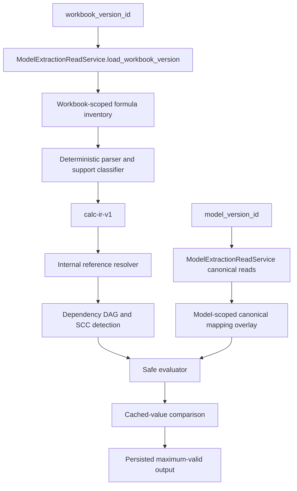
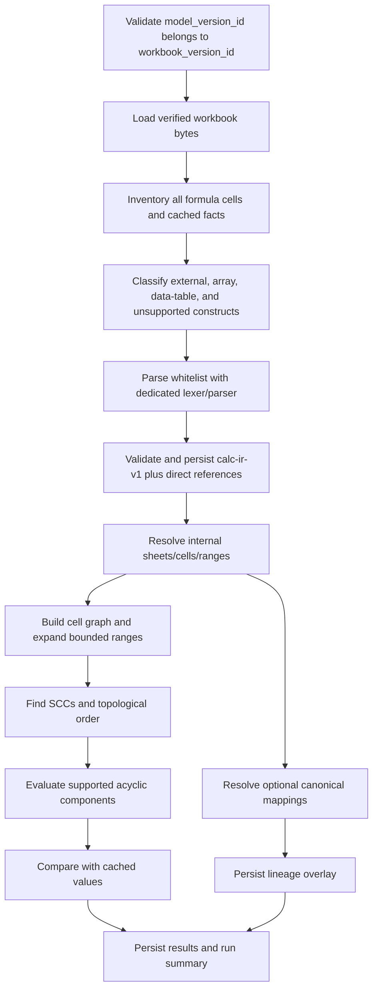
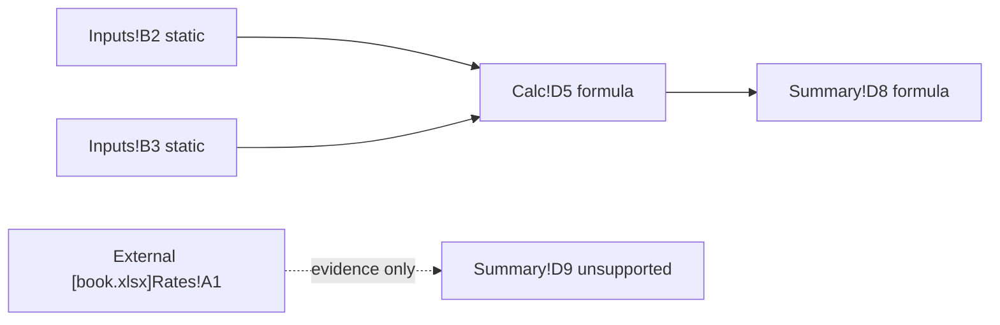
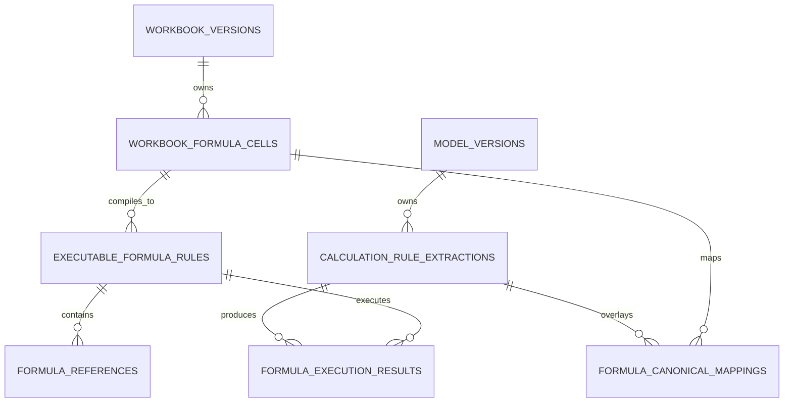
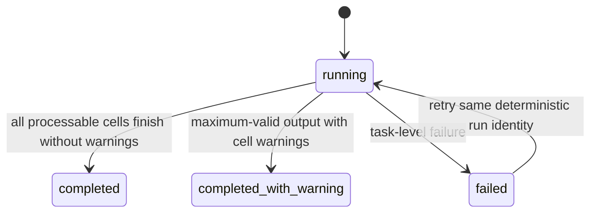

# Simple Executable Calculation Rule Extraction Design

**Date:** 2026-07-15
**Status:** Approved architecture design; implementation not started
**Phase:** 1 — Simple Executable Calculation Proof
**Branch:** `design/calculation-rule-extraction`
**Base commit:** `158bf40c460053cdc4d98d208625a50873dee580`
**Companion target design:** [2026-07-15-internal-excel-calculation-engine-target-design.md](2026-07-15-internal-excel-calculation-engine-target-design.md)

## 1. Executive Summary

**Recommended.** Build Phase 1 as a deterministic compiler-and-executor over a strict Excel subset. Inventory every formula in the immutable workbook, preserve unsupported formulas as evidence, compile supported formulas to a versioned typed representation named `calc-ir-v1`, build a workbook-cell dependency graph, safely evaluate supported acyclic subgraphs, and compare calculated values with workbook cached values. No raw formula string is ever executed.

Use workbook cell identity as execution truth and canonical Model Extraction identity as semantic lineage:

```text
WorkbookCellRef -> required for parsing, graphing, and execution
CanonicalEntityRef -> optional model-version-scoped business meaning
```

An internal helper cell therefore remains executable when it has no canonical mapping. A missing canonical mapping is a lineage metric and warning, not an execution failure. Formula inventory, references, and compiled IR belong to `workbook_version_id` and can be reused across model versions. Canonical mappings, extraction-run state, and execution results belong to `model_version_id`.

Phase 1 uses one formula cell as one executable rule. Cross-period grouping is explicitly deferred to Phase 2. The whitelist includes arithmetic, comparisons, and `IF` because the repository workbook contains 119 `IF` formulas among 352 formula cells; excluding `IF` would make the proof unrepresentative. Conditional aggregation, lookups, financial functions, named ranges, arrays, dynamic references, external workbooks, and iterative calculation remain excluded.



## 2. Scope

### 2.1 In scope

**Proposed.** Phase 1 covers:

- exact workbook loading by `workbook_version_id` through `WorkbookStorage`;
- materialized model/workbook matching through `ModelExtractionReadService`;
- all-sheet formula inventory, including hidden and very-hidden sheets;
- exact formula retention and cached-value telemetry;
- explicit external-link detection without link traversal;
- deterministic parsing of the approved whitelist;
- same-sheet and internal cross-sheet A1 references;
- relative, absolute, and mixed reference preservation;
- finite rectangular ranges;
- workbook-cell-to-canonical-entity mapping where available;
- `calc-ir-v1` validation and persistence;
- dependency edges, topological order, and cycle detection;
- safe in-process evaluation of typed IR;
- cached-value comparison with explicit freshness;
- SQLite and PostgreSQL persistence compatibility;
- internal service and DTO contracts; and
- maximum-valid output when unsupported formulas exist.

### 2.2 Explicit exclusions

**Proposed.** Phase 1 does not support:

- external workbook references;
- named ranges or named formulas;
- structured/table references;
- whole-row or whole-column references;
- reference union or intersection operators;
- array formulas, array constants, dynamic arrays, or spill semantics;
- `INDIRECT`, `OFFSET`, `INDEX`, `MATCH`, `XLOOKUP`, `VLOOKUP`, or `HLOOKUP`;
- `SUMIF`, `SUMIFS`, `COUNTIF`, `COUNTIFS`, or other conditional aggregation;
- `IRR`, `XIRR`, `NPV`, `XNPV`, or other financial functions;
- date functions;
- circular or iterative calculation;
- Excel What-If Data Tables;
- VBA, macros, UDFs, add-ins, Power Query, or data connections;
- remote link resolution;
- LLM parsing, repair, mapping, or inference;
- Scenario or Sensitivity execution;
- frontend review behavior; or
- public API changes as part of this design task.

Unsupported and external formulas are persisted with exact evidence and do not block independent supported subgraphs.

## 3. Current Repository Capabilities

### 3.1 Upstream persistence is present

**Observed in code.** `WorkbookStorage` is provider-neutral, and `DatabaseWorkbookStorage.load` returns immutable bytes only after size and SHA-256 verification. `ModelExtractionReadService.load_model_version` enforces materialized readiness and can enforce the supplied workbook ID. The read service returns canonical parameters, financial series, aligned values, and exact source-cell resolution without exposing snapshot JSON.

Evidence:
- `apps/api/app/workbook_storage.py:WorkbookStorage`
- `apps/api/app/workbook_storage.py:DatabaseWorkbookStorage.load`
- `apps/api/app/model_extraction_read_service.py:ModelExtractionReadService.load_workbook_version`
- `apps/api/app/model_extraction_read_service.py:ModelExtractionReadService.load_model_version`
- `apps/api/app/model_extraction_read_service.py:ModelExtractionReadService.resolve_entity_by_source_cell`
- `tests/test_model_extraction_reload.py:test_read_dtos_expose_no_snapshot_telemetry_or_validation_json`
- `tests/test_model_extraction_reload.py:test_missing_canonical_row_never_falls_back_to_snapshot`
- `tests/test_model_extraction_reload.py:test_model_workbook_mismatch_is_explicit`

### 3.2 Formula facts already exist, but not executable rules

**Observed in code.** `WorkbookToolset` loads the workbook twice: formula mode and `data_only=True` cached-value mode. A cell fact carries sheet, normalized A1 address, exact formula, cached/raw value, formula status, external/error flags, data type, number format, and warnings. `iter_formulas()` yields `(sheet_name, cell_coordinate, exact_formula)` for every string formula across all worksheets, including hidden worksheets.

Evidence:
- `experiments/workbook_agent_poc/workbook_tools.py:WorkbookToolset.__init__`
- `experiments/workbook_agent_poc/workbook_tools.py:WorkbookToolset._cell_fact`
- `experiments/workbook_agent_poc/workbook_tools.py:WorkbookToolset.iter_formulas`
- `experiments/workbook_agent_poc/tests/test_tools_ext.py:test_missing_cache_stays_null`
- `experiments/workbook_agent_poc/tests/test_tools_ext.py:test_hidden_sheet_cell_is_readable`
- `experiments/workbook_agent_poc/tests/test_tools_ext.py:test_formula_with_cache_reports_cached_value`

**Observed in code.** Canonical parameter and financial-series-value records already preserve `exact_formula`, `formula_status`, source cells, cached-value availability/freshness, data type, and number format. These records cover canonical cells only; they are not a workbook-wide inventory.

Evidence:
- `apps/api/app/model_extraction_models.py:ModelParameter`
- `apps/api/app/model_extraction_models.py:FinancialSeriesValue`
- `apps/api/app/model_extraction_types.py:CanonicalParameter`
- `apps/api/app/model_extraction_types.py:CanonicalFinancialSeriesValue`
- `tests/test_model_extraction_lifecycle.py:test_formula_derived_parameter_reloads_exact_formula_and_null_cache`

### 3.3 Existing dependency parsing is evidence, not an execution parser

**Observed in code.** `parse_formula_refs()` uses regular expressions to find direct A1 references, basic rectangular ranges, external references, and simple named ranges. It removes `$` anchors, does not create an AST, does not validate formulas against a function whitelist, and does not preserve source spans. `build_dependency_graph()` stores direct scalar precedents and reverse dependents, but it does not expand range dependencies, topologically sort, or detect cycles. Its `unsupported` named-range evidence is not propagated into the returned graph.

Evidence:
- `experiments/workbook_agent_poc/dependency.py:parse_formula_refs`
- `experiments/workbook_agent_poc/dependency.py:build_dependency_graph`
- `experiments/workbook_agent_poc/tests/test_dependency.py:test_absolute_references_are_normalized`
- `experiments/workbook_agent_poc/tests/test_dependency.py:test_external_reference_recorded_not_fabricated`
- `experiments/workbook_agent_poc/tests/test_dependency.py:test_named_range_resolves_to_target`

**Inferred.** The current parser is appropriate for role-classification evidence but cannot safely compile or execute formulas. It must not become the Phase 1 parser by incremental regex extension.

### 3.4 Formula normalization is narrow

**Observed in code.** `FinancialSeriesMaterializer._formula_pattern` uses openpyxl `Translator` to translate formulas to `A1` and compare whether a series pattern is consistent. The normalized formula is not persisted, and translation is not used for parsing, dependency identity, or execution.

Evidence:
- `experiments/workbook_agent_poc/time_series.py:FinancialSeriesMaterializer._formula_pattern`
- `experiments/workbook_agent_poc/tests/test_financial_series.py:test_formula_series_remains_financial_and_uses_backend_telemetry`

### 3.5 Cached values are deliberately uncertain

**Observed in code.** Formula cache absence remains `None`; external and error caches are unavailable; workbook calculation flags can only produce a recalculation warning. Existing series materialization records formula cache freshness as `unknown`.

Evidence:
- `experiments/workbook_agent_poc/workbook_tools.py:WorkbookToolset._cell_fact`
- `experiments/workbook_agent_poc/workbook_tools.py:WorkbookToolset.recalculation_signal`
- `experiments/workbook_agent_poc/time_series.py:FinancialSeriesMaterializer.materialize`
- `experiments/workbook_agent_poc/tests/test_tools_ext.py:test_error_cache_is_unavailable_not_a_value`
- `experiments/workbook_agent_poc/tests/test_financial_series.py:test_formula_series_remains_financial_and_uses_backend_telemetry`

### 3.6 Repository formula corpus

**Observed in workbook.** `Financial_Model_Data.xlsx` contains 352 formula cells across 11 sheets. Its function usage includes 119 `IF`, 60 `ABS`, 41 `SUM`, one `MIN`, and one `COUNTIF`. The repository fixtures add internal cross-sheet, mixed/absolute reference, named-range, hidden-sheet, no-cache, Unicode-sheet, and external-link cases.

Evidence:
- `Financial_Model_Data.xlsx:Revenue!C8`
- `Financial_Model_Data.xlsx:Assumptions!D10`
- `experiments/workbook_agent_poc/fixtures/no_assumptions_sheet.xlsx:Calc!C4`
- `experiments/workbook_agent_poc/fixtures/scenarios_sensitivity.xlsx:Sensitivity!D5`
- `experiments/workbook_agent_poc/fixtures/hidden_named_injection.xlsx:Model!C6`
- `experiments/workbook_agent_poc/fixtures/multilingual.xlsx:测算底稿!C3`

### 3.7 Persistence and testing conventions

**Observed in code and tests.** The repository uses SQLAlchemy 2, application-generated UUID strings with portable `Uuid(as_uuid=False)`, generic JSON, named constraints/indexes, Alembic, explicit service-owned commits, SQLite fast tests, and opt-in PostgreSQL integration tests.

Evidence:
- `apps/api/app/model_extraction_models.py`
- `apps/api/alembic/versions/20260715_0002_model_extraction_persistence.py:upgrade`
- `apps/api/app/model_extraction_repository.py:ModelExtractionRepository`
- `tests/test_model_extraction_persistence_schema.py:test_alembic_upgrades_empty_sqlite_database_to_persistence_head`
- `tests/test_model_extraction_persistence_schema.py:test_alembic_upgrades_postgres_database_to_persistence_head`
- `tests/test_model_extraction_lifecycle.py:test_t3_failure_rolls_back_children_and_marks_persistence_failed`

## 4. Design Principles

1. **Canonical-only upstream.** Consume IDs, immutable bytes, canonical relational DTOs, and source-cell resolution only through `ModelExtractionReadService` and `WorkbookStorage`.
2. **Workbook cell execution truth.** Exact internal cell identity controls calculation. Canonical coverage never gates helper-cell execution.
3. **Deterministic and LLM-free.** Formula parsing, support classification, reference resolution, mapping, graphing, execution, and validation contain no LLM call.
4. **No raw execution.** Formula text is evidence and parser input only. `eval`, generated Python/JavaScript, SQL expression execution, and plugin execution are prohibited.
5. **Maximum valid output.** Unsupported cells are preserved; independent supported subgraphs continue.
6. **Workbook/model scope separation.** Syntax is workbook-scoped; semantic mappings and run results are model-scoped.
7. **Stable IDs.** IDs are retry-stable and never depend on parser traversal order alone, LLM aliases, or database sequence values.
8. **Typed boundaries.** Every executable expression passes schema validation before graphing or evaluation.
9. **Exact provenance.** Every expression, reference, mapping, result, and warning traces to an immutable workbook and exact cell.
10. **Explicit Excel profile.** Supported coercion, precision, error, range, and cache semantics are named and versioned.
11. **Extensible, not broad.** Phase 1 proves the end-to-end architecture with a useful whitelist; unsupported constructs remain first-class evidence for Phase 2 prioritization.

## 5. Considered Approaches

| Approach | Complexity | Formula coverage | Auditability | Safety | Extensibility / Phase 2 fit | Testability | Persistence impact | Replacement risk | Decision |
|---|---:|---|---|---|---|---|---|---|---|
| A. Inventory and lineage only | Low | All formulas inventoried, none executable | Strong formula provenance, no execution proof | Strong | Weak; no executable contract | Parser/reference tests only | Low | High: Phase 2 still needs IR, graph, and results | Reject for Phase 1 objective |
| B. Translate strings directly to engine operations | Medium | Whitelist can execute but stays engine-coupled | Operations are engine-specific and hard to replay | Risk of accidental raw/generated execution | Weak; parser and evaluator stay coupled | Moderate | Engine representation leaks into rows | High | Reject |
| C. Versioned typed IR plus safe evaluator | Medium-high | Exact whitelist with explicit unsupported evidence | Strong: source, IR, graph, trace, result | Strongest: closed node/function registry | Strong: Phase 2 adds nodes/functions | Strong: parser, schema, graph, evaluator isolate cleanly | Six focused tables | Lowest | **Recommend** |

**Recommendation.** Choose C. Approach A cannot prove recalculation. Approach B saves an early abstraction but makes persisted records dependent on one evaluator implementation. `calc-ir-v1` creates the stable boundary that Phase 2 can read and extend.

## 6. Recommended Architecture

### 6.1 Ownership split

| Artifact | Owner | Rationale |
|---|---|---|
| Workbook formula inventory | `workbook_version_id` | Exact bytes determine formula cells and caches |
| Parsed references and `calc-ir-v1` | `workbook_version_id` + compiler/profile version | Syntax does not change between model extractions |
| Canonical mappings | `model_version_id` via extraction run | Canonical entities differ by Model Extraction execution |
| Dependency graph | Derived from workbook-scoped expressions/references | Cell dependencies do not require canonical coverage |
| Execution results | `calculation_rule_extraction_id` | Results depend on model/run configuration and engine version |
| Cached-value comparisons | Execution result | Preserve the exact calculated/cache pair used for validation |

### 6.2 End-to-end flow



### 6.3 Parser boundary

**Proposed.** Add a dedicated formula lexer/parser behind an internal `FormulaCompiler` interface. openpyxl remains workbook I/O. Its `Tokenizer` may be evaluated as a lexical helper, but its token types are not persisted and do not define `calc-ir-v1`. The current regex parser remains available to the experimental validator until separately migrated; Phase 1 does not mutate that behavior.

```text
FormulaCompiler.compile(
    formula_cell: WorkbookFormulaCell,
    workbook_catalog: WorkbookCatalog,
    profile: CalculationSemanticsProfile,
) -> FormulaCompilation
```

`FormulaCompilation` contains parse/support status, a validated `CalculationExpression` when supported, exact direct references, normalized signature, warnings, and unsupported constructs.

## 7. Component Boundaries

| Component | Responsibility | Depends on | Must not depend on |
|---|---|---|---|
| `CalculationRuleExtractionService` | Validate IDs, orchestrate stages, own transactions/status | Read service, repositories, compiler, graph, evaluator | Snapshot JSON, LLM, frontend |
| `WorkbookFormulaInventory` | Scan formula and cached-value workbooks | Verified bytes/openpyxl | Canonical entities |
| `FormulaSupportClassifier` | Identify external/special/unsupported constructs | Exact formula and workbook metadata | Guessed function behavior |
| `FormulaCompiler` | Produce references and `calc-ir-v1` | Formula cell, workbook catalog, semantics profile | DB entities, evaluator internals |
| `CalculationExpressionValidator` | Enforce closed schemas, limits, and reference rules | Versioned IR schema | Raw execution |
| `InternalReferenceResolver` | Resolve exact same-workbook targets | Workbook catalog | External I/O |
| `CanonicalMappingResolver` | Attach optional model-scoped lineage | `ModelExtractionReadService` | Snapshot JSON, fuzzy matching |
| `CalculationGraphBuilder` | Build cell graph, expand bounded ranges, find SCCs/order | Valid expressions/references | Canonical mappings |
| `SafeCalculationEvaluator` | Evaluate only validated nodes/functions | Execution context, function registry | Formula strings, `eval`, plugins |
| `CachedValueComparator` | Compare typed outputs with cached evidence | Result, cache fact, tolerance policy | Assumed freshness |
| Repositories | Persist six-table contract atomically | SQLAlchemy session | Formula interpretation |

## 8. Data Ownership

### 8.1 Stable identities

All IDs are UUID strings consistent with the current repository.

| Contract | Stable ID rule |
|---|---|
| `FormulaCellId` | UUIDv5 in `workbook_version_id` namespace over `formula-cell|sheet-position|sheet-name|A1` |
| `FormulaReferenceId` | UUIDv5 in `FormulaCellId` namespace over expression ID, ordinal, source span, kind, and normalized target |
| `CalculationExpressionVersion` | Literal `calc-ir-v1`; compiler and semantics versions are separate fields |
| `CalculationExpressionId` | UUIDv5 in `FormulaCellId` namespace over IR version, compiler version, semantics profile, and formula SHA-256 |
| `CalculationRuleExtractionId` | UUIDv5 in `model_version_id` namespace over workbook ID, inventory/compiler/engine/profile versions, and configuration hash |
| Mapping ID | UUIDv5 in extraction namespace over cell/reference role and canonical target |
| Execution result ID | UUIDv5 in extraction namespace over formula cell ID |

Sheet position and exact sheet name are both included because the workbook is immutable; neither is case-normalized or fuzzy-matched. Cell addresses are uppercase bounded A1 without `$` for identity.

### 8.2 Workbook cell and canonical identity are separate

```text
WorkbookCellRef(
    workbook_version_id,
    sheet_name,
    sheet_position,
    cell_address,
)

CanonicalEntityRef(
    model_version_id,
    entity_kind: parameter | financial_series,
    entity_id,
    financial_series_value_id?,
)
```

`CanonicalEntityRef` never appears inside workbook-scoped IR. A joined cell-level result may display mappings beside IR, but serialization preserves the separation.

## 9. Formula and Reference Model

### 9.1 Exact Phase 1 whitelist

| Category | Supported |
|---|---|
| Binary arithmetic | `+`, `-`, `*`, `/`, `^` |
| Unary | unary `+`, unary `-`, postfix `%` |
| Comparison | `=`, `<>`, `<`, `<=`, `>`, `>=` |
| Grouping | parentheses with Excel precedence |
| Literals | integer, decimal, boolean, quoted text, explicit Excel errors |
| References | same-sheet and internal cross-sheet A1 cells; relative/absolute/mixed anchors preserved |
| Ranges | finite rectangular A1 ranges; multiple range arguments allowed as distinct function arguments |
| Functions | `SUM`, `AVERAGE`, `MIN`, `MAX`, `ABS`, `ROUND`, `IF` |

Excel `%` is postfix percent, not modulo. Text concatenation `&`, range union comma, and range intersection space are not supported. Commas separating function arguments are supported; they are not treated as reference unions.

### 9.2 `IF` decision

**Approved.** Include `IF` with lazy branch evaluation and comparisons. The real repository workbook uses `IF` in 119 of 352 formulas. Only the selected branch executes, so an error or unsupported runtime value in the unselected branch does not fail the formula. Both branches must still be syntactically inside `calc-ir-v1`; a branch containing an unsupported function makes the formula unsupported at compile time.

### 9.3 Reference preservation

Every reference stores:

- exact source token and source span;
- target workbook classification (`internal`, `external`, `unresolved`);
- exact/canonical sheet name and sheet position when internal;
- uppercase cell address without anchors for identity;
- `column_absolute` and `row_absolute` booleans;
- reference kind (`cell`, `range`);
- start/end cells and shape for ranges; and
- resolution status and warning code.

Anchors affect copying/grouping semantics, not dependency identity. `$C5`, `C$5`, `$C$5`, and `C5` all depend on the same cell at one formula location but remain distinguishable in evidence and normalized signatures.

### 9.4 Range policy

- Each `range_reference` is one finite rectangle on one worksheet.
- A supported function can receive multiple scalar or rectangular arguments, such as `SUM(A1:A10,C1:C10)`, because each comma is a function argument separator.
- Whole-column, whole-row, multi-area union, intersection, 3-D, external, dynamic, or computed ranges are unsupported.
- The IR stores range boundaries once. The graph expands the rectangle to cell edges under configured per-range, per-formula, and per-workbook limits.
- A limit breach marks that formula `unsupported` with exact range evidence; it does not truncate dependencies.

### 9.5 Formula statuses

```text
FormulaParseStatus = not_attempted | parsed | syntax_error
FormulaSupportStatus = supported | unsupported | external_reference | special_formula
ReferenceResolutionStatus = resolved_internal | external | missing_sheet | invalid_address | unsupported
```

Array and Data Table formulas are `special_formula`, retained with their OOXML range/metadata, and not executed.

## 10. Typed IR Design

### 10.1 Expression envelope

```json
{
  "expression_id": "uuid",
  "formula_cell_id": "uuid",
  "ir_version": "calc-ir-v1",
  "compiler_version": "formula-compiler-v1",
  "semantics_profile": "excel-subset-v1",
  "formula_sha256": "hex64",
  "normalized_signature": "binary:multiply(ref:R[-4]C,ref:R[-3]C)",
  "root": {
    "node_type": "binary_operation",
    "operator": "multiply",
    "left": {},
    "right": {}
  }
}
```

The envelope is persisted in `executable_formula_rules.ir_json`; scalar query fields remain relational. The root and every child are validated before persistence and again before execution.

### 10.2 Common node fields

Every node contains:

```json
{
  "node_type": "...",
  "source_span": {"start": 1, "end": 5}
}
```

Spans use zero-based, half-open offsets into the exact formula string including its leading `=`. Generated or guessed spans are prohibited.

### 10.3 Formal node schemas

| Node | Required fields | Optional fields | Rules |
|---|---|---|---|
| `literal` | `literal_type`, `value`, `source_span` | `lexeme` | type is `number`, `boolean`, `text`, or `blank`; number serialized as finite decimal text |
| `error_value` | `error_code`, `source_span` | none | one of the versioned Excel error codes; evaluator propagates it |
| `cell_reference` | `reference_id`, `cell`, `source_span` | none | `cell` is a `WorkbookCellRef` plus anchor flags; internal only |
| `range_reference` | `reference_id`, `start_cell`, `end_cell`, `rows`, `columns`, `source_span` | none | one sheet, ordered rectangle, within limits |
| `binary_operation` | `operator`, `left`, `right`, `source_span` | none | operator is `add`, `subtract`, `multiply`, `divide`, `power` |
| `unary_operation` | `operator`, `operand`, `source_span` | none | `positive`, `negative`, or `percent` |
| `comparison` | `operator`, `left`, `right`, `source_span` | none | `equal`, `not_equal`, `less`, `less_equal`, `greater`, `greater_equal` |
| `function_call` | `function_name`, `arguments`, `source_span` | none | uppercase whitelist name; arity validated by registry |

`IF` remains a `function_call`; laziness is function-registry metadata, not an unversioned evaluator special case.

### 10.4 Validation rules

- reject unknown node types, fields, operators, functions, or error codes;
- reject non-finite numeric literals;
- reject missing/overlapping/out-of-bounds source spans;
- reject external or unresolved targets in executable nodes;
- reject range shape disagreement;
- enforce maximum formula length, node count, nesting depth, argument count, and expanded range cells;
- require referenced `FormulaReferenceId` rows to match the node target and span;
- require expression formula hash to match the immutable formula cell; and
- require compiler, profile, and IR versions to be registered.

### 10.5 Unsupported handling

Unsupported formulas receive `ir_json = null`, exact formula, parse/support status, recognized direct-reference evidence, `unsupported_constructs_json`, and warnings. The compiler never inserts placeholder values, unknown-function nodes, or guessed references. A syntactically valid external formula is `external_reference`, not `syntax_error`.

## 11. Dependency Graph

### 11.1 Graph identity

Each graph node is a `WorkbookCellRef`. Node kinds are:

- `formula_supported`;
- `formula_unsupported`;
- `formula_external`;
- `formula_special`;
- `static_value`;
- `blank`; or
- `invalid_reference`.

Each edge is directed `precedent -> dependent formula`, identified deterministically by the consuming `FormulaReferenceId` and expanded target cell. A range is not a value-producing graph node; it contributes one edge per contained cell while retaining one syntactic range record.



### 11.2 Ordering and cycles

1. Resolve all internal scalar and bounded range edges.
2. Run Tarjan strongly connected components over formula dependencies.
3. Persist every component with more than one node, or a self-edge, as cycle evidence on affected results.
4. Remove cyclic/unsupported components from the executable subgraph.
5. Mark their transitive dependents `blocked_by_dependency`.
6. Topologically sort each remaining independent component with deterministic cell ordering as the tie-breaker.

Cycle membership is stored in result warnings/error context in Phase 1; a dedicated cycle table is unnecessary because it is derivable from immutable references. Phase 2 may persist graph versions and SCCs for incremental reuse.

### 11.3 Partial execution

- An unmapped but resolved internal static/helper cell is executable.
- An unmapped but supported internal formula is executable.
- A supported formula that depends on an unsupported, external, special, cyclic, or failed formula is not executed.
- Cached values from a blocked formula are never substituted as calculation inputs.
- Independent supported components continue and the run becomes `completed_with_warning`.

## 12. Execution Semantics

### 12.1 Execution context

```text
CalculationExecutionContext(
    workbook_version_id,
    calculation_rule_extraction_id,
    engine_version,
    function_registry_version,
    semantics_profile,
    workbook_date_system,
    static_cell_values,
    calculated_cell_values,
    resource_limits,
)
```

No file path, network client, database session, LLM client, plugin loader, or formula string is present in evaluator input.

### 12.2 Scalar types

```text
Number(binary64 with finite serialized decimal)
Boolean
Text
Blank
DateSerial(number, date_system, optional ISO evidence)
ExcelError(#NULL!, #DIV/0!, #VALUE!, #REF!, #NAME?, #NUM!, #N/A)
RangeValue(row-major typed scalar matrix)
```

### 12.3 Operator precedence

The parser follows Excel order: reference construction, negation, percent, exponentiation, multiplication/division, addition/subtraction, then comparison. Equal-precedence binary operators evaluate left to right. Parentheses override precedence. This intentionally differs from parsers that treat exponentiation ahead of unary negation.

### 12.4 Coercion profile `excel-subset-v1`

| Context | Blank | Boolean | Text | DateSerial | Error |
|---|---|---|---|---|---|
| Arithmetic operator | `0` | `TRUE=1`, `FALSE=0` | `#VALUE!`; no text-number parsing | numeric serial | propagate |
| Comparison | blank equals blank/zero only under profile rule; otherwise typed comparison | boolean only with boolean | case-insensitive text-to-text | numeric serial-to-serial | propagate |
| `IF` condition | false | identity | `#VALUE!` | zero false, nonzero true | propagate |
| Range aggregation | ignored | ignored when from a range | ignored | included as serial number | propagate first error |
| Direct function argument | function-specific; `SUM` treats blank as zero | numeric functions coerce 1/0 | `#VALUE!` except text-valued `IF` branch | numeric serial | propagate |

No locale-dependent text-to-number or text-to-date coercion is included in Phase 1.

### 12.5 Function semantics

- `SUM`: zero or more scalar/range arguments; ignores blank/text/boolean values originating in ranges.
- `AVERAGE`: same collection rules; `#DIV/0!` when no numeric values remain.
- `MIN`/`MAX`: same collection rules; return zero when no numeric values remain, matching the profile contract.
- `ABS`: one numeric-coercible scalar.
- `ROUND`: two scalar arguments; Excel-compatible half-away-from-zero behavior, including negative digit counts.
- `IF`: two or three arguments; lazy selected branch; omitted false branch returns `FALSE` under the profile.

Every function implementation is registered with name, arity, accepted value kinds, range behavior, laziness, volatility, implementation version, and conformance-test version.

### 12.6 Errors and precision

- Division by zero returns `#DIV/0!`.
- Invalid arithmetic/coercion returns `#VALUE!`.
- Invalid numeric domain or non-finite result returns `#NUM!`.
- Invalid/missing reference returns `#REF!` only when the construct is representable; unresolved workbook structure normally prevents execution.
- Errors propagate deterministically left to right, except unselected `IF` branches.
- Arithmetic uses deterministic IEEE-754 binary64 because Excel stores numeric cell values as doubles; JSON persistence uses finite decimal strings plus value type, never NaN/Infinity.
- The evaluator is single-threaded in Phase 1. Ordering is stable by topological layer then `(sheet_position, row, column)`.

### 12.7 Dates

No date functions are supported. Static date/datetime cells are converted to `DateSerial` using the workbook's 1900 or 1904 epoch. Direct arithmetic and comparison can use the serial. Results retain type/evidence; the evaluator does not infer a date from cell formatting alone after calculation.

## 13. Persistence Design

### 13.1 Minimum tables

Six tables are required. The fifth candidate list is insufficient because canonical mappings are model-scoped while formula references are workbook-scoped.



### 13.2 Table contracts

#### `calculation_rule_extractions`

- PK: `id` (`CalculationRuleExtractionId`).
- FKs: `workbook_version_id RESTRICT`, `model_version_id RESTRICT`.
- Fields: inventory/compiler/IR/engine/function-registry/profile versions, configuration hash, status, summary JSON, sanitized error code/message, started/completed timestamps.
- Unique: `(model_version_id, workbook_version_id, compiler_version, engine_version, semantics_profile, configuration_hash)`.
- Indexes: `(model_version_id, created_at)`, `(workbook_version_id, status)`.
- Status: `completed`, `completed_with_warning`, `failed`.

#### `workbook_formula_cells`

- PK: `id` (`FormulaCellId`).
- FK: `workbook_version_id RESTRICT`.
- Fields: sheet name/position, row/column/A1, exact formula, formula SHA-256, formula kind, cached value/type, formula cache status/freshness, number format, data type, inventory version, created timestamp.
- Unique: `(workbook_version_id, sheet_position, cell_address)`.
- Indexes: `(workbook_version_id, sheet_position, row_index, column_index)`, formula hash.
- Formula kind: `scalar`, `array`, `data_table`, `unknown_special`.

#### `executable_formula_rules`

- PK: `id` (`CalculationExpressionId`).
- FK: `formula_cell_id CASCADE`.
- Fields: IR/compiler/profile versions, formula hash, normalized signature, parse status, support status, `ir_json`, unsupported constructs JSON, warnings JSON, created timestamp.
- Unique: `(formula_cell_id, ir_version, compiler_version, semantics_profile, formula_sha256)`.
- Indexes: `(support_status, compiler_version)`, normalized-signature hash.
- One formula cell can have multiple immutable compiled versions over time; exactly one expression version is selected by a run.

#### `formula_references`

- PK: `id` (`FormulaReferenceId`).
- FK: `executable_formula_rule_id CASCADE`.
- Fields: ordinal, source token/span, kind, target classification, target sheet/cell/range, anchor flags, range shape, resolution status, warning/error code.
- Unique: `(executable_formula_rule_id, ordinal, source_span_start, source_span_end)`.
- Indexes: target workbook/sheet/cell; expression ID.
- External references contain exact token evidence but no internal target FK and no executable node.

#### `formula_canonical_mappings`

- PK: deterministic mapping ID.
- FKs: extraction ID `CASCADE`, formula cell ID `RESTRICT`; reference ID nullable `RESTRICT`.
- Fields: mapping role (`output`, `input`), mapping status (`mapped`, `unmapped`, `ambiguous`), `entity_kind`, `entity_id`, optional `financial_series_value_id`, warning JSON.
- Unique: `(calculation_rule_extraction_id, formula_cell_id, reference_id, mapping_role)` with an output-specific unique constraint.
- Indexes: `(model_version_id via extraction, entity_kind, entity_id)`, series value ID.
- Existing parameter/series tables have no shared FK target. The service validates canonical ownership through `ModelExtractionReadService`; the discriminated IDs remain relational columns rather than hidden JSON.

#### `formula_execution_results`

- PK: deterministic result ID.
- FKs: extraction ID `CASCADE`, formula cell ID `RESTRICT`, expression ID `RESTRICT`.
- Fields: execution status, calculated type/value, Excel error code, sanitized engine error code, direct input trace JSON, engine/profile versions, cached type/value, absolute/relative error, validation status, cache freshness, warnings, timestamps.
- Unique: `(calculation_rule_extraction_id, formula_cell_id)`.
- Indexes: `(calculation_rule_extraction_id, execution_status)`, validation status.

### 13.3 JSON boundaries and cascades

IR, heterogeneous typed scalar values, bounded traces, summaries, unsupported-construct lists, and warnings use generic JSON. IDs, ownership, statuses, versions, cell coordinates, mappings, and queryable comparison fields remain relational. Deleting a Phase 1 extraction cascades its mappings/results only. Workbook formula records are restricted by workbook ownership and are not deleted with one model version.

## 14. Status and Error Model

### 14.1 Run status



`completed_with_warning` includes unsupported functions, unmapped canonical lineage, external links, special formulas, cycles, missing caches, stale-suspected caches, mismatches, and formula-level execution errors. Formula-break detection belongs to Phase 2 grouping. `failed` is reserved for inability to produce a trustworthy run envelope: workbook load/integrity failure, model/workbook mismatch, unavailable/nonmaterialized canonical model, database transaction failure, invalid persisted IR contract, or unexpected parser/evaluator crash escaping cell isolation.

### 14.2 Cell execution status

```text
ExecutionStatus =
    executed
  | not_executable
  | blocked_by_dependency
  | cycle
  | execution_error
```

`not_executable` pairs with support/external/special status. `execution_error` is a deterministic formula-level Excel error or isolated engine error; it does not fail the run.

### 14.3 Never guess

An unresolved sheet/cell, unsupported function, ambiguous canonical mapping, missing cache, or external link generates evidence and a stable code. There is no `review_required` state, human pause, fuzzy entity match, inferred period offset, or formula repair.

## 15. Validation Strategy

### 15.1 Required result fields

Every attempted formula result contains:

```text
calculated_value
cached_value
absolute_error
relative_error
validation_status
cached_value_freshness
```

```text
ValidationStatus = matched | mismatched | not_comparable | no_cached_value | execution_error
CachedValueFreshness = missing | unknown | recalculation_required
```

No Phase 1 state claims `fresh`. `recalculation_required` is used when workbook calculation settings request full/forced recalculation; otherwise a present cache is `unknown`.

### 15.2 Comparison policy

| Value kind | Rule |
|---|---|
| Zero/near-zero numeric | matched when absolute error `<= 1e-9` |
| General numeric | matched when `abs_error <= max(1e-9, 1e-9 * max(abs(calculated), abs(cached)))` |
| Percentage | compare underlying decimal using the numeric rule; never compare formatted display text |
| Large currency | numeric rule; persist both absolute and relative error so materiality can be applied downstream |
| Date-only | exact integer serial match |
| Datetime | absolute serial error `<= 1e-9` day |
| Boolean | exact boolean match; never equate `TRUE` with numeric `1` for validation |
| Text | exact Unicode code-point equality; no trim, locale, or case normalization |
| Blank | matches blank only, not zero or empty string |
| Excel error | comparable only when both sides are the same error code; otherwise `mismatched` |

`relative_error` is `null` when cached value is zero or either side is nonnumeric. A mismatch is a warning, not a run failure and never mutates the workbook or canonical values.

### 15.3 Metrics

```text
supported_formula_parse_rate = parsed_supported / formula_cells_supported_by_whitelist
supported_formula_execution_rate = executed / parsed_supported_acyclic_unblocked
cached_value_match_rate = matched / comparable_executed_with_cache
internal_reference_resolution_rate = resolved_internal_refs / internal_ref_tokens
canonical_mapping_rate = mapped_cell_occurrences / eligible_cell_occurrences
unsupported_formula_count
external_reference_count
cycle_count
```

Denominators and zero-denominator behavior (`null`, never fabricated `0%`) are persisted in summary metadata.

## 16. API/Internal Service Boundaries

### 16.1 Upstream gateway

```text
CalculationRuleExtractionUpstream(
    read_service: ModelExtractionReadService,
)

validate_inputs(model_version_id, workbook_version_id)
load_workbook_version(workbook_version_id)
list_parameters(model_version_id)
list_financial_series(model_version_id)
list_financial_series_values(model_version_id)
resolve_entity_by_source_cell(model_version_id, sheet_name, cell_address)
```

Direct ORM access to `ModelVersion.extraction_snapshot_json`, validation JSON, API `final_extraction`, agent trace, or legacy `FinancialModel.parsed_json` is a contract violation.

### 16.2 Extraction service

```text
extract_and_execute(
    model_version_id: str,
    workbook_version_id: str,
    configuration: CalculationRuleExtractionConfiguration,
) -> CalculationRuleExtractionResult
```

The method is internal in Phase 1. No HTTP endpoint or frontend contract is required. If a future API is added, it serializes these DTOs without exposing ORM models or arbitrary IR execution input.

### 16.3 Run-level output

```json
{
  "calculation_rule_extraction_id": "uuid",
  "model_version_id": "uuid",
  "workbook_version_id": "uuid",
  "ir_version": "calc-ir-v1",
  "engine_version": "calc-engine-v1",
  "status": "completed_with_warning",
  "summary": {
    "formula_cells_total": 352,
    "formula_cells_parsed": 300,
    "formula_cells_executable": 280,
    "formula_cells_executed": 270,
    "cached_values_matched": 250,
    "cached_values_mismatched": 5,
    "unsupported_formula_cells": 50,
    "external_reference_cells": 1,
    "cycles_detected": 0
  },
  "metrics": {
    "supported_formula_parse_rate": 1.0,
    "supported_formula_execution_rate": 0.9642857143,
    "cached_value_match_rate": 0.9803921569,
    "internal_reference_resolution_rate": 1.0,
    "canonical_mapping_rate": 0.42
  },
  "warnings": []
}
```

Numbers above illustrate shape only and are not repository results.

### 16.4 Cell-level output

```json
{
  "formula_cell_id": "uuid",
  "output_cell": {
    "workbook_version_id": "uuid",
    "sheet_name": "Revenue",
    "sheet_position": 2,
    "cell_address": "F10"
  },
  "exact_formula": "=F6*F7",
  "normalized_signature": "binary:multiply(ref:R[-4]C,ref:R[-3]C)",
  "parse_status": "parsed",
  "support_status": "supported",
  "calculation_expression": {},
  "direct_references": [],
  "canonical_mappings": [],
  "execution_status": "executed",
  "execution_result": {
    "value_type": "number",
    "value": "125.5"
  },
  "cached_value_comparison": {
    "cached_value": 125.5,
    "absolute_error": 0.0,
    "relative_error": 0.0,
    "validation_status": "matched",
    "cached_value_freshness": "unknown"
  },
  "warnings": []
}
```

## 17. Idempotency and Retry

1. Validate the model/workbook pair before creating a run.
2. Compute deterministic run identity from both IDs and all behavior-affecting versions/configuration.
3. Reuse existing immutable inventory and compiled expression records for the same workbook/compiler/profile.
4. Recompute canonical mappings for each model version.
5. A retry of a failed transaction reuses the same run ID and deterministic child IDs.
6. A completed identical request returns the persisted result without re-execution.
7. Changing compiler, IR, engine, function-registry, semantics profile, or resource limits creates a distinct run identity; old records remain readable.
8. Stage writes in short transactions: run identity; workbook compilation; mapping/graph readiness; results/summary. No transaction wraps workbook parsing or evaluation.
9. Never update a compiled expression in place. New compiler output creates a new expression version.

Repeated extraction for a second `model_version_id` using the same `workbook_version_id` reuses formula inventory/IR but creates new mappings and execution results.

## 18. Security

- Accept bytes only from the verified `WorkbookStorage` contract.
- Set parser limits for formula length, tokens, nodes, depth, arguments, range area, formula count, and total expanded edges.
- Detect OOXML array/data-table/external-link constructs before normal parsing.
- Do not open external links, remote URLs, linked workbooks, macros, relationships, or connections.
- Do not use `eval`, `exec`, AST-to-Python compilation, JavaScript, SQL expressions, shell commands, user code, or unrestricted plugins.
- Dispatch functions through an immutable allowlisted registry.
- Validate persisted IR before every execution; a database row is not trusted merely because it exists.
- Sanitize task-level errors. Formula text/cell values are authorized evidence, not generic log fields.
- Use deterministic resource budgets and abort one formula/component without corrupting other results.
- Treat ZIP/XML protections as part of workbook ingestion; Formula Extraction does not weaken upstream size/integrity checks.
- No LLM receives formula contents in Phase 1.

## 19. Testing Strategy

### 19.1 Parser and IR

- golden tests for every operator, precedence boundary, literal, reference anchor, quoted/Unicode sheet, range, function, and error literal;
- negative golden tests for every explicit exclusion;
- AST/IR schema round-trip and canonical serialization tests;
- source-span and exact-token property tests;
- normalized-signature tests independent of display coordinates; and
- property-based parser tests that never crash or emit unvalidated nodes.

### 19.2 Reference and graph

- same/cross-sheet and hidden-sheet resolution;
- range expansion and limit tests;
- external-link evidence with zero internal edges;
- static/helper/formula node identity;
- deterministic topological order;
- self-cycle and multi-cell SCC tests;
- independent-subgraph execution when another subgraph is blocked; and
- no cached-value fallback for unsupported precedents.

### 19.3 Evaluator conformance

- one table-driven suite per operator/function/coercion/error behavior;
- lazy `IF` branch tests;
- `ROUND` half-away-from-zero tests;
- blank, zero, text, boolean, date-system, and error propagation tests;
- range aggregation tests distinguishing direct arguments from range contents;
- numeric boundary/overflow tests; and
- tests proving formula strings cannot reach an execution primitive.

### 19.4 Workbook corpus

- preserve repository fixtures as targeted regressions;
- add parser-specific `.xlsx` fixtures with formulas and externally calculated cached values;
- use at least two structurally different real financial workbooks for acceptance;
- version workbook bytes and a sidecar manifest containing SHA-256, Excel version/date system, calculation timestamp/source, expected supported counts, and permitted tolerances;
- never generate expected values with the evaluator under test; and
- retain unsupported formulas in the golden output.

### 19.5 Persistence

- SQLite migration/schema/constraint/idempotency/reload tests;
- PostgreSQL migration, JSON/UUID, FK/cascade, uniqueness, rollback, and retry tests;
- cross-dialect identical DTO tests;
- service-restart reload tests; and
- regression tests proving Model Extraction persistence and upload behavior remain unchanged.

## 20. Migration and Compatibility

### 20.1 Additive migration boundary

Implementation will require one future additive Alembic revision for the six tables. This design creates no migration. Existing Model Extraction tables and API contracts remain unchanged. The migration must run against both empty SQLite and isolated PostgreSQL, following current tests.

### 20.2 Shared Phase 1/Phase 2 compatibility contract

| Contract | Frozen in Phase 1 | Extensible in Phase 2 |
|---|---|---|
| `FormulaCellId` | Workbook-scoped identity and exact source cell | Additional metadata only |
| `FormulaReferenceId` | Source span/token, internal/external classification, exact cell identity | New reference kinds through new expression versions |
| `CalculationRuleExtractionId` | Model/workbook ownership and traceability | New version/config fields, never repurpose ID |
| `CalculationExpression` | Envelope, source linkage, version fields | New IR versions and additive node families |
| `CalculationExpressionVersion` | Explicit `ir_version` required | `calc-ir-v2+` readers coexist with v1 |
| `ExecutionStatus` | Existing values retain meaning | Add new values; never reinterpret |
| `ExecutionResult` | Cell/run/expression trace and typed value/error | Additional trace/cache fields |
| `FormulaParseStatus` | `not_attempted`, `parsed`, `syntax_error` meanings | Additive statuses only |
| `FormulaSupportStatus` | Supported/unsupported/external/special meanings | More specific reason codes |
| `WorkbookCellRef` | Workbook, exact sheet, position, A1 identity | Range/name/table wrappers reference it |
| `CanonicalEntityRef` | Model-scoped discriminated mapping, optional for execution | Grouping/scenario consumers reuse it |

Phase 2 must not replace formula-cell IDs, exact formula retention, internal cell identity, v1 IR records, unsupported/external evidence, mappings, result traceability, or canonical-only upstream reads.

## 21. Deferred Features

- named ranges and named formulas;
- structured references and tables;
- arrays, dynamic arrays, spills, and implicit intersection;
- lookup, conditional aggregation, financial, date/time, statistics, and text function families;
- dynamic references such as `OFFSET`/`INDIRECT`;
- circular/iterative calculation;
- incremental recalculation and dirty propagation;
- persisted graph versions and calculation runs separate from extraction;
- cross-period grouped semantic rules;
- hardcoded override and historical/forecast boundary grouping;
- Scenario/Sensitivity consumers;
- What-If Data Table special engine.

## 22. Risks and Mitigations

| Risk | Mitigation |
|---|---|
| Regex dependency behavior is mistaken for an execution parser | New compiler boundary; current parser remains observed evidence only |
| Phase 1 grows into a full Excel engine | Closed whitelist and explicit unsupported policy |
| Helper cells fail due to incomplete canonical extraction | Workbook cell identity gates execution; mapping is optional lineage |
| Cached values are treated as truth | Freshness never claims `fresh`; caches are comparison-only |
| Large ranges create graph explosion | Exact area budgets; reject, never truncate |
| IR embeds model-specific IDs and becomes unreusable | Canonical mappings stored in a model-scoped overlay table |
| Numeric results differ subtly from Excel | Named semantics profile, conformance corpus, persisted errors/tolerances |
| `IF` evaluates both branches | Lazy function metadata and targeted tests |
| External links leak into internal graph | Pre-classification, evidence-only reference, zero internal edge |
| Unsupported cells stop the run | SCC/component isolation and maximum-valid output |
| Third-party parser becomes a black box | InvestIQ-owned IR schema and acceptance tests; no library dependency in Phase 1 decision |
| Persistence IDs change on retry | UUIDv5 rules and immutable versioned rows |

## 23. Open Decisions

The architecture direction and `IF`/comparison whitelist are approved. The following are product/policy approvals required before implementation completion, not unresolved technical placeholders:

1. Approve the exact default resource budgets after profiling the two acceptance workbooks.
2. Approve numeric tolerance defaults for audit reporting; engine calculations remain exact to the named profile regardless of reporting tolerance.
3. Approve retention/access policy for persisted formulas, cell values, and execution traces.
4. Approve whether a future third-party engine may be used only as a test oracle; it must never become authoritative without a separate license/security decision.

No decision blocks writing an implementation plan later, but this task explicitly does not create that plan.

## 24. Implementation Readiness Checklist

### 24.1 Architecture checklist

- [x] Upstream persistence base exists on the branch base.
- [x] Canonical-only read boundary identified.
- [x] Workbook/model ownership split decided.
- [x] Helper-cell execution decision made.
- [x] Exact Phase 1 whitelist decided.
- [x] `IF` and comparison behavior decided.
- [x] Typed IR envelope and node schemas defined.
- [x] Reference/range identity and anchor behavior defined.
- [x] Graph, cycle, and partial-execution behavior defined.
- [x] Coercion, precision, date, blank, and error semantics defined.
- [x] Cached-value freshness and tolerance policy defined.
- [x] Six-table persistence boundary defined.
- [x] Run/cell statuses and retry identity defined.
- [x] Security prohibitions defined.
- [x] Phase 2 compatibility contract frozen.
- [x] Acceptance metrics and test categories defined.
- [ ] Product owners approve resource budgets, tolerances, and retention policy.

### 24.2 Phase 1 implementation acceptance criteria

The future implementation is accepted only when evidence proves all of the following; these boxes are intentionally unchecked because this task creates design documents only:

- [ ] Load the exact persisted workbook through `WorkbookStorage` by `workbook_version_id` and verify integrity.
- [ ] Scan every explicit formula cell on visible, hidden, and very-hidden sheets.
- [ ] Identify external references, retain their evidence, and never execute or retrieve them.
- [ ] Parse every formula that is entirely inside the exact Phase 1 whitelist.
- [ ] Produce schema-valid `calc-ir-v1` with exact source traceability.
- [ ] Resolve same-workbook scalar and bounded-range references without requiring canonical mappings.
- [ ] Build the dependency DAG for supported components and represent static/helper cells.
- [ ] Detect self-cycles and multi-cell cycles deterministically.
- [ ] Safely execute supported acyclic formulas without raw-string execution.
- [ ] Compare calculated results with cached values using the named tolerance and freshness policies.
- [ ] Preserve unsupported formulas while independent supported components continue.
- [ ] Persist and reload outputs after a new service process/session.
- [ ] Prove that no path reads `extraction_snapshot_json` or API `final_extraction` as canonical input.
- [ ] Prove that formula strings cannot reach `eval`, `exec`, generated code, SQL, shell, or plugin execution.
- [ ] Meet the acceptance metrics on at least two structurally different real financial workbooks.
- [ ] Pass equivalent persistence/DTO behavior on SQLite and isolated PostgreSQL.
- [ ] Preserve all existing Model Extraction persistence, reload, and upload behavior.

## 25. Repository Evidence Appendix

| Conclusion | Classification | Evidence |
|---|---|---|
| Exact immutable workbook bytes are reloadable and verified | Observed in code/tests | `apps/api/app/workbook_storage.py:DatabaseWorkbookStorage.load`; `tests/test_model_extraction_reload.py:test_reload_workbook_after_new_session_returns_verified_bytes` |
| Model/workbook mismatch is explicit | Observed in code/tests | `apps/api/app/model_extraction_read_service.py:ModelExtractionReadService.load_model_version`; `tests/test_model_extraction_reload.py:test_model_workbook_mismatch_is_explicit` |
| Downstream DTOs exclude snapshot JSON | Observed in tests | `tests/test_model_extraction_reload.py:test_read_dtos_expose_no_snapshot_telemetry_or_validation_json`; `tests/test_model_extraction_reload.py:test_missing_canonical_row_never_falls_back_to_snapshot` |
| Exact canonical source-cell lookup exists and may return no mapping | Observed in code/tests | `apps/api/app/model_extraction_read_service.py:ModelExtractionReadService.resolve_entity_by_source_cell`; `tests/test_model_extraction_reload.py:test_unmapped_source_cell_returns_none` |
| Formula and cached-value workbooks are loaded separately | Observed in code | `experiments/workbook_agent_poc/workbook_tools.py:WorkbookToolset.__init__` |
| Formula inventory covers hidden sheets | Observed in code/tests | `experiments/workbook_agent_poc/workbook_tools.py:WorkbookToolset.iter_formulas`; `experiments/workbook_agent_poc/tests/test_tools_ext.py:test_hidden_sheet_cell_is_readable` |
| Missing/external/error caches are unavailable, not zero | Observed in code/tests | `experiments/workbook_agent_poc/workbook_tools.py:WorkbookToolset._cell_fact`; `experiments/workbook_agent_poc/tests/test_tools_ext.py:test_missing_cache_stays_null`; `experiments/workbook_agent_poc/tests/test_tools_ext.py:test_error_cache_is_unavailable_not_a_value` |
| Existing reference parser strips anchors and lacks execution semantics | Observed in code/tests | `experiments/workbook_agent_poc/dependency.py:parse_formula_refs`; `experiments/workbook_agent_poc/tests/test_dependency.py:test_absolute_references_are_normalized` |
| Existing graph lacks range edges, sorting, and cycles | Observed in code | `experiments/workbook_agent_poc/dependency.py:build_dependency_graph` |
| Translator is used only for formula-pattern consistency | Observed in code/tests | `experiments/workbook_agent_poc/time_series.py:FinancialSeriesMaterializer._formula_pattern`; `experiments/workbook_agent_poc/tests/test_financial_series.py:test_formula_series_remains_financial_and_uses_backend_telemetry` |
| Current canonical rows retain formula/cache telemetry | Observed in code/tests | `apps/api/app/model_extraction_models.py:FinancialSeriesValue`; `tests/test_model_extraction_reload.py:test_series_values_are_ordered_by_series_and_period_index` |
| Snapshot dependency evidence is intentionally not canonical persistence | Observed in tests | `tests/test_model_extraction_lifecycle.py:test_snapshot_strips_dependency_evidence` |
| Current migration style supports SQLite and PostgreSQL | Observed in code/tests | `apps/api/alembic/versions/20260715_0002_model_extraction_persistence.py:upgrade`; `tests/test_model_extraction_persistence_schema.py:test_alembic_upgrades_empty_sqlite_database_to_persistence_head`; `tests/test_model_extraction_persistence_schema.py:test_alembic_upgrades_postgres_database_to_persistence_head` |
| Existing `libs/calc_engine` is bespoke finance math, not an Excel formula engine | Observed in code/tests | `libs/calc_engine/irr.py:compute_irr`; `libs/calc_engine/npv.py:compute_npv`; `tests/test_calc_engine.py:TestCalcEngineIntegration` |
| Phase 1 needs a new compiler/IR/evaluator boundary | Inferred | Combined evidence above |
| Workbook syntax must be separated from model semantic mapping | Proposed | Sections 6, 8, and 13 |
| One formula cell is one Phase 1 rule | Proposed | Sections 6 and 13 |

### External semantic references

- Microsoft documents `%` as percent, the comparison operators, and Excel operator precedence: <https://support.microsoft.com/en-us/excel/calculation-operators-and-precedence-in-excel>.
- openpyxl documents that it does not evaluate formulas and that `data_only=True` returns the last stored value: <https://openpyxl.readthedocs.io/en/3.1.2/simple_formulae.html> and <https://openpyxl.readthedocs.io/en/3.1.2/api/openpyxl.reader.excel.html>.
- openpyxl documents Tokenizer/Translator limitations; these utilities do not define the persisted IR: <https://openpyxl.readthedocs.io/en/latest/formula.html>.
