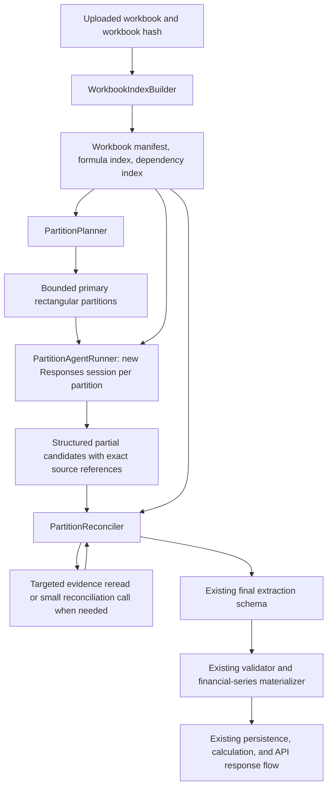

# Large Workbook Partitioned Extraction Design

Date: 2026-07-28

Status: Approved design; implementation not started

Branch: `feature/backend-scale-up`

## 1. Objective

Prevent large `.xlsx` uploads from exceeding the Azure Responses API context
window while preserving complete workbook extraction and the existing downstream
contracts.

The accepted solution replaces the workbook agent's single growing Responses
conversation with independent, bounded partition calls. Each call examines raw
workbook evidence for one primary rectangular partition plus only the
deterministically related cross-sheet evidence. The backend then validates and
reconciles structured candidates before invoking the existing final validation,
materialization, persistence, calculation, and response path.

This design does not treat a natural-language intermediate summary as workbook
truth. Every accepted conclusion remains traceable to cells or ranges in the
uploaded workbook.

## 2. Problem Statement

The current workbook agent reads chunks through one Responses API conversation.
`AzureDriver` threads calls with `previous_response_id`, and `observe_many`
returns chunk results into that same conversation. Increasing local chunk-count
or byte caps therefore permits the process to read more workbook data but does
not bound the accumulated model context.

For the supplied benchmark workbook, the local inventory observed during
diagnosis was:

- 14 content sheets;
- 44,541 non-empty cells;
- 2,378 current internal chunks;
- approximately 17.3 MiB of chunk payload;
- individual large sheets that already produce hundreds of chunks.

The diagnosed Azure failure was `context_length_exceeded`. The deployment was
verified through Azure metadata as the full `gpt-5.4` model, so changing a
deployment-name assumption or increasing `AZURE_OPENAI_MAX_OUTPUT_TOKENS` does
not address the accumulated input context.

The previously approved runtime caps of 768 chunks per request, 4,096 chunks per
run, and 24 MiB remain useful local safety limits, but they are not a solution to
unbounded conversation history.

## 3. Scope

### In scope

- deterministic workbook indexing;
- token- and byte-bounded rectangular partition planning;
- independent Azure Responses calls per partition;
- structured, provenance-bearing partial candidates;
- deterministic backend validation, merge, deduplication, and conflict checks;
- targeted raw-evidence rereads for cross-partition ambiguity;
- bounded error handling and safe partition telemetry;
- regression and real-workbook acceptance tests.

### Explicit non-goals

- no frontend change;
- no upload API request or response contract change;
- no calculation-engine change;
- no canonical extraction schema change;
- no database schema or migration change;
- no new partition, checkpoint, or resumability table;
- no persistence of partial partition state after a failed upload;
- no reuse of partial work by a later upload;
- no natural-language summary used as evidence or source of truth;
- no change to the rule that a failed upload is retried as a new `model_id`;
- no deployment, Azure resource, or model change.

## 4. Chosen Approach

Use stateless bounded partition calls, structured local candidates, and
deterministic backend reconciliation.

Two alternatives were rejected:

1. Compressing and carrying summaries in one long Responses session still
   accumulates context and makes semantic loss difficult to detect.
2. One call per sheet is not reliably bounded because a single wide or dense
   sheet may exceed the safe input budget.

The chosen approach bounds every model call independently while preserving
source provenance.

## 5. Architecture

### 5.1 WorkbookIndexBuilder

The backend reads the workbook once and creates deterministic, request-scoped
indexes:

- immutable workbook SHA-256;
- sheet inventory and dimensions;
- named ranges;
- merged-cell and hidden-sheet metadata where already supported;
- non-empty-cell inventory;
- formula cells and parsed direct references;
- cross-sheet dependency edges;
- number formats and cell data types;
- primary ranges requiring extraction.

The workbook remains the source of truth. The index contains addresses and
metadata needed to plan and validate evidence; it does not contain model-authored
interpretations.

### 5.2 PartitionPlanner

The planner divides each content sheet's required range into deterministic
rectangular primary partitions. It estimates both serialized bytes and input
tokens before a request is issued.

Planning rules:

- every required primary cell belongs to a planned primary partition;
- primary partition coverage has no gaps;
- primary partitions should not overlap except where a rectangular split cannot
  avoid workbook formatting boundaries;
- repeated inclusion of a cell as dependency evidence does not count as
  duplicate primary coverage;
- if a planned request exceeds either budget, recursively split its primary
  rectangle by the larger dimension;
- preserve nearby labels, headers, period axes, and formulas when they fit;
- attach only dependency evidence selected from deterministic formula or named
  range references;
- bind every partition to the workbook hash, sheet, primary range, and stable
  partition ID.

A single cell whose serialized evidence cannot fit the hard request limit
produces a typed local failure. Its content is not silently truncated.

### 5.3 PartitionAgentRunner

Each primary partition is processed through a new Azure Responses session.
Calls do not share `previous_response_id`.

Each request contains only:

- the stable extraction instructions and structured output contract;
- a compact workbook manifest;
- the partition identity and primary range;
- raw evidence for the primary rectangle;
- deterministically selected related headers and cross-sheet dependencies;
- bounded instructions to return candidate facts, not a final workbook-wide
  conclusion.

The result is a structured partial candidate envelope. It cannot submit the
workbook-wide extraction directly.

Initial execution is sequential to simplify deterministic failure semantics and
Azure throttling. Parallel execution is a later optimization and is outside this
design.

### 5.4 PartitionReconciler

The backend reconciler:

- rejects candidates bound to the wrong workbook or partition;
- re-reads every cited source cell or range;
- replaces model-supplied raw values, formulas, formats, and data types with
  backend-observed facts;
- creates deterministic candidate IDs;
- deduplicates candidates that cite the same source and semantic type;
- joins financial-series fragments by source ranges and period alignment;
- checks formula and named-range dependency edges;
- detects incompatible classifications or overlapping series;
- requests a small targeted reconciliation only when deterministic rules cannot
  resolve a conflict;
- marks unresolved ambiguity as `review_required` rather than inventing a
  resolution.

The reconciler emits the same final extraction structure consumed by the current
validator and financial-series materializer.

### 5.5 Existing Finalization Path

After every planned partition has completed and coverage is proven, the
reconciled extraction enters the existing finalization path.

The following remain unchanged:

- final extraction schema;
- deterministic workbook validation;
- financial-series materialization;
- canonical database tables;
- calculation engine;
- frontend;
- public upload response contract.

No downstream component reads partition envelopes.

## 6. Evidence and Candidate Contract

Every partial candidate must carry:

- workbook hash;
- partition ID;
- semantic candidate type;
- exact sheet and cell or rectangular range;
- any cited header, period, or dependency ranges;
- model classification and bounded confidence;
- optional short `reasoning_summary`.

Backend-derived fields include:

- deterministic candidate ID;
- actual raw or cached value;
- exact formula;
- number format;
- data type;
- formula/cache status;
- validated source and dependency references;
- reconciliation and review status.

`reasoning_summary` is explanatory only. It is never accepted as proof, never
replaces cells, and is not carried as context into unrelated partition calls.

### 6.1 Stable identities

Partition IDs are deterministic from:

`workbook_hash + sheet + primary_range + planner_version`

Candidate IDs are deterministic from:

`workbook_hash + semantic_type + normalized_source_reference`

These identities exist only for request-scoped processing and diagnostics. They
do not require new persisted entities.

### 6.2 Cross-partition financial series

The model identifies candidate labels, period ranges, and value ranges. The
backend performs the authoritative join:

1. normalize sheet and range references;
2. re-read period and value cells;
3. verify compatible orientation and dimensions;
4. align periods in source order;
5. merge contiguous fragments;
6. reject conflicting overlaps;
7. retain exact per-cell provenance.

No model-authored value array overrides workbook values.

### 6.3 Cross-sheet dependencies

Formula references and named ranges are parsed deterministically by the backend.
Related evidence may be included with a partition or retrieved in a bounded
targeted reread. The model is not expected to remember evidence from a previous
partition.

Dynamic or unsupported references that cannot be resolved statically remain
explicitly unresolved and may require review. They are not guessed.

## 7. Context and Resource Budgets

The initial target per partition request is:

- approximately 200,000 total input tokens;
- no more than approximately 120,000 tokens of raw workbook evidence;
- the remaining allowance reserved for system instructions, tool schemas,
  manifest, dependency evidence, and reconciliation overhead;
- an independent serialized-byte ceiling enforced before the request.

These are conservative application budgets, not assertions about the
deployment's absolute model limit. They must be configurable and tested without
requiring a long-context billable request.

Budget enforcement occurs twice:

1. preflight estimation during planning;
2. exact serialized-size validation immediately before the Azure call.

If the second check fails, the planner splits the primary rectangle again before
calling Azure.

The existing run-level limits remain final circuit breakers. New explicit limits
also bound:

- total partition count;
- total Azure calls;
- targeted reconciliation calls;
- retries per call;
- total wall-clock runtime.

## 8. Failure Semantics

The upload is atomic from the user's perspective.

- Any missing primary range, failed partition, invalid binding, or unreconciled
  structural failure causes the entire `model_id` to fail.
- No partial extraction is submitted or persisted as a successful model.
- Request-scoped indexes, partition results, and reconciliation state are
  discarded after failure.
- The same failed `model_id` is not resumed.
- A later upload starts from the original workbook with a new `model_id`.
- Content-addressed workbook storage may reuse the same immutable
  `workbook_version`, as it does today, but this does not resume extraction.

### 8.1 Azure and structured-output handling

- `context_length_exceeded`: do not repeat the same request; split the primary
  range once more and retry only the smaller requests within global limits.
- `401` or `403`: fail immediately as authentication or authorization errors.
- `429`, Azure `5xx`, and transport failures: use bounded retry with backoff.
- invalid structured output: allow one bounded correction attempt in the same
  partition session; then fail the upload.
- local workbook/index/validation errors: fail immediately with the existing
  sanitized error boundary.

No error path silently drops a range to make the upload succeed.

## 9. Observability

Safe diagnostic logs record:

- model ID and workbook hash prefix;
- planner version;
- sheet and primary range;
- partition count and partition ID;
- estimated input tokens;
- serialized request bytes;
- response usage when Azure returns it;
- Azure request ID;
- retry, split, and reconciliation counts;
- typed terminal failure code.

Logs must not record:

- API keys, tokens, connection strings, or credentials;
- full request or response payloads;
- complete workbook contents;
- unrestricted cell values that may contain sensitive data.

The existing public API error envelope remains unchanged. More precise internal
diagnostics stay in sanitized server logs and trace metadata already permitted by
the current contract.

## 10. Testing Strategy

Implementation must follow RED-GREEN TDD.

### 10.1 Planner unit tests

Prove:

- deterministic partition IDs and ordering;
- complete primary coverage of every required range;
- no unintended primary overlap;
- recursive row and column splitting;
- token and byte budgets are both enforced;
- large single-cell evidence returns a typed failure;
- dependency evidence does not alter primary coverage;
- workbook hash and planner-version bindings are verified.

### 10.2 Runner unit tests

With a fake Responses driver, prove:

- every partition starts without `previous_response_id`;
- only the assigned primary and dependency evidence is supplied;
- structured partial candidates cannot invoke final submission;
- per-call usage and request IDs are recorded;
- context overflow causes a smaller split rather than an identical retry;
- authentication failure is not retried;
- transient errors and invalid output use only their bounded retries.

### 10.3 Reconciler unit tests

Prove:

- source cells are re-read and model-authored values cannot override them;
- wrong workbook and partition bindings are rejected;
- deterministic candidate IDs and deduplication;
- cross-partition horizontal and vertical series assembly;
- period alignment and exact value-cell provenance;
- formula and named-range dependency validation;
- deterministic conflict resolution;
- bounded targeted reconciliation;
- unresolved conflicts become `review_required`;
- missing partition evidence fails the whole upload.

### 10.4 Regression tests

Existing small-workbook fixtures must continue to produce the same public
response shape and semantically equivalent final extraction. Existing
validator, financial-series, upload API, persistence, calculation, and frontend
contract tests must remain green without schema updates.

Tests must also prove that no partition/checkpoint database table or migration is
introduced.

### 10.5 Real-workbook acceptance

Run the supplied `PF Full Model END (1).xlsx` through the rebuilt local Docker
stack using the configured full Azure deployment.

Acceptance requires:

- inventory is recomputed and accounts for all 14 content sheets and all 44,541
  observed non-empty cells, or explicitly reports a deterministic inventory
  difference caused by workbook/library version;
- every required primary range is covered;
- every Azure call remains below configured token and byte budgets;
- no call fails with `context_length_exceeded`;
- every accepted candidate has validated workbook provenance;
- cross-partition financial series and dependencies reconcile;
- the workbook reaches the existing final submission path;
- `submitted=true`;
- existing downstream persistence and response contracts remain valid.

This acceptance run is intentionally multi-call but must not create a synthetic
billable long-context request.

## 11. Rollout and Rollback

Implement behind one backend configuration switch, defaulting to the current
path until automated regression tests pass. Enable partitioned extraction for
the benchmark validation, then make it the workbook-agent default after the real
workbook acceptance criteria pass.

Rollback disables the partitioned runner and restores the current single-session
agent loop. Because this design changes no database or public contract, rollback
requires no data migration or frontend deployment.

The existing increased local hard caps are retained as safety ceilings and can
be tuned independently after partitioned extraction is proven.

## 12. Acceptance Summary

The design is complete when implementation demonstrates all of the following:

1. No individual model call depends on accumulating the full workbook context.
2. Complete workbook primary coverage is deterministically proven.
3. Every accepted conclusion is traceable to backend-validated raw cells or
   ranges.
4. Cross-partition and cross-sheet facts are reconciled without free-text
   summaries becoming authoritative.
5. A partition failure fails the entire `model_id`; the next upload starts from
   scratch with a new `model_id`.
6. The calculation engine, frontend, canonical tables, and public upload
   contract remain unchanged.
7. The supplied large workbook completes without Azure context overflow.
